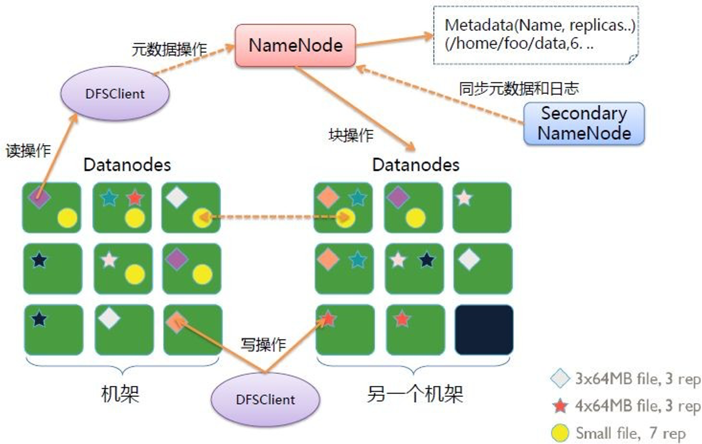
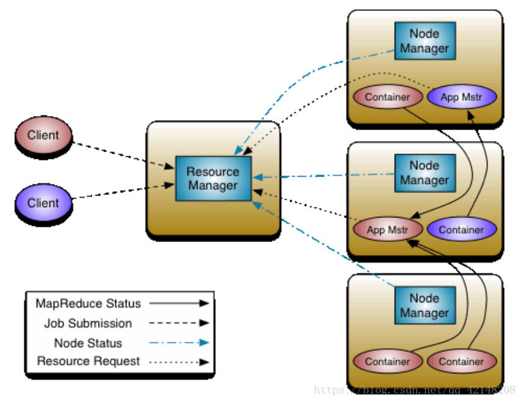
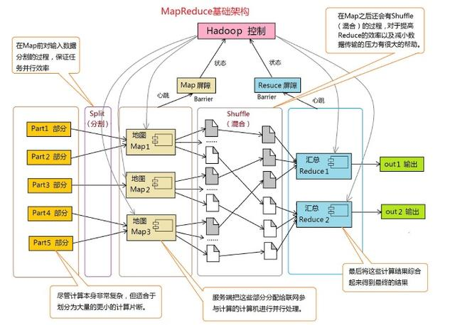
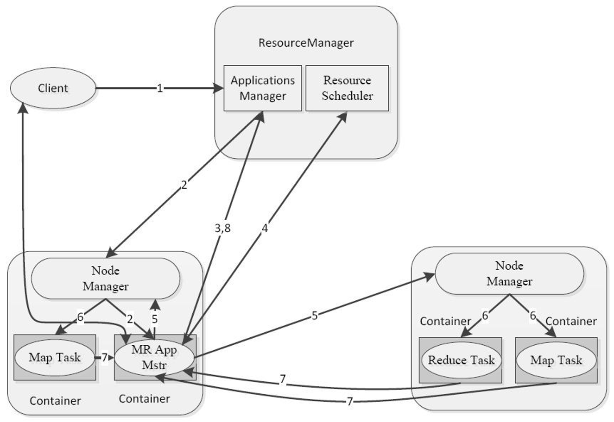
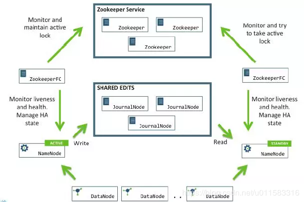

[TOC]

# Hadoop 概述与生态

    GFS         ==>     HDFS
    MapReduce   ==>     MapReduce
    BigTable    ==>     HBase

* MapReduce：处理海量数据，将海量数据划分为无数个数据集，针对每个数据集进行处理并将处理后的结果进行合并。
* HDFS：分布式存储海量数据，所有数据均以块的方式进行存储。
* YARN：分布式资源管理框架用于管理整个集群的资源（内存、CPU核心数以及存储空间），将集群的资源分配调度给各个任务。

## 概述



* NameNode：主节点，用于存储文件的元数据信息（文件名、目录结构、文件属性、时间戳、副本数、权限），以及每个文件的块列表与块所在的DataNode等，NameNode的元数据一部分保存在内存中另一部分保存在本地磁盘的fsimage（镜像文件）和edites（编辑日志）文件中。
* DataNodes：在本地文件系统中真正存储文件块数据以及文件块数据的校验和。
* Secondary NameNode：用于监控HDFS状态的辅助后台程序，每隔一段时间获取HDFS元数据的快照。



* NodeManager：管理、调度当前机器上的资源；处理来自ResourceManager和ApplicationMaster上的命令。
* ResourceManager：用于管理、调度整个集群上的资源；处理客户端的请求；启动/监控ApplicationMaster；监控NodeManager。
* ApplicationMaster：对数据进行切片；为应用程序申请资源并将申请到的资源分配给内部任务；对任务进行监控和容错；
* Container：对任务运行环境进行抽象，封装了CPU、内存等多维资源以及环境变量、启动命令等任务运行相关的信息；



* 将计算过程分为两个阶段，即Map和Reduce
    - Map阶段并行处理输入数据
    - Reduce阶段对Map结果进行汇总
* Shuffle连接Map和Reduce两个阶段
    - Map Task将数据写到本地磁盘
    - Reduce Task从每个Map Task上读取一份数据
* 仅适合离线批处理
    - 具有很好的容错性的扩展性
    - 适合简单的批处理任务
* 缺点明显
    - 启动开销大、过多使用磁盘导致效率低下等



1. 客户端向ResourceManager的Applications Manager提交一个MapReduce的任务；
2. ResourceManager的Applications Manager向集群内的NodeManager申请资源创建一个MapReduce Application Master（用于监控任务使用的资源、任务进度等）；
3. 由MapReduce Application Master对任务进行划分，然后向ResourceManager的Applications Manager需要资源；
4. 由ResourceManager的Resource Scheduler将资源进行分配，将资源分配的结果发给MapReduce Application Master；
5. MapReduce Application Master接收到Resource Scheduler的资源分配方案后向各个NodeManager申请资源用于创建Container以运行Map Task或Reduce Task；
6. NodeManager接收到申请资源申请后，在集群内部创建Container以运行Map Task或Reduce Task；
7. 在Map Task和Reduce Task完成所属部分的任务后将执行结果返回给MapReduce Application Master，由MapReduce Application Master将所有结果进行合并；
8. MapReduce Application Master将最终结果返回给ResourceManager的Applications Manager，同时销毁所有的Container；
9. 客户端可以通过查看MapReduce Application Master的状态来实时查看这个MapReduce任务的进展与资源消耗情况；

## 生态


* HDFS：Hadoop分布式文件系统，由NameNode和DataNode组成。
* YARN：Hadoop通用资源管理器，可为上层应用提供统一的资源管理和调度，用于优化集群的资源利用率、资源统一管理和数据。
* MapReduce：Hadoop的离线计算框架。
* Hbase：分布式面向列的开源数据库，其技术来源于Google的论文”Bigtable“。
* Spark：内存计算框架。
* Tez：DAG（Directed Acyclic Graph，有向无环图）计算框架。
* Hive：数据仓库工具，用于数据提取、转化和加载；hive可将结构化的数据文件映射为一张数据库表，提供SQL查询功能，将SQL语句转变为MapReduce任务来执行。
* Pig：Hadoop的数据操作引擎，采用一定的语法操作HDFS中的数据，Pig的脚本叫Pig Latin，之所以说Pig是一个数据分析引擎，是因为Pig相当于一个翻译器，将Pig Latin语句翻译成MapReduce程序，而Pig Latin语句是一种用于处理大规模数据的脚本语言。
* Phoenix：HBase的查询引擎，phoenix操作的表及数据存储在HBase中。可以把Phoenix看作是一各替代HBase的语法工具。
* mahout：在大数据平台下通过MapReduce模式建立可伸缩的机器学习算法。
* Oozie：管理hadoop作业的工作流调度程序，Oozie Workflow job是由多个Action组成的有向无环图。
* Flume：cloudera开源的高可用、高可靠以及分布式的海量日志采集、聚合和传输系统。
* Sqoop：sql to hadoop，将关系型数据库中的数据导入至hadoop的HDFS中，也可以将HDFS的数据导入至关系型数据库。
* Zookeeper：分布式应用程序协调服务，是Hadoop和HBase和重要组件，为分布式应用提供一致性服务的软件，主要提供配置维护、域名维护、分布式同步、组服务等。
* Ambari：基于web提供对Hadoop集群的创建、管理和监控服务。
* Cloudera Manager：cloudera开源的大数据集群安装、管理监控系统。
* Hue：Hadoop图形化用户界面，为大数据集群提供统一的访问入口。

# Hadoop 2.X的部署

Hadoop的官网：http://hadoop.apache.org

Hadoop有一些较老的版本在官网上没有提供直接下载的链接，可以在http://archive.apache.org进行下载。

## 版本兼容性列表

* S：Support，支持
* X：Not Support，不支持
* NT：Not Test，未经测试

|                        | JDK 1.7 | JDK 1.8 | JDK 1.11 |
| ---------------------- | ------- | ------- | -------- |
| Hadoop 2.7.x to 2.10.x | S       | S       | NT       |
| Hadoop 3.0.x to 3.2.x  | X       | S       | NT       |
| Hadoop 3.3.X           | X       | S       | S        |

|                  | HBase-1.2.X，HBase-1.3.X | HBase-1.4.X | HBase-1.5.x | HBase-1.6.x | HBase-1.7.x | HBase-2.0.X | HBase-2.1.X | HBase-2.2.X | HBase-2.3.X |
| ---------------- | ------------------------ | ----------- | ----------- | ----------- | ----------- | ----------- | ----------- | ----------- | ----------- |
| Hadoop-2.4.x     | S                        | X           | X           | X           | X           | X           | X           | X           | X           |
| Hadoop-2.5.x     | S                        | X           | X           | X           | X           | X           | X           | X           | X           |
| Hadoop-2.6.0     | X                        | X           | X           | X           | X           | X           | X           | X           | X           |
| Hadoop-2.6.1+    | S                        | X           | X           | X           | X           | S           | X           | X           | X           |
| Hadoop-2.7.0     | X                        | X           | X           | X           | X           | X           | X           | X           | X           |
| Hadoop-2.7.1+    | S                        | S           | X           | X           | X           | S           | S           | X           | X           |
| Hadoop-2.8.[0-2] | X                        | X           | X           | X           | X           | X           | X           | X           | X           |
| Hadoop-2.8.[3-4] | X                        | X           | X           | X           | X           | S           | S           | X           | X           |
| Hadoop-2.8.5+    | NT                       | NT          | S           | S           | X           | S           | S           | S           | X           |
| Hadoop-2.9.[0-1] | X                        | X           | X           | X           | X           | X           | X           | X           | X           |
| Hadoop-2.9.2+    | X                        | X           | S           | S           | X           | NT          | NT          | S           | X           |
| Hadoop-2.10.0    | NT                       | NT          | S           | S           | S           | NT          | NT          | NT          | S           |
| Hadoop-3.0.[0-2] | X                        | X           | X           | X           | X           | X           | X           | X           | X           |
| Hadoop-3.0.3+    | X                        | X           | X           | X           | X           | S           | S           | X           | X           |
| Hadoop-3.1.0     | X                        | X           | X           | X           | X           | X           | X           | X           | X           |
| Hadoop-3.1.1+    | X                        | X           | X           | X           | X           | S           | S           | S           | S           |
| Hadoop-3.2.x     | NT                       | NT          | NT          | NT          | NT          | NT          | NT          | S           | S           |

|            | Hadoop 1.x.y | Hadoop 2.x.y | Hadoop 3.x.y |
| ---------- | ------------ | ------------ | ------------ |
| Hive 0.x.y | S            | S            | X            |
| Hive 1.x.y | S            | S            | X            |
| Hive 2.x.y | X            | S            | X            |
| Hive 3.x.y | X            | X            | S            |

|            | HBase 0.92 | HBase 0.98 | HBase 1.x | HBase 1+ |
| ---------- | ---------- | ---------- | --------- | -------- |
| Hive 0.9.0 | S          | S          | S         | S        |
| Hive 1.x   | X          | S          | S         | S        |
| Hive 2.x   | X          | X          | S         | S        |

Zookeeper的版本越新越好，但HBase 1.0.0的版本依赖Zookeeper 3.4.X的版本。

## Hadoop安装

### Hadoop本地模式

1. 安装JDK

    ```
    shell> mkdir /usr/java
    shell> wget http://local-yum.ycigilink.local/Softwares/ServiceSoftware/java/jdk-8u221-linux-x64.tar.gz -P /tmp
    shell> tar axf /tmp/jdk-8u221-linux-x64.tar.gz -C /usr/java/
    shell> ln -sv /usr/java/jdk1.8.0_221 /usr/java/default
    shell> vim /etc/profile.d/java.sh
        export JAVA_HOME="/usr/java/default"
        export JRE_HOME="/usr/java/default/jre"
        export PATH="${JAVA_HOME}/bin:${JRE_HOME}/bin:${PATH}"
        export CLASSPATH=".:${JAVA_HOME}/lib/dt.jar:${JAVA_HOME}/lib/tools.jar:${JRE_HOME}/lib"
    shell> source /etc/profile.d/java.sh
    shell> java -version
    ```

2. 安装并配置Hadoop

    ```
    shell> wget http://local-yum.ycigilink.local/Softwares/ServiceSoftware/Hadoop/hadoop-2.7.7.tar.gz -P /tmp
    shell> tar axf /tmp/hadoop-2.7.7.tar.gz -C /usr/local/
    shell> ln -s /usr/local/hadoop-2.7.7 /usr/local/hadoop
    shell> vim /etc/profile.d/hadoop.sh
        export HADOOP_HOME="/usr/local/hadoop"
        export HADOOP_COMMON_HOME="${HADOOP_HOME}"
        export HADOOP_HDFS_HOME="${HADOOP_HOME}"
        export HADOOP_MAPRED_HOME="${HADOOP_HOME}"
        export HADOOP_YARN_HOME="${HADOOP_HOME}"
        export HADOOP_CONF_DIR="${HADOOP_HOME}/etc/hadoop"
        export PATH="${HADOOP_HOME}/bin:${HADOOP_HOME}/sbin:${PATH}"
        export HADOOP_COMMON_LIB_NATIVE_DIR="${HADOOP_HOME}/lib/native"
        export HADOOP_OPTS="-Djava.library.path=${HADOOP_HOME}/lib/native/"
        export HADOOP_PID_DIR="/datas/hadoop/tmp"
        export HADOOP_LOG_DIR="/datas/hadoop/hdfs_log"
        export YARN_LOG_DIR="/datas/hadoop/yarn_log"
        export YARN_PID_DIR="/datas/hadoop/tmp"
    shell> mkdir -p /datas/{hadoop,hbase,zookeeper}
    shell> mkdir -p /datas/hadoop/{hdfs,hdfs_log,yarn_log,tmp}
    shell> mkdir -p /datas/hadoop/hdfs/{data,journal,name}
    ```

3. 在本地执行Hadoop的MapReduce的任务

    ```
    shell> mkdir /tmp/input
    shell> cp /usr/local/hadoop/etc/hadoop/*.xml /tmp/input/

    ## 注意/tmp/output目录不得存在
    shell> hadoop jar /usr/local/hadoop/share/hadoop/mapreduce/hadoop-mapreduce-examples-2.7.7.jar grep /tmp/input /tmp/output 'dfs[a-z]+'
    shell> ls /tmp/output/
        part-r-00000  _SUCCESS
    shell> cat /tmp/output/part-r-00000
        1       dfsadmin
    shell> rm -rf /tmp/input/*
    shell> rm -rf /tmp/output
    shell> cp /etc/passwd /tmp/input
    shell> sed -i '1,$s/:/ /g' /tmp/input/passwd
    shell> hadoop jar /usr/local/hadoop/share/hadoop/mapreduce/hadoop-mapreduce-examples-2.7.7.jar wordcount /tmp/input /tmp/output
    shell> ls /tmp/output
        part-r-00000  _SUCCESS
    shell> cat /tmp/output/part-r-00000
        /       4
        /bin    1
        /bin/bash       2
        /bin/sync       1
        ......
        ......
        systemd-network 1
        web     1
        x       24
    ```

### Hadoop伪分布式模式

在一台机器上运行HDFS（运行DataNode和NameNode的服务），运行YARN（运行ResourceManager和NodeManager的服务），基于YARN的框架操作HDFS中的数据执行MapReduce的任务。

1. 安装JDK

    ```
    shell> mkdir /usr/java
    shell> wget http://local-yum.ycigilink.local/Softwares/ServiceSoftware/java/jdk-8u221-linux-x64.tar.gz -P /tmp
    shell> tar axf /tmp/jdk-8u221-linux-x64.tar.gz -C /usr/java/
    shell> ln -sv /usr/java/jdk1.8.0_221 /usr/java/default
    shell> vim /etc/profile.d/java.sh
        export JAVA_HOME="/usr/java/default"
        export JRE_HOME="/usr/java/default/jre"
        export PATH="${JAVA_HOME}/bin:${JRE_HOME}/bin:${PATH}"
        export CLASSPATH=".:${JAVA_HOME}/lib/dt.jar:${JAVA_HOME}/lib/tools.jar:${JRE_HOME}/lib"
    shell> source /etc/profile.d/java.sh
    shell> java -version
    ```

2. 安装Hadoop

    ```
    shell> wget http://local-yum.ycigilink.local/Softwares/ServiceSoftware/Hadoop/hadoop-2.7.7.tar.gz -P /tmp
    shell> tar axf /tmp/hadoop-2.7.7.tar.gz -C /usr/local/
    shell> ln -s /usr/local/hadoop-2.7.7 /usr/local/hadoop
    shell> vim /etc/profile.d/hadoop.sh
        export HADOOP_HOME="/usr/local/hadoop"
        export HADOOP_COMMON_HOME="${HADOOP_HOME}"
        export HADOOP_HDFS_HOME="${HADOOP_HOME}"
        export HADOOP_MAPRED_HOME="${HADOOP_HOME}"
        export HADOOP_YARN_HOME="${HADOOP_HOME}"
        export HADOOP_CONF_DIR="${HADOOP_HOME}/etc/hadoop"
        export PATH="${HADOOP_HOME}/bin:${HADOOP_HOME}/sbin:${PATH}"
        export HADOOP_COMMON_LIB_NATIVE_DIR="${HADOOP_HOME}/lib/native"
        export HADOOP_OPTS="-Djava.library.path=${HADOOP_HOME}/lib/native/"
        export HADOOP_PID_DIR="/datas/hadoop/tmp"
        export HADOOP_LOG_DIR="/datas/hadoop/hdfs_log"
        export YARN_LOG_DIR="/datas/hadoop/yarn_log"
        export YARN_PID_DIR="/datas/hadoop/tmp"
    shell> mkdir -p /datas/{hadoop,hbase,zookeeper}
    shell> mkdir -p /datas/hadoop/{hdfs,hdfs_log,yarn_log,tmp}
    shell> mkdir -p /datas/hadoop/hdfs/{data,journal,name}
    ```

3. 配置HDFS

    ```
    shell> cd /usr/local/hadoop/etc/hadoop
    shell> cp core-site.xml{,.default}
    shell> hostname
        test-server041
    shell> vim core-site.xml
        <configuration>
            <property>
                <!-- 定义NameNode的节点 -->
                <name>fs.defaultFS</name>
                <value>hdfs://test-server041:8020</value>
            </property>

            <property>
                <!-- 指定hadoop运行的临时目录 -->
                <name>hadoop.tmp.dir</name>
                <value>/datas/hadoop/tmp</value>
            </property>
        </configuration>
    shell> cp hdfs-site.xml{,.default}
    shell> vim hdfs-site.xml
        <configuration>
            <property>
                <!-- 指定hdfs的副本数 -->
                <name>dfs.replication</name>
                <value>1</value>
            </property>
            <property>
                <!-- 指定SecondaryNameNode运行在哪个节点上 -->
                <name>dfs.namenode.secondary.http-address</name>
                <value>test-server041:50090</value>
            </property>
        </configuration>
    ```

4. 启动伪分布式服务

    ```
    ## 格式化hdfs的文件系统，该命令仅在配置hdfs集群时使用一次，以后启动hdfs服务不得执行该命令
    shell> hdfs namenode -format
    shell> hadoop-daemon.sh start namenode
    shell> hadoop-daemon.sh start secondarynamenode
    shell> hadoop-daemon.sh start datanode
    shell> jps

    ## HDFS的web页面的端口是50070
    shell> curl localhost:50070 &> /dev/null && echo "HDFS启动成功"
    ```

5. 操作HDFS中的数据（基于HDFS中的数据执行MapReduce任务）

    ```
    ## 在hdfs中创建目录
    shell> hdfs dfs -mkdir -p /tmp/input

    ## 列出指定指定目录下的文件
    shell> hdfs dfs -ls /
    shell> hdfs dfs -ls -R /

    ## 将本地文件系统中的文件上传至HDFS中
    shell> hdfs dfs -put /tmp/input/passwd /tmp/input/

    ## 查看HDFS中文本文件的内容
    shell> hdfs dfs -cat /tmp/input/passwd

    ## 基于HDFS执行MapReduce任务
    shell> hadoop jar /usr/local/hadoop/share/hadoop/mapreduce/hadoop-mapreduce-examples-2.7.7.jar wordcount /tmp/input/ /tmp/output/
    shell> hdfs dfs -ls /tmp/output/
        Found 2 items
        -rw-r--r--   1 root supergroup          0 2021-03-04 11:16 /tmp/output/_SUCCESS
        -rw-r--r--   1 root supergroup        846 2021-03-04 11:16 /tmp/output/part-r-00000
    shell> hdfs dfs -cat /tmp/output/part-r-00000
        /       4
        /bin    1
        /bin/bash       2
        /bin/sync       1
        /home/mysql     1
        ......
        ......
        sshd    1
        sync    2
        systemd 1
        systemd-network 1
        web     1
        x       24
    ```

6. 在伪分布式模式下运行YARN

    ```
    shell> cd /usr/local/hadoop/etc/hadoop
    shell> cp mapred-site.xml.template mapred-site.xml
    shell> vim mapred-site.xml
        <configuration>
            <property>
                <!-- 指定执行MapReduce作业的运行时框架 -->
                <name>mapreduce.framework.name</name>
                <value>yarn</value>
            </property>
        </configuration>
    shell> cp yarn-site.xml{,.default}
    shell> vim yarn-site.xml
        <configuration>
            <property>
                <!-- 指定在哪个主机上运行ResourceManager -->
                <name>yarn.resourcemanager.hostname</name>
                <value>test-server041</value>
            </property>
            <property>
                <!-- 指定在NodeManager上运行的附属服务，需配置成mapreduce_shuffle，才可运行MapReduce程序 -->
                <name>yarn.nodemanager.aux-services</name>
                <value>mapreduce_shuffle</value>
            </property>
        </configuration>

    ## slaves文件中用于定义datanode和nodemanager节点，每行一个节点
    shell> cp slaves{,.default}
    shell> vim slaves
        test-server041
    shell> yarn-daemon.sh start resourcemanager
    shell> yarn-daemon.sh start nodemanager

    ## yarn的web页面的端口是8088
    shell> curl test-server041:8088 &> /dev/null && echo "YARN启动成功"
    shell> hdfs dfs -rm -R /tmp/output/

    ## 可通过yarn的web页面查看mapreduce的执行过程
    shell> yarn jar /usr/local/hadoop/share/hadoop/mapreduce/hadoop-mapreduce-examples-2.7.7.jar wordcount /tmp/input/ /tmp/output/
    shell> hadoop jar /usr/local/hadoop/share/hadoop/mapreduce/hadoop-mapreduce-examples-2.7.7.jar wordcount /tmp/input/ /tmp/output/

    ```

7. 启动YARN的任务历史服务

    ```
    shell> mr-jobhistory-daemon.sh start historyserver
    shell> curl test-server041:19888 &> /dev/null && echo "History任务服务启动成功"

    ## 停止历史任务服务
    shell> mr-jobhistory-daemon.sh stop historyserver
    ```

***注意：如需要访问历史任务服务需要在客户端电脑上解析至历程任务服务器的主机名，否则无法访问。***

8. 启用日志聚集功能（Aggregation）

    ```
    shell> cd /usr/local/hadoop/etc/hadoop/
    shell> vim yarn-site.xml
        <property>
            <!-- 启用YARN的日志聚集的功能 -->
            <name>yarn.log-aggregation-enable</name>
            <value>true</value>
        </property>
        <property>
            <!-- 指定日志在HDFS文件系统上保存的时长（单位为秒），默认为-1即永久保存 -->
            <name>yarn.log-aggregation.retain-seconds</name>
            <value>86400</value>
        </property>
    shell> vim mapred-site.xml
        <property>
            <!-- 指定历史任务服务运行的IPC端口 -->
            <name>mapreduce.jobhistory.address</name>
            <value>test-server041:10020</value>
        </property>
        <property>
            <!-- 指定历史任务服务运行的web端口 -->
            <name>mapreduce.jobhistory.webapp.address</name>
            <value>test-server041:19888</value>
        </property>
    shell> yarn-daemon.sh stop nodemanager
    shell> yarn-daemon.sh stop resourcemanager
    shell> mr-jobhistory-daemon.sh stop historyserver
    shell> yarn-daemon.sh start resourcemanager
    shell> yarn-daemon.sh start nodemanager
    shell> mr-jobhistory-daemon.sh start historyserver

    ## 重新执行MapReduce任务
    shell> yarn jar /usr/local/hadoop/share/hadoop/mapreduce/hadoop-mapreduce-examples-2.7.7.jar wordcount /tmp/input/ /tmp/output/
    ```

在MapReduce任务执行完成以后将任务的日志信息上传至HDFS系统上。

### Hadoop完全分布式模式

#### 服务规划

|         10.169.10.40         |         10.169.10.41         |         10.169.10.42         |
| :--------------------------: | :--------------------------: | :--------------------------: |
| test-node040.ycigilink.local | test-node041.ycigilink.local | test-node042.ycigilink.local |
|           NameNode           |           NameNode           |              ——              |
|           DataNode           |           DataNode           |           DataNode           |
|              ——              |       ResourceManager        |              ——              |
|         NodeManager          |         NodeManager          |         NodeManager          |
|              ——              |              ——              |       JobHistoryServer       |

* hdfs：
    - hadoop-env.sh（配置hdfs的环境变量，主要用于配置JAVA_HOME）
    - core-site.xml（配置NameNode）
    - hdfs-site.xml（SecondaryNameNode）
    - slaves （配置DataNode）
* yarn：
    - yarn-env.sh（配置yarn的环境变量）
    - yarn-site.xml（配置ResourceManager）
    - slaves（配置NodeManager）
* mapreduce：
    - mapred-env.sh（配置MapReduce的环境变量）
    - mapred-site.xml (配置JobHistoryServer)

#### 完全分布式部署

1. 集群内姓名解析

```
shell> vim /etc/hosts
    10.169.10.40 test-node040.ycigilink.local test-node040
    10.169.10.41 test-node041.ycigilink.local test-node041
    10.169.10.42 test-node042.ycigilink.local test-node042
```

2. 创建数据目录、下载软件包并设置环境变量

各节点通用操作

```
shell> mkdir -pv /datas/{hadoop,hbase,zookeeper}
shell> mkdir -pv /datas/hadoop/{hdfs,hdfs_log,yarn_log,tmp}
shell> mkdir -pv /datas/hadoop/hdfs/{data,journal,name}
shell> wget http://local-yum.ycigilink.local/Softwares/ServiceSoftware/Hadoop/hadoop-2.7.7.tar.gz -P /tmp
shell> tar axf /tmp/hadoop-2.7.7.tar.gz -C /usr/local
shell> ln -sv /usr/local/hadoop-2.7.7 /usr/local/hadoop
shell> vim /etc/profile.d/hadoop.sh
    export HADOOP_HOME="/usr/local/hadoop"
    export HADOOP_COMMON_HOME="${HADOOP_HOME}"
    export HADOOP_HDFS_HOME="${HADOOP_HOME}"
    export HADOOP_MAPRED_HOME="${HADOOP_HOME}"
    export HADOOP_YARN_HOME="${HADOOP_HOME}"
    export HADOOP_CONF_DIR="${HADOOP_HOME}/etc/hadoop"
    export PATH="${HADOOP_HOME}/bin:${HADOOP_HOME}/sbin:${PATH}"
    export HADOOP_COMMON_LIB_NATIVE_DIR="${HADOOP_HOME}/lib/native"
    export HADOOP_OPTS="-Djava.library.path=${HADOOP_HOME}/lib/native/"
    export HADOOP_PID_DIR="/datas/hadoop/tmp"
    export HADOOP_LOG_DIR="/datas/hadoop/hdfs_log"
    export YARN_LOG_DIR="/datas/hadoop/yarn_log"
    export YARN_PID_DIR="/datas/hadoop/tmp"
```

3. 配置hdfs

以下配置各节点相同。

```
shell> vim /usr/local/hadoop/etc/hadoop/core-site.xml
    <configuration>

        <property>
            <description>定义NameNode的节点</description>
            <name>fs.defaultFS</name>
            <value>hdfs://test-node040.ycigilink.local:8020</value>
        </property>

        <property>
            <description>指定hadoop运行的临时目录</description>
            <name>hadoop.tmp.dir</name>
            <value>/datas/hadoop/tmp</value>
        </property>

        <property>
            <description>启用垃圾箱，dfs命令删除的文件不会立即从HDFS中删除，删除的文件保存在/user/${USER_NAME}/.Trash目录下，文件移动到垃圾箱之后120分钟后才会真正删除</description>
            <name>fs.trash.interval</name>
            <value>120</value>
        </property>

    </configuration>

shell> vim /usr/local/hadoop/etc/hadoop/hdfs-site.xml
    <configuration>

        <property>
            <description>指定hdfs的副本数</description>
            <name>dfs.replication</name>
            <value>2</value>
        </property>

        <property>
            <description>指定SecondaryNameNode运行在哪个节点上</description>
            <name>dfs.namenode.secondary.http-address</name>
            <value>test-node042.ycigilink.local:50090</value>
        </property>

    </configuration>

shell> vim /usr/local/hadoop/etc/hadoop/slaves
    test-node040.ycigilink.local
    test-node041.ycigilink.local
    test-node042.ycigilink.local
```

4. 配置yarn

以下配置各节点相同。

```
shell> vim /usr/local/hadoop/etc/hadoop/yarn-site.sh
    <configuration>

            <property>
                <description>指定在哪个主机上运行ResourceManager</description>
                <name>yarn.resourcemanager.hostname</name>
                <value>test-node041.ycigilink.local</value>
            </property>

            <property>
                <description>指定在NodeManager上运行的附属服务，需配置成mapreduce_shuffle，才可运行MapReduce程序</description>
                <name>yarn.nodemanager.aux-services</name>
                <value>mapreduce_shuffle</value>
            </property>

            <property>
                <description>表示该节点上YARN可使用的物理内存总量，单位为MB，默认为8192</description>
                <name>yarn.nodemanager.resource.memory-mb</name>
                <value>4096</value>
            </property>

            <property>
                <description>表示该节点服务器上yarn可以使用的虚拟CPU个数，默认是8</description>
                <name>yarn.nodemanager.resource.cpu-vcores</name>
                <value>2</value>
            </property>

            <property>
                <description>启用日志聚合，将运行完成的Container/任务日志上传到HDFS上，从而减轻NodeManager负载</description>
                <name>yarn.log-aggregation-enable</name>
                <value>true</value>
            </property>

            <property>
                <description>在HDFS上聚集的日志最多保存多长时间</description>
                <name>yarn.log-aggregation.retain-seconds</name>
                <value>86400</value>
            </property>

    </configuration>
```

5. 配置mapred-site.xml

以下配置各节点相同。

```
shell> cp /usr/local/hadoop/etc/hadoop/mapred-site.xml.template /usr/local/hadoop/etc/hadoop/mapred-site.xml
shell> vim /usr/local/hadoop/etc/hadoop/mapred-site.xml
    <configuration>

        <property>
            <description>指定执行MapReduce作业的运行时框架</description>
            <name>mapreduce.framework.name</name>
            <value>yarn</value>
        </property>

        <property>
            <description>指定MR JobHistory Server管理的日志的存放位置</description>
            <name>mapreduce.jobhistory.address</name>
            <value>test-node042.ycigilink.local:10020</value>
        </property>

        <property>
            <description>指定查看历史服务器已经运行完的Mapreduce作业记录的web地址</description>
            <name>mapreduce.jobhistory.webapp.address</name>
            <value>test-node042.ycigilink.local:19888</value>
        </property>

    </configuration>
```

6. 配置集群内各节点之间的免密码登陆

```
test-node040> ssh-keygen -t rsa -P ""
test-node040> for i in 40 41 42 ; do ssh-copy-id -i ~/.ssh/id_rsa.pub test-node0${i}.ycigilink.local ; done

test-node041> ssh-keygen -t rsa -P ""
test-node041> for i in 40 41 42 ; do ssh-copy-id -i ~/.ssh/id_rsa.pub test-node0${i}.ycigilink.local; done

test-node042> ssh-keygen -t rsa -P ""
test-node042> for i in 40 41 42 ; do ssh-copy-id -i ~/.ssh/id_rsa.pub test-node0${i}.ycigilink.local; done
```

7. 启动集群各服务

```
# 在NameNode节点上格式化文件系统。
shell> hdfs namenode -format

# 启动hdfs集群（包括NameNode、SecondaryNameNode和DataNode），该命令应该在NameNode节点上执行
# 也可以在各主机节点上分别执行hadoop-daemon.sh start namenode，hadoop-daemon.sh start secondarynamenode，hadoop-daemon.sh start datanode来启动hdfs集群的服务
shell> start-dfs.sh
shell> curl -I http://test-node040.ycigilink.local:50070 && echo "HDFS启动成功"

# 启动yarn（包括ResourceManager和NodeManager），该命令应该在ResourceManager上执行
# 也可以在各节点上分别执行yarn-daemon.sh start resourcemanager，yarn-daemon.sh start nodemanager来启动yarn集群的服务
shell> start-yarn.sh
shell> curl -I http://10.169.10.41:8088 && echo "YARN启动成功"

# 启动JobHistory的服务，该命令应该在JobHistory的节点上执行
shell> mr-jobhistory-daemon.sh start historyserver
```

### 基于zookeeper的hadoop分布式集群

#### zookeeper典型应用场景

zookeeper从设计模式角度来看，是一个**基于观察者模式设计**的分布式服务管理框架，它**负责存储和管理**大家都关心的数据，然后接受**观察者的注册**，一旦这些数据的状态发生变化，zookeeper就将负责通知已经在zookeeper上注册的那些观察者做出相应的反应，从而实现集群中**类似Master/Slave管理模式**。

应用场景：

* 统一命名服务（Name Service）
* 配置管理（Configuration Management）
* 集群管理（Group Membership）
* 共享锁（Locks）/同步锁

#### 基于zookeeper部署高可用的Hadoop集群

通过zookeeper部署的Hadoop集群可实现NameNode的高可用。

|         10.169.10.40         |         10.169.10.41         |         10.169.10.42         |
| :--------------------------: | :--------------------------: | :--------------------------: |
| test-node040.ycigilink.local | test-node041.ycigilink.local | test-node042.ycigilink.local |
|           NameNode           |           NameNode           |              ——              |
|           DataNode           |           DataNode           |           DataNode           |
|         JournalNode          |         JournalNode          |         JournalNode          |
|             ZKFC             |             ZKFC             |              ——              |
|              ——              |       ResourceManager        |       ResourceManager        |
|         NodeManager          |         NodeManager          |         NodeManager          |
|              ——              |              ——              |       JobHistoryServer       |



1. 环境准备

```
shell> vim /etc/hosts
    10.169.10.40 node040
    10.169.10.41 node041
    10.169.10.42 node042
shell> mkdir -pv /datas/{hadoop,hbase,zookeeper}
shell> mkdir -pv /datas/hadoop/{hdfs,hdfs_log,yarn_log,tmp}
shell> mkdir -pv /datas/hadoop/hdfs/{data,journal,name}
shell> mkdir -pv /datas/hadoop/journal/data
shell> wget http://local-yum.ycigilink.local/Softwares/ServiceSoftware/Hadoop/hadoop-2.7.7.tar.gz -P /tmp
shell> tar axf /tmp/hadoop-2.7.7.tar.gz -C /usr/local
shell> ln -sv /usr/local/hadoop-2.7.7 /usr/local/hadoop
shell> vim /etc/profile.d/hadoop.sh
    export HADOOP_HOME="/usr/local/hadoop"
    export HADOOP_COMMON_HOME="${HADOOP_HOME}"
    export HADOOP_HDFS_HOME="${HADOOP_HOME}"
    export HADOOP_MAPRED_HOME="${HADOOP_HOME}"
    export HADOOP_YARN_HOME="${HADOOP_HOME}"
    export HADOOP_CONF_DIR="${HADOOP_HOME}/etc/hadoop"
    export PATH="${HADOOP_HOME}/bin:${HADOOP_HOME}/sbin:${PATH}"
    export HADOOP_COMMON_LIB_NATIVE_DIR="${HADOOP_HOME}/lib/native"
    export HADOOP_OPTS="-Djava.library.path=${HADOOP_HOME}/lib/native/"
    export HADOOP_PID_DIR="/datas/hadoop/tmp"
    export HADOOP_LOG_DIR="/datas/hadoop/hdfs_log"
    export YARN_LOG_DIR="/datas/hadoop/yarn_log"
    export YARN_PID_DIR="/datas/hadoop/tmp"
```

2. 配置hdfs

```
shell> vim /usr/local/hadoop/etc/hadoop/core-site.xml
    <configuration>
        <property>
            <description>定义NameNode的节点</description>
            <name>fs.defaultFS</name>
            <value>hdfs://hadoop</value>
        </property>

        <property>
            <description>指定故障转移所需要的zookeeper的服务端地址</description>
            <name>ha.zookeeper.quorum</name>
            <value>node040:2181,node041:2181,node042:2181</value>
        </property>

        <property>
            <description>指定hadoop运行的临时目录</description>
            <name>hadoop.tmp.dir</name>
            <value>/datas/hadoop/tmp</value>
        </property>

        <property>
            <description>启用垃圾箱，dfs命令删除的文件不会立即从HDFS中删除，删除的文件保存在/user/${USER_NAME}/.Trash目录下，文件移动到垃圾箱之后120分钟后才会真正删除</description>
            <name>fs.trash.interval</name>
            <value>120</value>
        </property>
    </configuration>

shell> vim /usr/local/hadoop/etc/hadoop/hdfs-site.xml
    <configuration>

        <property>
            <description>定义NameNode的统一名称空间</description>
            <name>dfs.nameservices</name>
            <value>hadoop</value>
        </property>

        <property>
            <description>定义指定的NameService下面哪两个节点上运行NameNode，dfs.ha.namenodes.hadoop的最后一个字段为NameService的名称</description>
            <name>dfs.ha.namenodes.hadoop</name>
            <value>NameNode1,NameNode2</value>
        </property>

        <property>
            <description>指定hadoop名称空间下的nn1的RPC对应哪个主机的哪个端口</description>
            <name>dfs.namenode.rpc-address.hadoop.NameNode1</name>
            <value>node040:8020</value>
        </property>

        <property>
            <description>指定hadoop名称空间下的nn2的RPC对应哪个主机的哪个端口</description>
            <name>dfs.namenode.rpc-address.hadoop.NameNode2</name>
            <value>node041:8020</value>
        </property>

        <property>
            <description>指定hadoop名称空间下的nn1的web对应哪个主机的哪个端口</description>
            <name>dfs.namenode.http-address.hadoop.NameNode1</name>
            <value>node040:50070</value>
        </property>

        <property>
            <description>指定hadoop名称空间下的nn2的web对应哪个主机的哪个端口</description>
            <name>dfs.namenode.http-address.hadoop.NameNode2</name>
            <value>node041:50070</value>
        </property>

        <property>
            <description>指定journal有服务运行在哪几个主机上</description>
            <name>dfs.namenode.shared.edits.dir</name>
            <value>qjournal://node040:8485;node041:8485;node042:8485/hadoop</value>
        </property>

        <property>
            <description>指定journalnode的数据存放目录</description>
            <name>dfs.journalnode.edits.dir</name>
            <value>/datas/hadoop/journal/data</value>
        </property>

        <property>
            <description>指定提供给客户端的代理，注意dfs.client.failover.proxy.provider.hadoop的最后一个字段表示NameService的名称</description>
            <name>dfs.client.failover.proxy.provider.hadoop</name>
            <value>org.apache.hadoop.hdfs.server.namenode.ha.ConfiguredFailoverProxyProvider</value>
        </property>

        <property>
            <description>定义两个NameNode之间的隔离模式，sshfence中仅允许一个NameNode存活，如有第一个NameNode也为active在状态则通过ssh将对应服务kill掉</description>
            <name>dfs.ha.fencing.methods</name>
            <value>sshfence</value>
        </property>

        <property>
            <description>指定隔离时如需登陆另一NameNode主机所使用的密钥</description>
            <name>dfs.ha.fencing.ssh.private-key-files</name>
            <value>/root/.ssh/id_rsa</value>
        </property>

        <property>
            <description>namenode存放元数据的路径</description>
            <name>dfs.namenode.name.dir</name>
            <value>/datas/hadoop/hdfs/name</value>
        </property>

        <property>
            <description>datanode存放数据的路径</description>
            <name>dfs.datanode.data.dir</name>
            <value>/datas/hadoop/hdfs/data</value>
        </property>

        <property>
            <description>配置NameNode自动故障转移</description>
            <name>dfs.ha.automatic-failover.enabled</name>
            <value>true</value>
        </property>

        <property>
            <description>指定hdfs的副本数</description>
            <name>dfs.replication</name>
            <value>2</value>
        </property>

        <property>
            <description>最好开启，否则有些命令无法使用</description>
            <name>dfs.webhdfs.enabled</name>
            <value>true</value>
        </property>

    </configuration>


shell> vim /usr/local/hadoop/etc/hadoop/slaves
    node040
    node041
    node042

```

3. 配置高可用的yarn集群

```
shell> vim /usr/local/hadoop/etc/hadoop/yarn-site.xml
    <configuration>

        <property>
            <description>配置ResourceManager的高可用</description>
            <name>yarn.resourcemanager.ha.enabled</name>
            <value>true</value>
        </property>

        <property>
            <description>指定RM的cluster id</description>
            <name>yarn.resourcemanager.cluster-id</name>
            <value>yarn-ha</value>
        </property>

        <property>
            <description>指定开启高可用的RM别名</description>
            <name>yarn.resourcemanager.ha.rm-ids</name>
            <value>RM1,RM2</value>
        </property>

        <property>
            <description>指定在哪个主机上运行ResourceManager</description>
            <name>yarn.resourcemanager.hostname.RM1</name>
            <value>node041</value>
        </property>

        <property>
            <description>指定在哪个主机上运行ResourceManager</description>
            <name>yarn.resourcemanager.hostname.RM2</name>
            <value>node042</value>
        </property>

        <property>
            <name>yarn.resourcemanager.webapp.address.RM1</name>
            <value>node041:8088</value>
        </property>

        <property>
            <name>yarn.resourcemanager.webapp.address.RM2</name>
            <value>node042:8088</value>
        </property>

        <property>
            <name>yarn.resourcemanager.zk-address</name>
            <value>node040:2181,node041:2181,node042:2181</value>
        </property>

        <property>
            <name>yarn.resourcemanager.recovery.enabled</name>
            <value>true</value>
        </property>

        <property>
            <name>yarn.resourcemanager.store.class</name>
            <value>org.apache.hadoop.yarn.server.resourcemanager.recovery.ZKRMStateStore</value>
        </property>

        <property>
            <description>指定在NodeManager上运行的附属服务，需配置成mapreduce_shuffle，才可运行MapReduce程序</description>
            <name>yarn.nodemanager.aux-services</name>
            <value>mapreduce_shuffle</value>
        </property>

        <property>
            <description>表示该节点上YARN可使用的物理内存总量，单位为MB，默认为8192</description>
            <name>yarn.nodemanager.resource.memory-mb</name>
            <value>4096</value>
        </property>

        <property>
            <description>表示该节点服务器上yarn可以使用的虚拟CPU个数，默认是8</description>
            <name>yarn.nodemanager.resource.cpu-vcores</name>
            <value>2</value>
        </property>

        <property>
            <description>启用日志聚合，将运行完成的Container/任务日志上传到HDFS上，从而减轻NodeManager负载</description>
            <name>yarn.log-aggregation-enable</name>
            <value>true</value>
        </property>

        <property>
            <description>在HDFS上聚集的日志最多保存多长时间</description>
            <name>yarn.log-aggregation.retain-seconds</name>
            <value>86400</value>
        </property>

    </configuration>

shell> vim mapred-site.xml
    <configuration>

        <property>
            <description>指定执行MapReduce作业的运行时框架</description>
            <name>mapreduce.framework.name</name>
            <value>yarn</value>
        </property>

        <property>
            <description>指定MR JobHistory Server管理的日志的存放位置</description>
            <name>mapreduce.jobhistory.address</name>
            <value>node042:10020</value>
        </property>

        <property>
            <description>指定查看历史服务器已经运行完的Mapreduce作业记录的web地址</description>
            <name>mapreduce.jobhistory.webapp.address</name>
            <value>node042:19888</value>
        </property>

    </configuration>
```

4. 启动hadoop集群

```
######################### Step1 #########################
# 在各JournalNode节点上启动Journal服务
shell> hadoop-daemon.sh start journalnode

######################### Step2 #########################
# 执行zkfc的初始化，仅在第一次启动时执行该命令，仅在master上执行初始化
shell> hdfs zkfc -formatZK

# 在zookeeper上查看zkfc格式化生成的元数据文件
shell> zkCli.sh
[zk: localhost:2181(CONNECTED) 0] ls /
[hadoop-ha, zookeeper]

# 在NameNode1上对其进行格式化，并启动NameNode服务，执行完成后查看dfs.namenode.name.dir定义的目录下是否生成对应的元数据目录
shell> hdfs namenode -format
shell> hadoop-daemon.sh start namenode

######################### Step3 #########################
# 在NameNode2上将NameNode1上的元数据同步至NameNode2上，在执行完成同步后查看dfs.namenode.name.dir定义的目录下是否生成元数据目录
shell> hdfs namenode -bootstrapStandby
shell> hadoop-daemon.sh start namenode

######################### Step4 #########################
# 仅在第一次启动或active的NameNode宕机后将NameNode2切换为Active时执行如下命令
shell> hdfs haadmin -transitionToActive --forcemanual NameNode1

# 启动zkfc
shell> hadoop-daemons.sh start zkfc

######################### Step5 #########################
# 在nn1节点上启动所有DataNode服务
shell> hadoop-daemon.sh start datanode

######################### Step6 #########################
# 在两个ResourceManager节点上分别启动ResourceManager并查看主备状态
shell> yarn-daemon.sh start resourcemanager
shell> yarn rmadmin -getServiceState RM1

# 在集群的各节点上分别启动NodeManager服务
shell> yarn-daemon.sh start nodemanager

```


```
shell> start-dfs.sh
```


## Hadoop完全分布式集群的基准测试

* 基本测试
    - 服务启动是否启动，并且可用
    - hdfs的读写功能是否正常
        + `hdfs dfs -mkdir -p /tmp/t1/input`
        + `hdfs dfs -put /etc/profile.d/hadoop.sh /tmp/t1/input/`
        + `hdfs dfs -text /tmp/t1/a/b/hadoop.sh`
    - MapReduce的任务是否可基于yarn来运行
        + `hadoop jar /usr/local/hadoop/share/hadoop/mapreduce/hadoop-mapreduce-examples-2.7.7.jar wordcount /tmp/t1/input/ /tmp/t1/output/`
        + `hdfs dfs -ls /tmp/t1/output/`
* 基准测试
    - 测试集群性能
    - 测试hdfs的IO性能
    - 测试基于yarn的MapReduce任务运行情况（能运行多少个MapReduce任务）
    - 通过集群监控工具监测集群性能

# Hadoop配置文件简介

hadoop的配置文件主要有两类：

1. 默认配置文件（位于${HADOOP_HOME}/share/hadoop目录下相应的JAR包中）
    * core-default.xml
    * hdfs-default.xml
    * mapred-default.xml
    * yarn-default.xml

2. 自定义配置文件（位于${HADOOP_HOME}/etc/hadoop目录下）
    * core-site.xml
    * hdfs-site.xml
    * mapred-site.xml
    * yarn-site.xml

## Hadoop日志

Hadoop的日志大致可分为两类：

1. Hadoop系统服务输出的日志

诸如NameNode、DataNode、ResourceManager等系统自带的服务输出的日志默认是存放在“${HADOOP_HOME}/logs”目录下。例如：ResourceManager的输出日志即为yarn-${USER}-resourcemanager-${hostname}.log，其中${USER}是指启动ResourceManager进程的用户，${hostname}是ResourceManager进程所在的机器的hostname，当日志到达一定大小（在log4j.properties文件中配置日志切割的策略）将会初切割出一个新的文件，切割出来的日志文件名类似yarn-${USER}-resourcemanager-${hostname}.log.NUMBER，后面的数字越大，表示日志越早。默认只保存20个日志文件。

2. MapReduce程序输出的日志

# Hadoop常用命令

## HDFS常用命令

HDFS的命令语法是`hdfs [--config confdir] [--loglevel loglevel] COMMAND`。

常用的命令是：

1. 用户类命令
    * dfs：在HDFS上执行文件操作相关的命令。
    * classpath：显示Hadoop jar和所需要的类的路径。
    * fetchdt：从NameNode获取代理令牌，这个token可以在之后从一个非安全客户端来访问安全服务器（例如NameNode）。
    * fsck：执行HDFS文件系统的检查命令。
    * getconf：通过配置文件的目录获取配置信息。
    * groups：显示给定的一个或多个用户名的信息。
    * lsSnapshottableDir：获取快照表目录列表。以超级用户身份运行时，它将返回所有快照表目录。否则，它将返回当前用户拥有的目录。
    * jmxget：从服务中转储JMX信息。
    * oev：Hadoop离线编辑查看工具。
    * oiv：Hadoop离线图像查看工具，用于更新的图像文件。
    * oiv_legacy：Hdoop离线图像查看工具，用于较早的Hadoop版本。
    * snapshotDiff：检查HDFS快照之间的差异。
    * version：显示Hadoop的版本信息。

2. 管理类命令
    * balancer：执行集群平衡的应用程序，管理员只需要执行Ctrl-C即可停止重新平衡的过程。
    * cacheadmin：使用该命令可以与缓存池和指令进行交互。
    * crypto：HDFS加密传输相关命令。
    * datanode：执行HDFS的DataNode。
    * dfsadmin：执行HDFS的管理类命令，例如用于查看HDFS的健康状况等。
    * haadmin：执行HDFS的HA的集群管理。
    * journalnode：使用该命令启动一个Jouralnode节点，使得与带有QJM的HDFS HA一起使用。
    * mover：执行数据实时迁移的命令。
    * namenode：运行NameNode服务程序。
    * nfs3：用于管理NFS的网关服务。
    * portmap：该命令启动与HDFS NFS3服务一起使用的RPC端口映射。
    * secondarynamenode：运行HDFS的SecondaryNameNode服务。
    * storagepolicies：列出所有的存储策略。
    * zkfc：该命令将启动Zookeeper故障转移控制器进程，以与带有QJM的HDFS HA一起使用。

3. Debug相关命令
    * verify：验证HDFS元数据和阻止文件。如果指定了阻止文件，我们将验证元数据文件中的校验和是否与阻止文件匹配。
    * recoverLease：在指定的路径上恢复租约。该路径必须位于HDFS文件系统之上。默认重试次数为1。

### hdfs dfs

`hdfs dfs`：用于操作HDFS文件系统上的相关文件。

`hdfs dfs -help`可列出dfs子命令的帮助信息。

#### appendToFile

`hdfs dfs appendToFile`：将单个src或多个src从本地文件系统追加到目标文件系统。还可以从stdin读取输入，并将其追加到目标文件系统。


```
hdfs dfs -appendToFile localfile /user/hadoop/hadoopfile
hdfs dfs -appendToFile localfile1 localfile2 /user/hadoop/hadoopfile
hdfs dfs -appendToFile localfile hdfs://nn.example.com/hadoop/hadoopfile

## 通过标准命令输入将读取到的内容追加至HDFS文件中
hdfs dfs -appendToFile - hdfs://nn.example.com/hadoop/hadoopfile

shell> cat /etc/passwd | hdfs dfs -appendToFile - hdfs://test-server041/tmp/input/passwd
```

#### cat

`hdfs dfs -cat`：查看HDFS文件系统中文本文件中的内容。

* -ignoreCrc：用于禁用文件的校验和验证。

```
hdfs dfs -cat hdfs://nn1.example.com/file1 hdfs://nn2.example.com/file2
hdfs dfs -cat file:///file3 /user/hadoop/file4
```


    ```
    checksum
    chgrp
    chmod
    chown
    copyFromLocal
    copyToLocal
    count
    ```

#### cp

`hdfs dfs -cp [-f] [-p | -p[topax]] URI [URI ...] <dest>`：将文件从源复制到目标。此命令也允许多个源，在这种情况下，目标必须是目录。

* -f：如果目标文件已存在则用于覆盖该目标文件。
* -p[topax]：用于保留文件的属性（时间戳、所有权、权限、ACL、XAttr），如果没有指定该选项，则保留时间戳、所有权和权限。
* -pa：保留时间戳、所有权、权限和ACL。确定是否保留原始名称空间扩展属性与-p选项无关。

```
hdfs dfs -cp /user/hadoop/file1 /user/hadoop/file2
hdfs dfs -cp /user/hadoop/file1 /user/hadoop/file2 /user/hadoop/dir
```

    ```
    createSnapshot
    deleteSnapshot
    df
    du
    dus
    expunge
    find
    ```

#### get

`hdfs dfs -get [-ignorecrc] [-crc] [-p] [-f] <src> <localdst>`：将文件复制到本地文件系统。未通过CRC检查的文件可以使用-ignorecrc选项进行复制。可以使用-crc选项复制文件和CRC。

* -p：保留访问和修改时间，所有权和权限（假设权限可以在文件系统之间传播）。
* -f：如果目标文件已经存在，则将其覆盖。
* -ignorecrc：跳过CRC检查。
* -crc：为下载的文件写入CRC校验和。

```
hdfs dfs -get /user/hadoop/file localfile
hdfs dfs -get hdfs://nn.example.com/user/hadoop/file localfile
```

    ```
    getfacl
    getfattr
    getmerge
    help
    ls
    lsr
    ```

#### mkdir

`hdfs dfs -mkdir [-p] <paths>`：在HDFS文件系统上创建目录。

* -p：用于一并创建其父目录。

```
hdfs dfs -mkdir /user/hadoop/dir1 /user/hadoop/dir2
hdfs dfs -mkdir hdfs://nn1.example.com/user/hadoop/dir hdfs://nn2.example.com/user/hadoop/dir
```

    ```
    moveFromLocal
    moveToLocal
    mv
    ```

#### put

`hdfs dfs -put [-f] [-p] [-l] [-d] [ - | <localsrc1> .. ]. <dst>`：将一个或多个本地文件复制到HDFS中。如果源设置为“-”还可以从stdin读取输入并写入目标文件系统中，如目标文件已存在则复制失败（除非指定-f）。

* -p：保留访问和修改时间，所有权和权限（假设权限可以在文件系统之间传播）。
* -f：如果目标文件已存在则将其覆盖。
* -l：允许DataNode将文件延迟保存到磁盘，将复制因子强制为1。此标志将导致持久性降低。小心使用。
* -d：跳过带有后缀._COPYING_的临时文件的创建。

```
hdfs dfs -put localfile /user/hadoop/hadoopfile
hdfs dfs -put -f localfile1 localfile2 /user/hadoop/hadoopdir
hdfs dfs -put -d localfile hdfs://nn.example.com/hadoop/hadoopfile
hdfs dfs -put - hdfs://nn.example.com/hadoop/hadoopfile Reads the input from stdin.
```

    ```
    renameSnapshot
    ```

#### rm

`hdfs dfs -rm [-f] [-r |-R] [-skipTrash] URI [URI ...]`：用于删除指定文件，如果启用了垃圾回收机制，则文件系统会将已删除的文件移到垃圾回收目录（由FileSystem的getTrasnRoot提供），默认情况下禁用垃圾桶功能，用户可以通过在core-site.xml中设置参数“fs.trash.interval”的值大于0来启用垃圾箱的功能。

* -f：选项将不显示诊断消息或修改退出状态以反映错误。
* -r：以递归的方式删除目录及其下的所有内容。
* -R：等同-r。
* -skipTrash：如果启用垃圾桶的功能则会跳过垃圾桶直接删除指定文件，当需要从超配额目录中删除文件时，这很有用。

```
hdfs dfs -rm hdfs://nn.example.com/file /user/hadoop/emptydir
```

    ```
    rmdir
    rmr
    setfacl
    setfattr
    setrep
    stat
    tail
    test
    text
    touchz
    truncate
    usage
    ```

# HDFS架构与启动过程

# YARN架构与应用监控

# MapReduce编程模型和Shuffle过程
