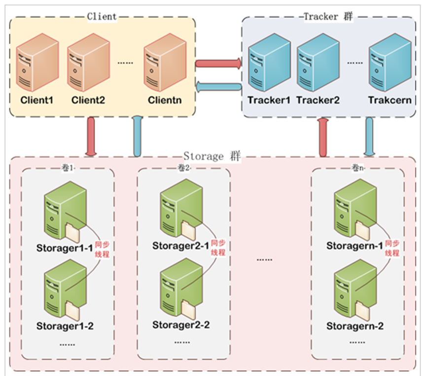
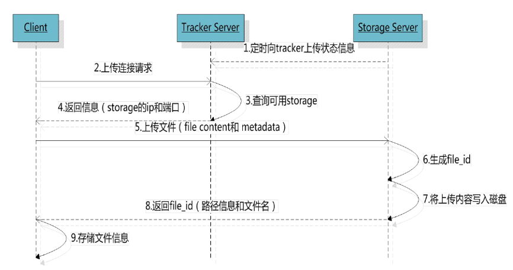
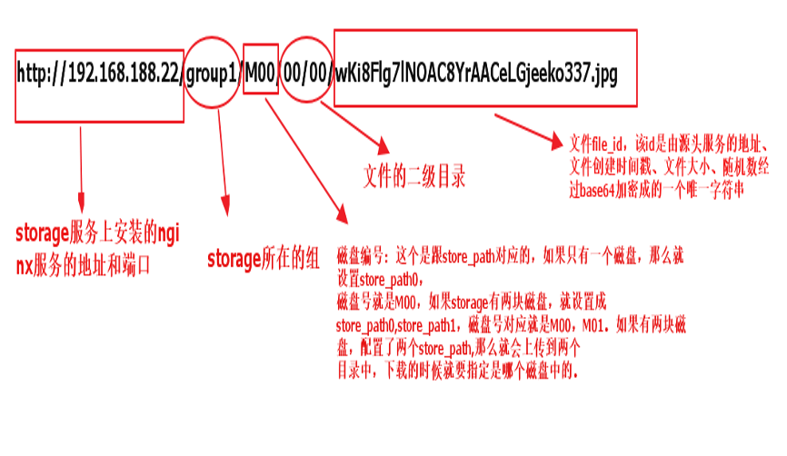
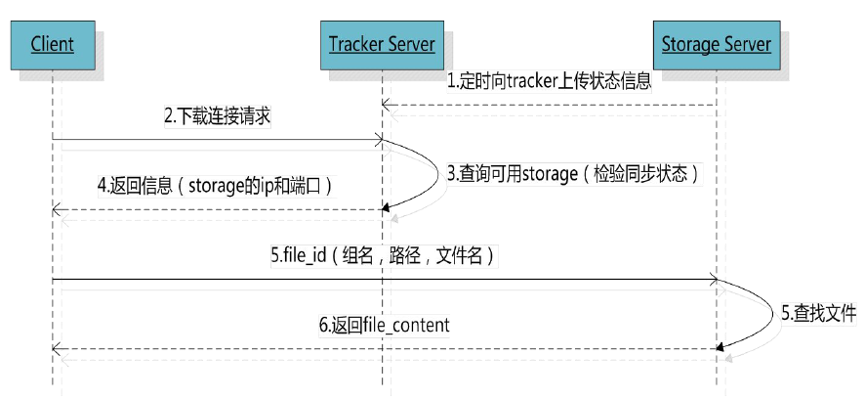

[TOC]

# fastdfs简介

FastDFS是用c语言编写的一款开源的分布式文件系统。FastDFS为互联网量身定制，充分考虑了冗余备份、负载均衡、线性扩容等机制，并注重高可用、高性能等指标，使用FastDFS很容易搭建一套高性能的文件服务器集群提供文件上传、下载等服务。由跟踪服务器（tracker server）、存储服务器（storage server）和客户端（client）组成。它主要解决的是海量数据存储的问题。

## fastDFS系统架构

FastDFS架构包括 Tracker server和Storage server。客户端请求Tracker server进行文件上传、下载，通过Tracker server调度最终由Storage server完成文件上传和下载。

Tracker server作用是负载均衡和调度，通过Tracker server在文件上传时可以根据一些策略找到Storage server提供文件上传服务。可以将tracker称为追踪服务器或调度服务器。

Storage server作用是文件存储，客户端上传的文件最终存储在Storage服务器上，Storage server没有实现自己的文件系统而是利用操作系统 的文件系统来管理文件。可以将storage称为存储服务器。

### Tracker集群

FastDFS集群中的Tracker server可以有多台，Tracker server之间是相互平等关系同时提供服务，Tracker server不存在单点故障。客户端请求Tracker server采用轮询方式，如果请求的tracker无法提供服务则换另一个tracker。

因此一般建议在两个tracker之前部署keepalived通过vip对外提供tracker的服务，或者在tracker之前使用负载均衡器，client通过访问负载均衡器访问到tracker。

### Storage集群

Storage集群采用了分组存储方式。storage集群由一个或多个组构成，集群存储总容量为集群中所有组的存储容量之和。一个组由一台或多台存储服务器组成，组内的Storage server之间是平等关系，不同组的Storage server之间不会相互通信，同组内的Storage server之间会相互连接进行文件同步，从而保证同组内每个storage上的文件完全一致的。一个组的存储容量为该组内存储服务器容量最小的那个，由此可见组内存储服务器的软硬件配置最好是一致的。

采用分组存储方式的好处是灵活、可控性较强。比如上传文件时，可以由客户端直接指定上传到的组也可以由tracker进行调度选择。一个分组的存储服务器访问压力较大时，可以在该组增加存储服务器来扩充服务能力（纵向扩容）。当系统容量不足时，可以增加组来扩充存储容量（横向扩容）。

### Storage的状态收集

Storage server会连接集群中所有的Tracker server，定时向他们报告自己的状态，包括磁盘剩余空间、文件同步状况、文件上传下载次数等统计信息。

标识 | 含义
- | -
INIT | 初始化，尚未得到同步已有数据的源服务器
WAIT_SYNC | 等待同步，已得到同步已有数据的源服务器
SYNCING | 同步中
DELETED | 已删除，该服务器从本组中摘除
OFFLINE | 离线
ONLINE | 在线，尚不能提供服务
ACTIVE | 在线，可以提供服务

### 文件上传流程

客户端上传文件后存储服务器将文件ID返回给客户端，此文件ID用于以后访问该文件的索引信息。文件索引信息包括：组名，磁盘编号，数据两级目录，文件名。这里的文件名是由文件上传的源头服务器、文件上传的时间戳、文件大小、随机数经过base64加密后的一个串。

* 组名：文件上传后所在的storage组名称，在文件上传成功后有storage服务器返回，需要客户端自行保存。
* 磁盘编号：storage配置的上传路store_path*与磁盘编号对应。如果配置了store_path0则是M00，如果配置了store_path1则是M01，以此类推。因为FastDFS支持多次盘上传，也就是说如果你的服务器有多块儿挂在磁盘，那么可以配置多个Store_path，如store_path0、store_path1..对应的磁盘编号就是M00、M01，这样在上传的时候会上传到多块磁盘上。
* 数据两级目录：storage服务器在每个虚拟磁盘路径下创建的两级目录，用于存储数据文件。
* 文件名：与文件上传时不同。是由存储服务器根据特定信息生成，文件名包含：源存储服务器IP地址、文件创建时间戳、文件大小、随机数和文件拓展名等信息。

### 文件下载流程

tracker根据请求的文件路径即文件ID 来快速定位文件。

比如请求下边的文件：

1. 通过组名tracker能够很快的定位到客户端需要访问的存储服务器组是group1，并选择合适的存储服务器提供客户端访问；
2. 选择完一台存储服务器后，存储服务器根据“磁盘编号M00”可以得知使用的是哪块磁盘是M00这块磁盘。由于M00对应的是store_path0,所以根据store_path0配置的路径就可以找到对应的目录。
3. 根据两级目录/02/44/和文件名就可以获取到对应的文件了。

**注意：由于FastDFS只提供了文件上传的服务并没有提供文件下载的接口，所以需要在storage上安装nginx来实现文件下载。**

# fastdfs集群部署

## 集群架构

### 架构描述-TrackerServer

每个tracker server互相平等，tracker server上部署nginx不是为了对外提供http文件下载接口，tracker上nginx只是起到负载均衡、反向代理的作用。tracker的nginx会反向代理转发至storage上的nginx。

### 架构描述-StorageServer

每台storage上也部署nginx，storage上的nginx与tracker上的nginx有区别，storage上的nginx需要安装FastDSF-nginx模块，此模块的作用是使用FastDFS和nginx进行整合，nginx对外提供http文件下载接口，注意：nginx只提供文件下载接口不提供上传接口。文件上传仍然通过java client API进行。

# fastdfs功能测试

# 调整集群规模

# fastdfs优化