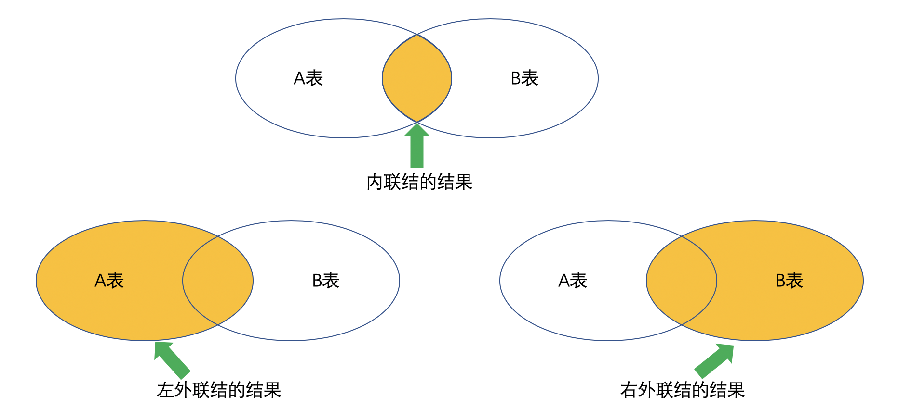

[TOC]

# 查询语句

## SELECT惯常用法

```
SELECT ...;
SELECT ... FROM ... WHERE ...;
SELECT ... FROM ... HAVING ...;
SELECT ... FROM ... ORDER BY ...;
SELECT ... FROM ... GROUP BY ... HAVING ...;
SELECT ... FROM ... WHERE ... GROUP BY ... LIMIT ...;
```

## SELECT语句的执行流程

```
SELECT DISTINCT  <select_list>
FROM             <left_table>
<join_type> JOIN <right_table>
ON               <join_condition>
WHERE            <where_condition>
GROUP BY         <group_by_list>
WITH             {CUBE | ROLLUP}
HAVING           <having_condition>
ORDER BY         <order_by_list>
LIMIT            <limit_number>
```

SELECT的处理流程：

1. FROM，对FROM子句中的左表<left_table>和右表<right_table>执行笛卡尔积（Cartesian product），产生虚拟表“VT1”。
2. ON，对虚拟表“VT1”应用ON筛选条件，只有那些符合<join_condition>的行才被插和虚表“VT2”中。
3. JOIN，如果指定了OUTER JOIN（如“LEFT OUTER JOIN”、“RIGHT OUTER JOIN”）那么保留表中未匹配的行作为外部行添加到虚氛表“VT2”中，产生虚拟表“VT3”。如果FROM子句包含两个以上表，则对上一个连接生成的结果表“VT3”和下一个表重复执行步骤1～步骤3，直到处理完成有的表为止。
4. WHERE，对虚拟表“VT3”应用WHERE过滤条件，只有符合<where_condition>的记录才被插入虚拟表VT4中。
5. GROUP BY，根据GROUP BY子句中的列，对“VT4”中的记录进行分组，产生“VT5”。
6. CUBE | ROLLUP，对表“VT5”进行CUBE或ROLLUP操作，产生表“VT6”。
7. HAVING，对虚拟表“VT6”应用HAVING过滤器，只有符合<having_condition>的记录才被插入虚拟表“VT7”中。
8. SELECT，第二次执行SELECT操作，选择指定的列，插入虚拟表“VT8”。
9. DISTINCT，去除重复数据，产生虚拟表“VT9”。
10. ORDER BY，将虚拟表“VT9”中的记录按照<order_by_list>进行排序操作，产生虚拟表“VT10”。
11. LIMIT，取出指定行的记录，产生虚拟表“VT11”，并返回组查询用户。

## 语法

```
SELECT
    [ALL | DISTINCT | DISTINCTROW ]
      [HIGH_PRIORITY]
      [STRAIGHT_JOIN]
      [SQL_SMALL_RESULT] [SQL_BIG_RESULT] [SQL_BUFFER_RESULT]
      [SQL_CACHE | SQL_NO_CACHE] [SQL_CALC_FOUND_ROWS]
    select_expr [, select_expr ...]
    [FROM table_references
      [PARTITION partition_list]
    [WHERE where_condition]
    [GROUP BY {col_name | expr | position}
      [ASC | DESC], ... [WITH ROLLUP]]
    [HAVING where_condition]
    [ORDER BY {col_name | expr | position}
      [ASC | DESC], ...]
    [LIMIT {[offset,] row_count | row_count OFFSET offset}]
    [PROCEDURE procedure_name(argument_list)]
    [INTO OUTFILE 'file_name'
        [CHARACTER SET charset_name]
        export_options
      | INTO DUMPFILE 'file_name'
      | INTO var_name [, var_name]]
    [FOR UPDATE | LOCK IN SHARE MODE]]
```

> 1. 在“SELECT”中使用“LIMIT [offset,] row_count”仍会遍历表中的前“offset”行。
> 2. 不建议在线上执行“SELECT”时使用“[ALL | DISTINCT | DISTINCTROW ]”、“[HIGH_PRIORITY]”、“[STRAIGHT_JOIN]”、“[SQL_SMALL_RESULT]”、“[SQL_BIG_RESULT]”、“[SQL_BUFFER_RESULT]”、“[SQL_CACHE | SQL_NO_CACHE]”和“[SQL_CALC_FOUND_ROWS]”这样的参数（其一，此类参数为非标准化的参数，其二，只有部分存储引擎支持此类操作）。
> 	注意：以下的SELECT语句修饰符一般用于MyISAM表中的查询中。
> 		a. DISTINCT用于指定结果相同的只显示一资。
> 		b. SQL_CACHE用于指定语句缓存于查询缓存中。
> 		c. SQL_NO_CACHE用于指定名句不缓存于查询缓存中。
> 3. 在使用“ASC”或“DESC”进行排序时不一定会创建临时表，如果排序的字段是索引，则不会创建临时表，否则就会创建临时表。

* select_expr [, select_expr ...]：指定要查询的字段。
* FROM table_references：指定从哪些表中进行查询操作。
* WHERE where_condition：指定查询时的过滤条件。
* GROUP BY {col_name | expr | position} [ASC | DESC], ... [WITH ROLLUP]：指定分组；
  * ASC：指定排序规则为升序。
  * DESC：指定排序规则为降序。
* HAVING where_condition：分组的条件。
* ORDER BY {col_name | expr | position} [ASC | DESC], ...：指定查询后的排序规则。
* LIMIT {[offset,] row_count | row_count OFFSET offset}：指定对查询后的结果予以显示，以指定显示的行以及偏移量。

### where条件表达式

```
WHERE EXPRESSION [{AND | OR }]

EXPRESSION：
column {OPERATOR value | IS NULL | IS NOT NULL | LIKE string | RLIKE pattern | REGEXP pattern | IN (value1,value2,...) | BETWEEN ... AND ...}
```

OPERATOR：

* =：等值比较。
* <=>：与空值比较不会产生意外情况。
* <>：不等值比较，也可使用!=表示相同含义。
* <：小于。
* <=：小于或等于。
* \>：大于。
* \>=：大于或等于。
* IS NULL：判断值是否为空。
* IS NOT NULL：判断是否非空。
* LIKE: 支持的通配符: %(任意长度的任意字符)，_（任意单个字符）。
* RLIKE, REGEXP: 支持使用正则表达式，仅做字符串比较，且性能较差。
* IN: 判断指定字段的值是否在给定在列表中。
* BETWEEN ... AND ...: 位于指定的范围之间，数值范围包括两端的数值。

多个表达式之间也支持组合使用：

* NOT, !
* AND, &&
* OR, ||
* XOR：异或运算。

# 联合查询

自然联结：

* 将两张表中的对应字段做等值关联，但实现等值联结的两个表中的字段不能为空，有一个为空则不会出现在最终结果里，且自然联结一般放在WHERE子句进之后，JOIN上的关联一般会通过外键来实现（或两表中有相同字段），以“employees”库为例（见示例1）。

内联结：

* 语法为：SELECT select_expr [, select_expr ...] FROM tb_name1 [INNER] JOIN tb_name2 {ON | WHERE} EXPRESSION...
* 在内联结中使用“ON”或“WHERE”来引用过滤条件的效果和执行方式都是一样的，见示例2。

左外联结：

* 以第一张表为标准则称之为左外连接，只保留出现在左外连接运算之前（左边）的关系中的记录，并以左表中的字段为准，如果右表中没有与之对应的对应字段则显示NULL（见示例3）。
* 语法为：SELECT select_expr [, select_expr ...] FROM tb_name1 LEFT [OUTER] JOIN tb_name2 ON EXPRESSION ...

右外联结：

* 以第二张表作为标准则称之为右外连接，只保留出现在右外连接运算之后（右边）的关系中的记录，并以右表中的字段为准，如果左表中没有与之对应的字段为空则显示NULL（见示例4）。



## 示例1——自然联结

```
mysql> select * from t11;
+----+
| id |
+----+
|  1 |
|  2 |
+----+
mysql> select * from t12;
+----+
| id |
+----+
|  1 |
|  2 |
|  3 |
|  4 |
+----+
mysql> select * from t11,t12;
+----+----+
| id | id |
+----+----+
|  1 |  1 |
|  2 |  1 |
|  1 |  2 |
|  2 |  2 |
|  1 |  3 |
|  2 |  3 |
|  1 |  4 |
|  2 |  4 |
+----+----+
```

以上即为笛卡尔乘积。

```
mysql> SELECT
    -> * 
    -> FROM
    -> titles,
    -> employees 
    -> WHERE
    -> titles.emp_no = employees.emp_no 
    -> LIMIT 1;
+--------+-----------------+------------+------------+--------+------------+------------+-----------+--------+------------+
| emp_no | title           | from_date  | to_date    | emp_no | birth_date | first_name | last_name | gender | hire_date  |
+--------+-----------------+------------+------------+--------+------------+------------+-----------+--------+------------+
|  10001 | Senior Engineer | 1986-06-26 | 9999-01-01 |  10001 | 1953-09-02 | Georgi     | Facello   | M      | 1986-06-26 |
+--------+-----------------+------------+------------+--------+------------+------------+-----------+--------+------------+
```

在上述结果中两张表是通过“employees.titles.emp_no = employees.employees.emp_no”进行关联的，并且其结果将两张表中的所有信息均展现出来了。

如仅显示两个表中的某几个字段可通过如下的SQL获取结果

```
mysql> SELECT
    -> titles.emp_no AS emp_no,
    -> CONCAT( employees.last_name, " ", employees.first_name ) AS NAME,
    -> titles.title AS title 
    -> FROM
    -> titles,
    -> employees 
    -> WHERE
    -> titles.emp_no = employees.emp_no 
    -> LIMIT 10;
+--------+-------------------+-----------------+
| emp_no | NAME              | title           |
+--------+-------------------+-----------------+
|  10001 | Facello Georgi    | Senior Engineer |
|  10002 | Simmel Bezalel    | Staff           |
|  10003 | Bamford Parto     | Senior Engineer |
|  10004 | Koblick Chirstian | Engineer        |
|  10004 | Koblick Chirstian | Senior Engineer |
|  10005 | Maliniak Kyoichi  | Senior Staff    |
|  10005 | Maliniak Kyoichi  | Staff           |
|  10006 | Preusig Anneke    | Senior Engineer |
|  10007 | Zielinski Tzvetan | Senior Staff    |
|  10007 | Zielinski Tzvetan | Staff           |
+--------+-------------------+-----------------+
```

## 示例2——内联结

```
mysql> SELECT
    -> t.emp_no AS id,
    -> CONCAT( e.first_name, " ", e.last_name ) AS NAME,
    -> t.title AS title,
    -> e.gender AS gender,
    -> e.birth_date AS birth_date 
    -> FROM
    -> titles AS t
    -> INNER JOIN employees AS e 
    -> WHERE
    -> t.emp_no = e.emp_no 
    -> ORDER BY
    -> e.birth_date 
    -> LIMIT 5;
+--------+-------------------+-----------------+--------+------------+
| id     | NAME              | title           | gender | birth_date |
+--------+-------------------+-----------------+--------+------------+
|  65308 | Jouni Pocchiola   | Senior Staff    | M      | 1952-02-01 |
|  65308 | Jouni Pocchiola   | Staff           | M      | 1952-02-01 |
|  87461 | Moni Decaestecker | Senior Engineer | M      | 1952-02-01 |
|  91374 | Eishiro Kuzuoka   | Engineer        | M      | 1952-02-01 |
| 207658 | Kiyokazu Whitcomb | Senior Engineer | M      | 1952-02-01 |
+--------+-------------------+-----------------+--------+------------+
```

内联结与自然联结在语法上的区别在于，自然联结使用“FROM tb1,tb2,... WHERE ...”而内联结使用“FROM tb1 INNER JOIN tb2 {WHERE|ON}...”的方式。

## 示例3——左外联结

```
mysql> create table t11 (id int not null);
mysql> create table t12 (id int not null);
mysql> insert into t11 (id) values (1),(2);
mysql> insert into t12 (id) values (1);
mysql> select * from t11;
+----+
| id |
+----+
|  1 |
|  2 |
+----+
mysql> select * from t12;
+----+
| id |
+----+
|  1 |
+----+

mysql> select * from t11 left join t12 on t11.id = t12.id ;
+----+------+
| id | id   |
+----+------+
|  1 |    1 |
|  2 | NULL |
+----+------+
```

以左表为准，左表中的数据全部显示，如左表中数据不满足“ON”条件则会在右表的区域中显示为“NULL”。

## 示例4——右外联结

```
mysql> create table t11 (id int not null);
mysql> create table t12 (id int not null);
mysql> insert into t11 (id) values (1),(2);
mysql> insert into t12 (id) values (1);
mysql> select * from t11;
+----+
| id |
+----+
|  1 |
|  2 |
+----+
mysql> select * from t12;
+----+
| id |
+----+
|  1 |
+----+

mysql> select * from t11 right join t12 on t11.id = t12.id;
+------+----+
| id   | id |
+------+----+
|    1 |  1 |
+------+----+
mysql> select * from t12 right join t11 on t11.id = t12.id;
+------+----+
| id   | id |
+------+----+
|    1 |  1 |
| NULL |  2 |
+------+----+
```

以右表为准，右表中的数据全部显示。

## 示例5——仅显示只在左表而不在右表中的数据

```
mysql> select * from t11;
+----+
| id |
+----+
|  1 |
|  2 |
+----+
mysql> select * from t12;
+----+
| id |
+----+
|  1 |
+----+

mysql> select * from t11 left join t12 on t11.id = t12.id where t12.id is null;
+----+------+
| id | id   |
+----+------+
|  2 | NULL |
+----+------+
```

查询employees库中基层员工的信息：

```
mysql> SELECT
    -> * 
    -> FROM
    -> employees AS e
    -> LEFT JOIN dept_manager AS m ON e.emp_no = m.emp_no 
    -> WHERE
    -> m.emp_no IS NULL
    -> LIMIT 10;
+--------+------------+------------+-----------+--------+------------+---------+--------+-----------+---------+
| emp_no | birth_date | first_name | last_name | gender | hire_date  | dept_no | emp_no | from_date | to_date |
+--------+------------+------------+-----------+--------+------------+---------+--------+-----------+---------+
|  10001 | 1953-09-02 | Georgi     | Facello   | M      | 1986-06-26 | NULL    |   NULL | NULL      | NULL    |
|  10002 | 1964-06-02 | Bezalel    | Simmel    | F      | 1985-11-21 | NULL    |   NULL | NULL      | NULL    |
|  10003 | 1959-12-03 | Parto      | Bamford   | M      | 1986-08-28 | NULL    |   NULL | NULL      | NULL    |
|  10004 | 1954-05-01 | Chirstian  | Koblick   | M      | 1986-12-01 | NULL    |   NULL | NULL      | NULL    |
|  10005 | 1955-01-21 | Kyoichi    | Maliniak  | M      | 1989-09-12 | NULL    |   NULL | NULL      | NULL    |
|  10006 | 1953-04-20 | Anneke     | Preusig   | F      | 1989-06-02 | NULL    |   NULL | NULL      | NULL    |
|  10007 | 1957-05-23 | Tzvetan    | Zielinski | F      | 1989-02-10 | NULL    |   NULL | NULL      | NULL    |
|  10008 | 1958-02-19 | Saniya     | Kalloufi  | M      | 1994-09-15 | NULL    |   NULL | NULL      | NULL    |
|  10009 | 1952-04-19 | Sumant     | Peac      | F      | 1985-02-18 | NULL    |   NULL | NULL      | NULL    |
|  10010 | 1963-06-01 | Duangkaew  | Piveteau  | F      | 1989-08-24 | NULL    |   NULL | NULL      | NULL    |
+--------+------------+------------+-----------+--------+------------+---------+--------+-----------+---------+
mysql> SELECT
    -> e.emp_no AS id,
    -> CONCAT( last_name, " ", first_name ) AS NAME,
    -> gender birth_date 
    -> FROM
    -> employees AS e
    -> LEFT JOIN dept_manager AS m ON e.emp_no = m.emp_no 
    -> WHERE
    -> m.emp_no IS NULL
    -> LIMIT 10;
+-------+--------------------+------------+
| id    | NAME               | birth_date |
+-------+--------------------+------------+
| 10001 | Facello Georgi     | M          |
| 10002 | Simmel Bezalel     | F          |
| 10003 | Bamford Parto      | M          |
| 10004 | Koblick Chirstian  | M          |
| 10005 | Maliniak Kyoichi   | M          |
| 10006 | Preusig Anneke     | F          |
| 10007 | Zielinski Tzvetan  | F          |
| 10008 | Kalloufi Saniya    | M          |
| 10009 | Peac Sumant        | F          |
| 10010 | Piveteau Duangkaew | F          |
+-------+--------------------+------------+
```

## 示例6——多表外联结查询

查询employees库中普通员的员工号、姓名、性别、生日、职称、职称的起止时间、薪资、薪资的起止时间、所在部门名称和所在部门的起止时间。

```
mysql> SELECT
    -> e.emp_no AS id,
    -> CONCAT( last_name, " ", first_name ) AS NAME,
    -> gender,
    -> birth_date,
    -> title,
    -> t.from_date,
    -> t.to_date,
    -> salary,
    -> s.from_date AS salarie_from,
    -> s.to_date AS salarie_to,
    -> dept_name,
    -> p_n.from_date AS dept_from,
    -> p_n.to_date AS dept_to
    -> FROM
    -> employees AS e
    -> LEFT JOIN dept_manager AS m ON e.emp_no = m.emp_no
    -> LEFT JOIN titles AS t ON e.emp_no = t.emp_no
    -> LEFT JOIN salaries AS s ON e.emp_no = s.emp_no
    -> LEFT JOIN dept_emp AS p_n ON e.emp_no = p_n.emp_no
    -> LEFT JOIN departments AS d ON p_n.dept_no = d.dept_no 
    -> WHERE m.emp_no IS NULL LIMIT 50;
+-------+-------------------+--------+------------+-----------------+------------+------------+--------+--------------+------------+-------------+------------+------------+
| id    | NAME              | gender | birth_date | title           | from_date  | to_date    | salary | salarie_from | salarie_to | dept_name   | dept_from  | dept_to    |
+-------+-------------------+--------+------------+-----------------+------------+------------+--------+--------------+------------+-------------+------------+------------+
| 10001 | Facello Georgi    | M      | 1953-09-02 | Senior Engineer | 1986-06-26 | 9999-01-01 |  60117 | 1986-06-26   | 1987-06-26 | Development | 1986-06-26 | 9999-01-01 |
| 10001 | Facello Georgi    | M      | 1953-09-02 | Senior Engineer | 1986-06-26 | 9999-01-01 |  62102 | 1987-06-26   | 1988-06-25 | Development | 1986-06-26 | 9999-01-01 |
| 10001 | Facello Georgi    | M      | 1953-09-02 | Senior Engineer | 1986-06-26 | 9999-01-01 |  66074 | 1988-06-25   | 1989-06-25 | Development | 1986-06-26 | 9999-01-01 |
| 10001 | Facello Georgi    | M      | 1953-09-02 | Senior Engineer | 1986-06-26 | 9999-01-01 |  66596 | 1989-06-25   | 1990-06-25 | Development | 1986-06-26 | 9999-01-01 |
| 10001 | Facello Georgi    | M      | 1953-09-02 | Senior Engineer | 1986-06-26 | 9999-01-01 |  66961 | 1990-06-25   | 1991-06-25 | Development | 1986-06-26 | 9999-01-01 |
| 10001 | Facello Georgi    | M      | 1953-09-02 | Senior Engineer | 1986-06-26 | 9999-01-01 |  71046 | 1991-06-25   | 1992-06-24 | Development | 1986-06-26 | 9999-01-01 |
| 10001 | Facello Georgi    | M      | 1953-09-02 | Senior Engineer | 1986-06-26 | 9999-01-01 |  74333 | 1992-06-24   | 1993-06-24 | Development | 1986-06-26 | 9999-01-01 |
| 10001 | Facello Georgi    | M      | 1953-09-02 | Senior Engineer | 1986-06-26 | 9999-01-01 |  75286 | 1993-06-24   | 1994-06-24 | Development | 1986-06-26 | 9999-01-01 |
| 10001 | Facello Georgi    | M      | 1953-09-02 | Senior Engineer | 1986-06-26 | 9999-01-01 |  75994 | 1994-06-24   | 1995-06-24 | Development | 1986-06-26 | 9999-01-01 |
| 10001 | Facello Georgi    | M      | 1953-09-02 | Senior Engineer | 1986-06-26 | 9999-01-01 |  76884 | 1995-06-24   | 1996-06-23 | Development | 1986-06-26 | 9999-01-01 |
| 10001 | Facello Georgi    | M      | 1953-09-02 | Senior Engineer | 1986-06-26 | 9999-01-01 |  80013 | 1996-06-23   | 1997-06-23 | Development | 1986-06-26 | 9999-01-01 |
| 10001 | Facello Georgi    | M      | 1953-09-02 | Senior Engineer | 1986-06-26 | 9999-01-01 |  81025 | 1997-06-23   | 1998-06-23 | Development | 1986-06-26 | 9999-01-01 |
| 10001 | Facello Georgi    | M      | 1953-09-02 | Senior Engineer | 1986-06-26 | 9999-01-01 |  81097 | 1998-06-23   | 1999-06-23 | Development | 1986-06-26 | 9999-01-01 |
| 10001 | Facello Georgi    | M      | 1953-09-02 | Senior Engineer | 1986-06-26 | 9999-01-01 |  84917 | 1999-06-23   | 2000-06-22 | Development | 1986-06-26 | 9999-01-01 |
| 10001 | Facello Georgi    | M      | 1953-09-02 | Senior Engineer | 1986-06-26 | 9999-01-01 |  85112 | 2000-06-22   | 2001-06-22 | Development | 1986-06-26 | 9999-01-01 |
| 10001 | Facello Georgi    | M      | 1953-09-02 | Senior Engineer | 1986-06-26 | 9999-01-01 |  85097 | 2001-06-22   | 2002-06-22 | Development | 1986-06-26 | 9999-01-01 |
| 10001 | Facello Georgi    | M      | 1953-09-02 | Senior Engineer | 1986-06-26 | 9999-01-01 |  88958 | 2002-06-22   | 9999-01-01 | Development | 1986-06-26 | 9999-01-01 |
| 10002 | Simmel Bezalel    | F      | 1964-06-02 | Staff           | 1996-08-03 | 9999-01-01 |  65828 | 1996-08-03   | 1997-08-03 | Sales       | 1996-08-03 | 9999-01-01 |
| 10002 | Simmel Bezalel    | F      | 1964-06-02 | Staff           | 1996-08-03 | 9999-01-01 |  65909 | 1997-08-03   | 1998-08-03 | Sales       | 1996-08-03 | 9999-01-01 |
| 10002 | Simmel Bezalel    | F      | 1964-06-02 | Staff           | 1996-08-03 | 9999-01-01 |  67534 | 1998-08-03   | 1999-08-03 | Sales       | 1996-08-03 | 9999-01-01 |
| 10002 | Simmel Bezalel    | F      | 1964-06-02 | Staff           | 1996-08-03 | 9999-01-01 |  69366 | 1999-08-03   | 2000-08-02 | Sales       | 1996-08-03 | 9999-01-01 |
| 10002 | Simmel Bezalel    | F      | 1964-06-02 | Staff           | 1996-08-03 | 9999-01-01 |  71963 | 2000-08-02   | 2001-08-02 | Sales       | 1996-08-03 | 9999-01-01 |
| 10002 | Simmel Bezalel    | F      | 1964-06-02 | Staff           | 1996-08-03 | 9999-01-01 |  72527 | 2001-08-02   | 9999-01-01 | Sales       | 1996-08-03 | 9999-01-01 |
| 10003 | Bamford Parto     | M      | 1959-12-03 | Senior Engineer | 1995-12-03 | 9999-01-01 |  40006 | 1995-12-03   | 1996-12-02 | Production  | 1995-12-03 | 9999-01-01 |
| 10003 | Bamford Parto     | M      | 1959-12-03 | Senior Engineer | 1995-12-03 | 9999-01-01 |  43616 | 1996-12-02   | 1997-12-02 | Production  | 1995-12-03 | 9999-01-01 |
| 10003 | Bamford Parto     | M      | 1959-12-03 | Senior Engineer | 1995-12-03 | 9999-01-01 |  43466 | 1997-12-02   | 1998-12-02 | Production  | 1995-12-03 | 9999-01-01 |
| 10003 | Bamford Parto     | M      | 1959-12-03 | Senior Engineer | 1995-12-03 | 9999-01-01 |  43636 | 1998-12-02   | 1999-12-02 | Production  | 1995-12-03 | 9999-01-01 |
| 10003 | Bamford Parto     | M      | 1959-12-03 | Senior Engineer | 1995-12-03 | 9999-01-01 |  43478 | 1999-12-02   | 2000-12-01 | Production  | 1995-12-03 | 9999-01-01 |
| 10003 | Bamford Parto     | M      | 1959-12-03 | Senior Engineer | 1995-12-03 | 9999-01-01 |  43699 | 2000-12-01   | 2001-12-01 | Production  | 1995-12-03 | 9999-01-01 |
| 10003 | Bamford Parto     | M      | 1959-12-03 | Senior Engineer | 1995-12-03 | 9999-01-01 |  43311 | 2001-12-01   | 9999-01-01 | Production  | 1995-12-03 | 9999-01-01 |
| 10004 | Koblick Chirstian | M      | 1954-05-01 | Engineer        | 1986-12-01 | 1995-12-01 |  40054 | 1986-12-01   | 1987-12-01 | Production  | 1986-12-01 | 9999-01-01 |
| 10004 | Koblick Chirstian | M      | 1954-05-01 | Engineer        | 1986-12-01 | 1995-12-01 |  42283 | 1987-12-01   | 1988-11-30 | Production  | 1986-12-01 | 9999-01-01 |
| 10004 | Koblick Chirstian | M      | 1954-05-01 | Engineer        | 1986-12-01 | 1995-12-01 |  42542 | 1988-11-30   | 1989-11-30 | Production  | 1986-12-01 | 9999-01-01 |
| 10004 | Koblick Chirstian | M      | 1954-05-01 | Engineer        | 1986-12-01 | 1995-12-01 |  46065 | 1989-11-30   | 1990-11-30 | Production  | 1986-12-01 | 9999-01-01 |
| 10004 | Koblick Chirstian | M      | 1954-05-01 | Engineer        | 1986-12-01 | 1995-12-01 |  48271 | 1990-11-30   | 1991-11-30 | Production  | 1986-12-01 | 9999-01-01 |
| 10004 | Koblick Chirstian | M      | 1954-05-01 | Engineer        | 1986-12-01 | 1995-12-01 |  50594 | 1991-11-30   | 1992-11-29 | Production  | 1986-12-01 | 9999-01-01 |
| 10004 | Koblick Chirstian | M      | 1954-05-01 | Engineer        | 1986-12-01 | 1995-12-01 |  52119 | 1992-11-29   | 1993-11-29 | Production  | 1986-12-01 | 9999-01-01 |
| 10004 | Koblick Chirstian | M      | 1954-05-01 | Engineer        | 1986-12-01 | 1995-12-01 |  54693 | 1993-11-29   | 1994-11-29 | Production  | 1986-12-01 | 9999-01-01 |
| 10004 | Koblick Chirstian | M      | 1954-05-01 | Engineer        | 1986-12-01 | 1995-12-01 |  58326 | 1994-11-29   | 1995-11-29 | Production  | 1986-12-01 | 9999-01-01 |
| 10004 | Koblick Chirstian | M      | 1954-05-01 | Engineer        | 1986-12-01 | 1995-12-01 |  60770 | 1995-11-29   | 1996-11-28 | Production  | 1986-12-01 | 9999-01-01 |
| 10004 | Koblick Chirstian | M      | 1954-05-01 | Engineer        | 1986-12-01 | 1995-12-01 |  62566 | 1996-11-28   | 1997-11-28 | Production  | 1986-12-01 | 9999-01-01 |
| 10004 | Koblick Chirstian | M      | 1954-05-01 | Engineer        | 1986-12-01 | 1995-12-01 |  64340 | 1997-11-28   | 1998-11-28 | Production  | 1986-12-01 | 9999-01-01 |
| 10004 | Koblick Chirstian | M      | 1954-05-01 | Engineer        | 1986-12-01 | 1995-12-01 |  67096 | 1998-11-28   | 1999-11-28 | Production  | 1986-12-01 | 9999-01-01 |
| 10004 | Koblick Chirstian | M      | 1954-05-01 | Engineer        | 1986-12-01 | 1995-12-01 |  69722 | 1999-11-28   | 2000-11-27 | Production  | 1986-12-01 | 9999-01-01 |
| 10004 | Koblick Chirstian | M      | 1954-05-01 | Engineer        | 1986-12-01 | 1995-12-01 |  70698 | 2000-11-27   | 2001-11-27 | Production  | 1986-12-01 | 9999-01-01 |
| 10004 | Koblick Chirstian | M      | 1954-05-01 | Engineer        | 1986-12-01 | 1995-12-01 |  74057 | 2001-11-27   | 9999-01-01 | Production  | 1986-12-01 | 9999-01-01 |
| 10004 | Koblick Chirstian | M      | 1954-05-01 | Senior Engineer | 1995-12-01 | 9999-01-01 |  40054 | 1986-12-01   | 1987-12-01 | Production  | 1986-12-01 | 9999-01-01 |
| 10004 | Koblick Chirstian | M      | 1954-05-01 | Senior Engineer | 1995-12-01 | 9999-01-01 |  42283 | 1987-12-01   | 1988-11-30 | Production  | 1986-12-01 | 9999-01-01 |
| 10004 | Koblick Chirstian | M      | 1954-05-01 | Senior Engineer | 1995-12-01 | 9999-01-01 |  42542 | 1988-11-30   | 1989-11-30 | Production  | 1986-12-01 | 9999-01-01 |
| 10004 | Koblick Chirstian | M      | 1954-05-01 | Senior Engineer | 1995-12-01 | 9999-01-01 |  46065 | 1989-11-30   | 1990-11-30 | Production  | 1986-12-01 | 9999-01-01 |
+-------+-------------------+--------+------------+-----------------+------------+------------+--------+--------------+------------+-------------+------------+------------+
```

# 分组查询

通过对指定列内的内容按某个条件进行分类，每个类别即为一个组。

如需对分组后的结果进行条件过滤则需要使用“HAVING”子名实现，如果在“HAVING”之前使用了“ON”和“WHERE”进行条件过滤，则“HAVING”是最后一个过滤器。

## 示例1——单表内字段分组

查询各职称的历任人次。

```
mysql> SELECT
    -> title,
    -> COUNT( emp_no ) AS count
    -> FROM
    -> titles 
    -> GROUP BY
    -> title;
+--------------------+--------+
| title              | count  |
+--------------------+--------+
| Assistant Engineer |  15128 |
| Engineer           | 115003 |
| Manager            |     24 |
| Senior Engineer    |  97750 |
| Senior Staff       |  92853 |
| Staff              | 107391 |
| Technique Leader   |  15159 |
+--------------------+--------+
```

## 示例2——多表联合查询并分组

查询employees表中每个部门的员工数。

```
mysql> SELECT
    -> dept_name,
    -> COUNT( e.emp_no ) AS count 
    -> FROM
    -> employees AS e
    -> INNER JOIN dept_emp AS p_n ON e.emp_no = p_n.emp_no
    -> INNER JOIN departments as d on p_n.dept_no = d.dept_no
    -> GROUP BY
    -> p_n.dept_no;
+--------------------+-------+
| dept_name          | count |
+--------------------+-------+
| Marketing          | 20211 |
| Finance            | 17346 |
| Human Resources    | 17786 |
| Production         | 73485 |
| Development        | 85707 |
| Quality Management | 20117 |
| Sales              | 52245 |
| Research           | 21126 |
| Customer Service   | 23580 |
+--------------------+-------+
```

## 示例3——对字段处理后分组

查询employees库中员工大于30000人的部门的名称。

```
mysql> SELECT
    -> dept_name,
    -> COUNT( e.emp_no ) AS count 
    -> FROM
    -> employees AS e
    -> INNER JOIN dept_emp AS p_n ON e.emp_no = p_n.emp_no
    -> INNER JOIN departments AS d ON p_n.dept_no = d.dept_no 
    -> GROUP BY
    -> p_n.dept_no 
    -> HAVING
    -> COUNT( e.emp_no ) > 30000;
+-------------+-------+
| dept_name   | count |
+-------------+-------+
| Production  | 73485 |
| Development | 85707 |
| Sales       | 52245 |
+-------------+-------+
```

## 示例4——单表多字段分组查询

在dbt3库中查询每个顾客，每个月的订单数。

```
mysql> SELECT
    -> o_orderkey,
    -> o_custkey,
    -> count( o_orderkey ),
    -> DATE_FORMAT( o_orderDATE, "%Y-%m" ) AS 'YYYY-MM' 
    -> FROM
    -> orders 
    -> GROUP BY
    -> o_custkey,
    -> DATE_FORMAT( o_orderDATE, "%Y-%m" ) 
    -> LIMIT 10;
+------------+-----------+---------------------+---------+
| o_orderkey | o_custkey | count( o_orderkey ) | YYYY-MM |
+------------+-----------+---------------------+---------+
|     454791 |         1 |                   1 | 1992-04 |
|    3868359 |         1 |                   1 | 1992-08 |
|    4808192 |         1 |                   1 | 1996-06 |
|    5133509 |         1 |                   1 | 1996-07 |
|     579908 |         1 |                   1 | 1996-12 |
|    4273923 |         1 |                   1 | 1997-03 |
|    1374019 |         2 |                   1 | 1992-04 |
|    2992930 |         2 |                   1 | 1994-05 |
|    1763205 |         2 |                   1 | 1994-08 |
|     430243 |         2 |                   1 | 1994-12 |
+------------+-----------+---------------------+---------+
```

# 子查询

子查询就是在一个SELECT内部嵌套另一个SELECT语句。

```
SELECT * FROM t1 WHERE column1 = (SELECT column1 FROM t2)
```

其中“SELECT * FROM t1”是外部查询，“SELECT column1 FROM t2”是子查询。实际使用过程中也可以将两个或两个以上的子查询进行嵌套使用。

**注意：子查询必需包含括号。**

语法：

```
operand comparison_operator ANY (subquery)
operand IN (subquery)
operand comparison_operator SOME (subquery)
operand comparison_operator ALL (subquery)
```

> * ANY：对于在子查询返回的列中的任一数值，如果比较结果为TRUE的话，则返回为TRUE
>   * SELECT s1 FROM t1 WHERE s1 > ANY (SELECT s1 FROM t2);
>
> * SOME = ANY
>
> * “IN”等同于“= ANY”，如下：
>   * SELECT s1 FROM t1 WHERE s1 = ANY (SELECT s1 FROM t2);
>   * SELECT s1 FROM t1 WHERE s1 IN (SELECT s1 FROM t2);
>
> * ALL：对于子查询返回的列中的所有值，如果比较结果为TRUE，则返回TRUE
>
> * “NOT IN”等同于“<> ALL”
>   * SELECT s1 FROM t1 WHERE s1 > ALL (SELECT s1 FROM t2);

在MySQL中NULL是一个不确定的值，如下：

```
mysql> SELECT NULL IN ("A","B",NULL);
+------------------------+
| NULL IN ("A","B",NULL) |
+------------------------+
|                   NULL |
+------------------------+

mysql> SELECT NULL NOT IN ("A","B",NULL);
+----------------------------+
| NULL NOT IN ("A","B",NULL) |
+----------------------------+
|                       NULL |
+----------------------------+

mysql> SELECT "C" NOT IN ("A","B",NULL);    
+---------------------------+
| "C" NOT IN ("A","B",NULL) |
+---------------------------+
|                      NULL |
+---------------------------+
```

* NULL和NULL的比较永远为NULL。
* 其他值和NULL比较永远为NULL。

## 独立子查询

不依赖外部查询而运行的子查询。

```
mysql> SELECT
    -> customerid 
    -> FROM
    -> orders 
    -> WHERE
    -> employeeid IN ( 1, 2, 3, 4, 8 ) 
    -> GROUP BY
    -> customerid HANING COUNT( DISTINCT employeeid ) = 5;
```

此处的IN所使用的条件是单独指定的，而不是通过外部查询得来的，因此为独立子查询。

## 相关子查询

引用了外部查询列的子查询。

```
mysql> SELECT
    -> orderid,
    -> customerid,
    -> employeeid,
    -> orderdate,
    -> requiredate 
    -> FROM
    -> orders 
    -> WHERE
    -> orderdate IN ( SELECT MAX( orderdate ) FROM orders GROUP BY employeeid );
```

## 子查询的优化

MySQL IN优化器不完善，一般建议重写成“JOIN”。

```
优化前的语句：
    SELECT ... FROM t1 WHERE t1.a IN (SELECT b FROM t2);
    
优化后的语句：
    SELECT ... FROM t1 WHERE EXISTS (SELECT 1 FROM t2 WHERE t2.b = t1.a);
```

1. 统计employees库下基础员工的姓名、title、部门和薪资。

2. 统计dbt3库下orders每周每个客户的订单数量。
3. 通过子查询或者其他方法计算出employees的行号问题。

### 示例——子查询

查询dbt3库中每个月最一天实际的订单的详情。

```
mysql> SELECT * 
    -> FROM orders WHERE o_orderDATE IN (
    -> SELECT
    -> max( o_orderDATE ) FROM orders 
    -> GROUP BY DATE_FORMAT( o_orderDATE, "%Y-%m" )) 
    -> LIMIT 10;
+------------+-----------+---------------+--------------+-------------+-----------------+-----------------+----------------+---------------------------------------------------------------------------+
| o_orderkey | o_custkey | o_orderstatus | o_totalprice | o_orderDATE | o_orderpriority | o_clerk         | o_shippriority | o_comment                                                                 |
+------------+-----------+---------------+--------------+-------------+-----------------+-----------------+----------------+---------------------------------------------------------------------------+
|        100 |    147004 | O             |    187782.63 | 1998-02-28  | 4-NOT SPECIFIED | Clerk#000000577 |              0 | regular deposits sleep closely regular, regular packages. carefully si    |
|        161 |     16619 | F             |     34439.93 | 1994-08-31  | 2-HIGH          | Clerk#000000322 |              0 | ironic, even attainments cajole closely                                   |
|        353 |      1777 | F             |    249710.43 | 1993-12-31  | 5-LOW           | Clerk#000000449 |              0 | even ideas haggle excuses? slyly ironic packages wake alongside of the qu |
|        356 |    146809 | F             |    209439.04 | 1994-06-30  | 4-NOT SPECIFIED | Clerk#000000944 |              0 | fluffily pending theo                                                     |
|        420 |     90145 | O             |    343254.06 | 1995-10-31  | 4-NOT SPECIFIED | Clerk#000000756 |              0 | slyly final deposits sublate after the quickly pending deposits           |
|        422 |     73075 | O             |    188124.81 | 1997-05-31  | 4-NOT SPECIFIED | Clerk#000000049 |              0 | carefully even packages use                                               |
|        519 |     62953 | O             |    161219.18 | 1997-10-31  | 1-URGENT        | Clerk#000000985 |              0 | quick depths are! slyly express requests along the carefully ironic       |
|        675 |     11704 | O             |    206195.97 | 1997-07-31  | 2-HIGH          | Clerk#000000168 |              0 | fluffily special accounts sublate packages. furiously express package     |
|        739 |       307 | O             |    243259.37 | 1998-05-31  | 5-LOW           | Clerk#000000900 |              0 | carefully thin packages against the regular orbits haggle slyly fina      |
|        966 |     13306 | O             |    163834.51 | 1998-04-30  | 2-HIGH          | Clerk#000000239 |              0 | carefully ironic the                                                      |
+------------+-----------+---------------+--------------+-------------+-----------------+-----------------+----------------+---------------------------------------------------------------------------+

mysql> SELECT
    -> max( o_orderDATE ) FROM orders 
    -> GROUP BY DATE_FORMAT( o_orderDATE, "%Y-%m" ) LIMIT 10;
+--------------------+
| max( o_orderDATE ) |
+--------------------+
| 1992-01-31         |
| 1992-02-29         |
| 1992-03-31         |
| 1992-04-30         |
| 1992-05-31         |
| 1992-06-30         |
| 1992-07-31         |
| 1992-08-31         |
| 1992-09-30         |
| 1992-10-31         |
+--------------------+

mysql> EXPLAIN EXTENDED SELECT*FROM orders WHERE o_orderDATE IN ( SELECT max(o_orderDATE) FROM orders GROUP BY DATE_FORMAT(o_orderDATE,"%Y-%m")) LIMIT 10;
+----+-------------+--------+------------+-------+---------------+---------------+---------+------+---------+----------+----------------------------------------------+
| id | select_type | table  | partitions | type  | possible_keys | key           | key_len | ref  | rows    | filtered | Extra                                        |
+----+-------------+--------+------------+-------+---------------+---------------+---------+------+---------+----------+----------------------------------------------+
|  1 | PRIMARY     | orders | NULL       | ALL   | NULL          | NULL          | NULL    | NULL | 1410558 |   100.00 | Using where                                  |
|  2 | SUBQUERY    | orders | NULL       | index | i_o_orderdate | i_o_orderdate | 4       | NULL | 1410558 |   100.00 | Using index; Using temporary; Using filesort |
+----+-------------+--------+------------+-------+---------------+---------------+---------+------+---------+----------+----------------------------------------------+
mysql> SHOW WARNINGS\G
*************************** 1. row ***************************
  Level: Warning
   Code: 1681
Message: 'EXTENDED' is deprecated and will be removed in a future release.
*************************** 2. row ***************************
  Level: Note
   Code: 1003
Message: /* select#1 */ select `dbt3`.`orders`.`o_orderkey` AS `o_orderkey`,`dbt3`.`orders`.`o_custkey` AS `o_custkey`,`dbt3`.`orders`.`o_orderstatus` AS `o_orderstatus`,`dbt3`.`orders`.`o_totalprice` AS `o_totalprice`,`dbt3`.`orders`.`o_orderDATE` AS `o_orderDATE`,`dbt3`.`orders`.`o_orderpriority` AS `o_orderpriority`,`dbt3`.`orders`.`o_clerk` AS `o_clerk`,`dbt3`.`orders`.`o_shippriority` AS `o_shippriority`,`dbt3`.`orders`.`o_comment` AS `o_comment` from `dbt3`.`orders` where <in_optimizer>(`dbt3`.`orders`.`o_orderDATE`,`dbt3`.`orders`.`o_orderDATE` in ( <materialize> (/* select#2 */ select max(`dbt3`.`orders`.`o_orderDATE`) from `dbt3`.`orders` group by date_format(`dbt3`.`orders`.`o_orderDATE`,'%Y-%m') having 1 ), <primary_index_lookup>(`dbt3`.`orders`.`o_orderDATE` in <temporary table> on <auto_key> where ((`dbt3`.`orders`.`o_orderDATE` = `materialized-subquery`.`max(o_orderDATE)`))))) limit 10
```

# UNION

MySQL UNION 操作符用于连接两个以上的 SELECT 语句的结果组合到一个结果集合中。多个 SELECT 语句会删除重复的数据。

但如果使用UNION ALL则不会对重复的结果去重。

