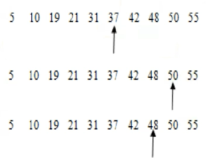
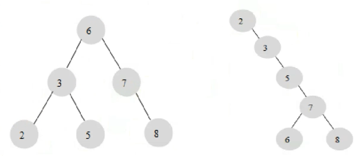
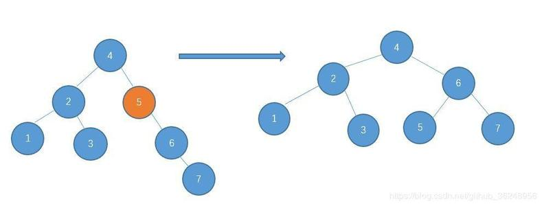
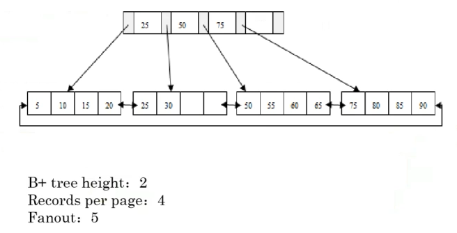
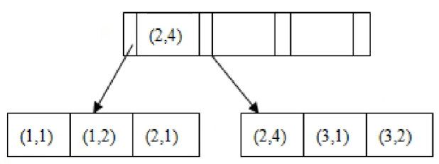

[TOC]

# 概述

MySQL中除了B+树索引还有其他的索引类型，全文索引和地理索引，在MySQL Cluster中使用的是T树索引，在Memory存储引擎中使用的是hash索引。

创建索引的语法：

```
语法1：
ALTER TALBE tbl_name ADD {INDEX|KEY} [index_name] [index_type] (key_part,...) [index_option] ...

语法2：
CREATE [UNIQUE | FULLTEXT | SPATIAL] INDEX index_name
    [index_type]
    ON tbl_name (key_part,...)
    [index_option]
    [algorithm_option | lock_option] ...

key_part:
    col_name [(length)] [ASC | DESC]

index_option:
    KEY_BLOCK_SIZE [=] value
  | index_type
  | WITH PARSER parser_name
  | COMMENT 'string'

index_type:
    USING {BTREE | HASH}

algorithm_option:
    ALGORITHM [=] {DEFAULT | INPLACE | COPY}

lock_option:
    LOCK [=] {DEFAULT | NONE | SHARED | EXCLUSIVE}
```

# 索引的数据结构

## 二叉查找法

* 对有序的数组中进行查找
* 找到数组中的中间节点
  * 如果要查找的值就是这个中间节点，则返回查找的结果；
  * 如果比中间节点小则查找左侧的数据中的中间节点，从此递归进行查找；
  * 如果比中间节点大则查找右侧的数据；

如果在以下数组中查找出48的值（5、10、19、21、31、37、42、48、50、52）。



顺序查找的平均代价：(1+2+3+4+5+6+7+8+9+10)/10=5.5

二分查找法的平均代价：(4+3+2+4+3+1+4+3+2+3)/10=2.9



根据二叉查找法可以构建出多种类型的二叉查找树，左右两颗二叉查找树均符合二叉查找树的定义，而左侧的二叉查找树的性能是比较好的（平衡二叉树）。

平衡二叉树的定义是两侧子树的高度的比例在1以内。

而为了保证二叉树的平衡，就需要实时的维护这颗树，这类操作即为旋转，因此为了保证二叉树的平衡在数据插入的时候会有一些额外的开销。



## B+树

* B+树的主要目的是为了在基于块设备的存储的环境下有效的数据存储和数据查找；
* 对比B树，B+树中所有数据都是存放在叶子节点中；
* B+树有非常高的扇出（通常是要大于100），可以有效的减少I/O的次数。



扇出：非叶节点指向叶子节点的指针的数量。

在数据库中，每个叶子节点都是存放一条完整的记录，非叶节点是存放key和point（指针），每个point固定为6个字节，key即为索引所在的字段的内容。

读取每个页中所有内容的时间由磁盘I/O决定，无论要读取一个页内多少内容其消耗的时间都是一样的。

如果在B+树中的填充率小于50%，则会左右兄弟节点进行合并。

在B+树中进行分裂的开销是非常大的，因此要尽量避免，在InnoDB中会在每个叶节点中预留一部分存储空间。

## 查看表的索引

```
通过查看表结构可看出表的索引列：
mysql> DESC child;
+-----------+---------+------+-----+---------+----------------+
| Field     | Type    | Null | Key | Default | Extra          |
+-----------+---------+------+-----+---------+----------------+
| child_id  | int(11) | NO   | PRI | NULL    | auto_increment |
| parent_id | int(11) | YES  | MUL | NULL    |                |
+-----------+---------+------+-----+---------+----------------+

查看指定表的索引详细信息：
mysql> show index from child \G
*************************** 1. row ***************************
        Table: child
   Non_unique: 0
     Key_name: PRIMARY
 Seq_in_index: 1
  Column_name: child_id
    Collation: A
  Cardinality: 0
     Sub_part: NULL
       Packed: NULL
         Null:
   Index_type: BTREE
      Comment:
Index_comment:
*************************** 2. row ***************************
        Table: child
   Non_unique: 1
     Key_name: par_id
 Seq_in_index: 1
  Column_name: parent_id
    Collation: A
  Cardinality: 0
     Sub_part: NULL
       Packed: NULL
         Null: YES
   Index_type: BTREE
      Comment:
Index_comment:
```

Cardinality：表示这个列上不重复的值的数量，一般要求这个值要尽可能大，而通过“show index from tb_name”所查看到的“Cardinality”是一个比较精确的预估值（通过采样从而实现预估）。

Seq_in_index：表示该列在复合索引中的位置，而在复合索引中第一个列的Cardinality即为这个列中不重复的值的数量，在复合索引中第二个列的Cardinality即为前两个列组合不重复的值的数量。



如针对(a,b)创建索引，则在这个索引中即对a列进行了排序，也针对(a,b)进行了排序，但对于b列却没有排序。

```
SELECT * FROM tb WHERE a = ?;
SELECT * FROM tb WHERE a = ? AND b = ?;
以上的查询均会使用(a,b)的复合索引。

SELECT * FROM tb WHERE b = ?;
SELECT * FROM tb WHERE a = ? OR b = ?;
以上的查询是不会用到(a,b)的复合索引。

SELECT a FROM tb WHERE b = ?;
以上的查询的条件虽然是b，但由于查询的结果在这个复合索引中即可得到，因此也会使用这个复合索引。
```


## 基于什么原则来创建索引

* 在查询中用于条件判断的列；
* 作为索引的列应该是高选择性的。

在information_schema.key_column_usage表中保存有哪些列会使用到索引。

### 如何查看索引的选择性

Information_schema.tables表中包含有表的行数，而information_schema.statistics表中具有每张表中索引的cardinality，但在复合索引中，一个索引会有多个不同cardinality，因此取出最大的seq_in_index的cardinality的值，使用这个值来除以表的行数才是真正的索引的选择性。

```
mysql> SELECT
    -> t.TABLE_SCHEMA,t.TABLE_NAME,INDEX_NAME,CARDINALITY,TABLE_ROWS,CARDINALITY / TABLE_ROWS AS SELECTIVITY -- 得到选择性
    -> FROM
    -> TABLES t,-- 查询的表一，TABLES
    -> (SELECT table_schema,table_name,index_name,cardinality FROM STATISTICS
    -> WHERE ( table_schema, table_name, index_name, seq_in_index ) IN (SELECT table_schema,table_name,index_name,MAX( seq_in_index )
    -> FROM
    -> STATISTICS GROUP BY table_schema,table_name,index_name ) ) s -- 查询的表二，就是上面3.2的查询结果
    -> WHERE
    -> t.table_schema = s.table_schema -- 通过库关联
    -> AND t.table_name = s.table_name -- 再通过表变量
    -> AND t.table_schema = 'employees' -- 指定某一个库名
    -> ORDER BY
    -> SELECTIVITY;
+--------------+--------------+------------+-------------+------------+-------------+
| TABLE_SCHEMA | TABLE_NAME   | index_name | cardinality | TABLE_ROWS | SELECTIVITY |
+--------------+--------------+------------+-------------+------------+-------------+
| employees    | dept_emp     | dept_no    |           8 |     330400 |      0.0000 |
| employees    | salaries     | emp_no     |      303649 |    2742673 |      0.1107 |
| employees    | dept_manager | dept_no    |           9 |         24 |      0.3750 |
| employees    | titles       | emp_no     |      301627 |     441247 |      0.6836 |
| employees    | dept_emp     | emp_no     |      299598 |     330400 |      0.9068 |
| employees    | salaries     | PRIMARY    |     2742485 |    2742673 |      0.9999 |
| employees    | dept_emp     | PRIMARY    |      330400 |     330400 |      1.0000 |
| employees    | dept_manager | PRIMARY    |          24 |         24 |      1.0000 |
| employees    | departments  | PRIMARY    |           9 |          9 |      1.0000 |
| employees    | employees    | PRIMARY    |      298303 |     298303 |      1.0000 |
| employees    | titles       | PRIMARY    |      441247 |     441247 |      1.0000 |
| employees    | dept_manager | emp_no     |          24 |         24 |      1.0000 |
| employees    | departments  | dept_name  |           9 |          9 |      1.0000 |
+--------------+--------------+------------+-------------+------------+-------------+
```

除此之外可以查看sys.x$schema_index_statistics表用于查看指定表使用索引的情况。

```
mysql> select * from x$schema_index_statistics where table_schema = 'employees' limit 1 \G
*************************** 1. row ***************************
  table_schema: employees
    table_name: dept_emp
    index_name: PRIMARY
 rows_selected: 23901125
select_latency: 43499290090340
 rows_inserted: 0
insert_latency: 0
  rows_updated: 0
update_latency: 0
  rows_deleted: 0
delete_latency: 0
```

每个索引都是需要排序的，而维护这个顺序是会产生额外的开销的，如果索引建的过多则会导致插入的速度变慢。

mysql 5.7版本中的sys库其实就是视图，是基于performance_schema中的内容计算得来的。这个sys库是源自于github上名为mysql-sys的开源项目。


**查询当前线上没有主键的用户表。**

```
mysql> SELECT table_schema,
               table_name
        FROM information_schema.`TABLES`
        WHERE TABLE_NAME NOT IN (
            SELECT DISTINCT TABLE_NAME
            FROM information_schema.`COLUMNS`
            WHERE COLUMN_KEY = 'PRI'
        )
          AND TABLE_SCHEMA NOT IN ('mysql', 'information_schema', 'sys', 'performance_schema');
+--------------+---------------------+
| table_schema | table_name          |
+--------------+---------------------+
| c5web        | dc3                 |
| c5web        | oauth_access_token  |
| c5web        | oauth_approvals     |
| c5web        | oauth_client_token  |
| c5web        | oauth_refresh_token |
| c5web        | s_national_region   |
| c5web        | v_vehicletype       |
+--------------+---------------------+
```

