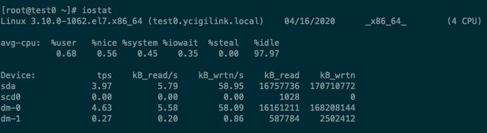
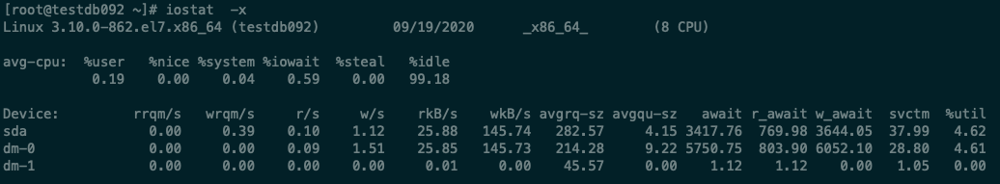

[TOC]

# EXPLAIN

显示SQL语句的执行计划。

```
{EXPLAIN | DESCRIBE | DESC}
    tbl_name [col_name | wild]

{EXPLAIN | DESCRIBE | DESC}
    [explain_type]
    {explainable_stmt | FOR CONNECTION connection_id}

explain_type: {
    EXTENDED
  | PARTITIONS
  | FORMAT = format_name
}

format_name: {
    TRADITIONAL
  | JSON
}

explainable_stmt: {
    SELECT statement
  | DELETE statement
  | INSERT statement
  | REPLACE statement
  | UPDATE statement
}
```

EXTENDED：在执行完EXPLAIN之后会抛出一个warning，然后再执行“SHOW WARNINGS;”即可查看这条SQL的实际的执行计划（在5.6之后默认为EXTENDED模式）。

JSON：会显示执行这条SQL的一些详细信息，包括执行SQL的开销。

## 示例

```
mysql> desc t10;
+-------+---------+------+-----+---------+-------------------+
| Field | Type    | Null | Key | Default | Extra             |
+-------+---------+------+-----+---------+-------------------+
| id    | int(11) | NO   | PRI | NULL    |                   |
| num   | int(11) | NO   |     | NULL    | VIRTUAL GENERATED |
+-------+---------+------+-----+---------+-------------------+
mysql> explain select * from t10 where num = 4;
+----+-------------+-------+------------+------+---------------+------+---------+------+------+----------+-------------+
| id | select_type | table | partitions | type | possible_keys | key  | key_len | ref  | rows | filtered | Extra       |
+----+-------------+-------+------------+------+---------------+------+---------+------+------+----------+-------------+
|  1 | SIMPLE      | t10   | NULL       | ALL  | NULL          | NULL | NULL    | NULL |    3 |    33.33 | Using where |
+----+-------------+-------+------------+------+---------------+------+---------+------+------+----------+-------------+
mysql> show warnings;
+-------+------+------------------------------------------------------------------------------------------------------------------------------------------+
| Level | Code | Message                                                                                                                                  |
+-------+------+------------------------------------------------------------------------------------------------------------------------------------------+
| Note  | 1003 | /* select#1 */ select `test_db`.`t10`.`id` AS `id`,`test_db`.`t10`.`num` AS `num` from `test_db`.`t10` where (`test_db`.`t10`.`num` = 4) |
+-------+------+------------------------------------------------------------------------------------------------------------------------------------------+
```

## Explain的输出

| 列            | 含义                         |
| ------------- | ---------------------------- |
| id            | 执行计划的id标志             |
| select_type   | SELECT的类型                 |
| table         | 输出记录的表                 |
| partitions    | 符合的分区                   |
| type          | JOIN的类型                   |
| possible_keys | 优化器可能使用到的索引       |
| key           | 优化器实际选择的索引         |
| key_len       | 使用索引的字节的长度         |
| ref           | 进行比较的索引列             |
| rows          | 优化器预估的返回的记录数量   |
| filtered      | 根据条件过滤得到记录的百分比 |
| Extra         | 额外的显示选项               |

Select_type包含如下类型：

* SIMPLE：简单SELECT（不使用UNION或子查询）；
* PRIMARY：最外层的select；
* UNION：UNION中的第二个或后面的SELECT语句；
* DEPENDENT UNION：UNION中的第二个或后面的SELECT语句，依赖于外面的查询；
* UNION RESULT：UNION的结果；
* SUBQUERY：子查询中的第一个SELECT；
* DEPENDENT SUBQUERY：子查询中的第一个SELECT，依赖于外面的查询；
* DERIVED：派生表的SELECT（FROM子句中的子查询）；
* MATERIALIZED：物化子查询；
* UNCACHEABLE SUBQUERY：不会被缓存的并且对于外部查询的每行都要重新计算的子查询；
* UNCACHEABLE UNION：属于不能被缓存的UNION中的第二个或后面的SELECT语句。

type的类型：

* system：只有一行记录的系统表；
* const：最多只有一行返回记录，如主键查询；
* eq_ref：通过唯一键进行JOIN；
* ref：使用普通索引进行查询；
* fulltext：使用全文索引进行查询；
* Ref_or_null：和ref类似，使用变通索引进行查询，但要查询NULL值；
* Index_merge：or查询会使用到的类型；
* Unique_subquery：子查询的列是唯一索引；
* Index_subquery：子查询的列是变通索引；
* range：范围扫描；
* index：索引扫描；
* All:全表扫描。

执行代价从上往下越来越大。

extra的值：

* Using filesort：需要使用额外的排序得到结果；
* Using index：优化器只需要使用索引就能得到结果；
* Using index condition：优化器使用Index Condition Pushdown优化；
* Using index for group by：优化器只需要使用索引就能处理group by或distinct语句；
* Using join buffer：优化器需要使用join buffer，join_buffer_size；
* Using MRR：优化器使用MRR优化；
* Using temporary：优化器需要使用临时表；
* Using where：优化器使用where过滤。

# 磁盘优化

在众多计算机的资源中磁盘的数据读写速度是最慢的，落到性能指标上就是iops较低，数据库的主要功能就是提供数据读写，如果iops低则直接影响到对数据库的读写效率，因此针对这一性能指标就有两个优化方向：

	1.　提高iops；
 	2.　提高单次io有效的读写数据量。


数据库的数据文件的读取通常都是随机的。因此在数据库服务器上对读请求的优化的重点就是将随机读转为顺序读。

可通过fio命令测试服务器的iops，而磁盘的iops可通过转速除以60秒进行估计。

**如果没有使用SSD作为数据库的数据存储则可以考虑使用RAID来提高磁盘的IOPS，建议使用RAID10，而对于RAID卡就建议开启写缓存（write backup）。**

通过使用MegaCLi软件包提供的MegaCli命令可查看当前服务器是否开启了写缓存。

磁盘与InnoDB存储优化：

* 磁盘调度算法设置为：deadline或者noop（/sys/block/sda/queue/scheduler ），对于HDD也建议将其设置为deadline（CentOS7默认使用deadline）；
  * noop：根据接收到的io的请求的顺序在磁盘上进行读写，在SSD上可使用该模式；
  * deadline：改进的cfq，将读的请求和写的请求分别放到各自的队列中，然后进行io操作，但读io的优先级高于写io的优先级；
  * cfq：将一批请求收集起来，然后按请求在磁盘上的顺序进行读取，会造成一部分请求处于等待的状态；
* InnoDB存储引擎参数设置：
  * Innodb_flush_neighbors=0
  * innodb_flush_log_at_trx_commit＝[0|1|2]（0：每隔1秒将缓存中的undo/redo log写入磁盘；1：每次事务提交时写入磁盘；2：写入系统的缓存，但每隔1秒才调用文件系统的flush将缓存刷新到磁盘中。如果允许有1秒的数据丢失则将其设置为2才是最优方案。）
  * sync_binlog=[0|1|N]（0：依赖系统执行合并写入；1：每次提交事务后都需要写入，方案最安全；N：一般为100～1000，表示写入N条后合并写入磁盘）；
  * Innodb_log_file_size=4G（要尽可能设置大）

**将/sys/block/sda/queue/scheduler的值设置为deadline可将多次IO进行合并从而提高单次IO的读写的数据量，从而进行优化。**

**使用RAID10并将RAID卡设置为write backup则可以提高磁盘的IOPS的性能。**

SSD品牌推荐：

* Intel、FusioIO、宝存

在SSD在磁盘挂载时建议使用“noatime,nobarrier”这两个选项。

## iostat

查看磁盘io的状态可使用iostat命令（由sysstat软件包提供）。





直接使用iostat命令所获取的是系统开机到当前执行时刻的统计信息。

> * Avg-cpu：总体cpu使用情况统计信息，对于多核cpu，这里为所有cpu的平均值。重点关注iowait值，表示CPU用于等待io请求的完成时间。
>   * %iowait表示CPU等待IO时间占整个CPU周期的百分比，如果iowait值超过50%，或者明显大于%system、%user以及%idle，表示IO可能存在问题。，表示硬盘存在I/O瓶颈；
>   * 如果%idle值高，表示CPU较空闲；
>   * 如果%idle值高但系统响应慢时，可能是CPU等待分配内存，应加大内存容量；
>   * 如果%idle值持续低于10，表明CPU处理能力相对较低，系统中最需要解决的资源是CPU。
> * Device: 各磁盘设备的IO统计信息。
> * Device: 以sdX形式显示的设备名称。
> * rrqm/s：读请求的合并的次数，将对连续的块的读请求合并为一次IO。
> * wrqm/s：写请求的合并的次数，将对连续的块的写请求合并为一次IO。
> * r/s：已合并过的每秒读请求的次数。
> * w/s：已合并过的每秒写请求的次数。
> * rsec/s (rkB/s, rMB/s)：每秒读的扇区的数量，将扇区数乘以扇区大小（默认512字节）即可得出读的字节数。
> * wsec/s (wkB/s, wMB/s)：每秒写的扇区的数量，将扇区数乘以扇区大小（默认512字节）即可得出写的字节数。
> * avgrq-sz：发起的IO的平均大小，其单位为扇区数。
> * avgqu-sz：平均队列大小，下一次IO中请求队列的长度（一般机械磁盘在4左右，SSD可以达到30左右）。
> * await：发起的IO平均等待时长，单位为ms。
> * r_await：读请求的平均等待时长。
> * w_await：写请求的平均等待时长。
> * svctm：在内核中服务于IO的时长，这个值一般为估算值，并不准确。
> * %util：磁盘IO使用率，用于表示磁盘是否繁忙，评估磁盘是否达到瓶颈需要结合avgqu-sz来看，当队列长度已经饱和且磁盘IO使用率较高时才能判断为磁盘已达到瓶颈。
> * tps: 每秒进程下发的IO读、写请求数量。
> * KB_read/s: 每秒从驱动器读入的数据量，单位为K。
> * KB_wrtn/s: 每秒从驱动器写入的数据量，单位为K。
> * KB_read: 读入数据总量，单位为K。
> * KB_wrtn: 写入数据总量，单位为K。

**当avgqu-sz值到达磁盘的饱和负荷（机械磁盘在4左右，SSD可以达到30左右）值且%util值达到90％以上，则表示磁盘的IO已经饱和。**

### 选项

```
iostat [ options ] [ <interval> [ <count> ]
	<interval>：间隔几秒查看一次io状态；
	<count>：总共显示几次io状态；
	-d：仅显示磁盘的详细信息；
	-t：显示CPU和磁盘的详细信息；
	-c：仅显示CPU的io信息；
	-m：以M为单位显示所有信息；
	-k：以K为单位显示所有信息；
	-x：显示详细信息；
```

* rrqm/s: 每秒对该设备的读请求被合并次数，文件系统会对读取同一块(block)或连续块的请求进行合并；
* wrqm/s: 每秒对该设备的写请求被合并次数；
* r/s: 每秒完成的读次数；
* w/s: 每秒完成的写次数；
* rkB/s: 每秒读数据量（默认以kB为单位）；
* wkB/s: 每秒写数据量（默认以kB为单位）；
* avgrq-sz:发起的IO的平均大小（扇区数为单位）；
* avgqu-sz： 平均IO队列大小，即一次IO的请求的数量，对于SSD而言队列长度通常可以到达30～40；
* %util：表示磁盘的使用率，用于表示当前这个磁盘是否空闲；
* await：表示每次IO请求等待时间，包括等待时间和处理时间（以毫秒为单位）；
* r_await：表示读请求的响应时长；
* w_await：表示写请求的响应时长；
* svctm ：表示每次IO请求处理的时间，但这个值通常中估算出来的。

dm-X设备可查看/dev/mapper目录下的映射关系，一般用于表示系统上的逻辑卷。

### 查看MySQL的IO情况与优化

1. 使用iotop（由iotop软件包提供）可查看每个进程的IO情况（iotop -u mysql可查看mysql的每个线程的io情况）；
   * 使用“iotop -u mysql -o”可查看活动中的每个线程的读写情况
2. 使用Systemtap可用于查看系统内核相关信息；
3. 查看performance_schema.threads表，该表中的thread_id和thread_os_id（对应系统的线程号），而这个表中的process_list_id与“show processlist”所看到的值一一对应。

针对数据文件的改动mysql每次执行完fwrite()之后都要立即执行fsync()以保证数据能够真正的落盘；但数据在写入的过程中通常都是将数据写入至内存的buffer_pool，然后将buffer_pool中的数据写入至文件系统（写入至文件系统并不一写就写入至存储设备中），最后由操作系统定期将文件系统中的数据同步至磁盘中，因此建议将innodb_flush_method的策略设置为“O_DIRECT”，从而实现将数据直接写入至磁盘中，但是重做日志不要开启为“O_DIRECT”。


对于MySQL5.6可通过gdb命令查看进程的运行情况。

### 测试当前系统的iops

Innodb_io_capacity：该参数应该基于系统的iops来调整；

sysbanch：可用于测试文件与数据库的基准性能，建议使用0.5或以上的版本。

```
生成测试文件：
shell> sysbench --test=fileio \
								--file-num=4 \
								--file-block-size=8K \
								--file-total-size=1G \
								--file-test-mode=rndrd \
								--file-extra-flags=direct \
								--max-requests=0 \
								--max-time=3600 \
								--num-threads=4 \
								prepare
```

* --file-num=N：表示创建文件的个数；
* --file-block-size=N：指定发起的一次io的大小，单位为B，该值一般可根据innodb_page_size的大小进行设置；
* --file-total-size=SIZE：文件数的大小总和；
* --file-test-mode=STRING：测试模式 {seqwr, seqrewr, seqrd, rndrd, rndwr, rndrw} （顺序写，顺序读写，顺序读，随机读，随机写，随机读写）；
* --file-io-mode=STRING：文件操作方式 {sync,async,mmap} ；
* --file-extra-flags=STRING：打开文件的额外标志 {sync,dsync,direct}；
* --file-fsync-freq=N：多少请求后执行fsync。默认是0，不执行；
* --file-fsync-all=[on|off]：是否每次操作后都执行fsync；
* --file-fsync-end=[on|off]：测完成后执行fsync，默认是on；
* --file-fsync-mode=STRING：同步的方法 {fsync, fdatasync}默认是 [fsync]；
* --file-merged-requests=N：最多多少IO请求被合并，默认为0，不合并；
* --file-rw-ratio=N：读写比例默认是 [1.5]，即 3:2；
* --max-requests=N：一共发起多少请求，0表示任意；
* --max-time=N：测试多长时间，单位为秒；
* --num-threads=N：指定使用几个线程进行并发测试。
* --report-interval=N：指定几秒显示一次性能报告；
* <prepare|run|clean>：指定生成文件、开始测试或删除测试文件。