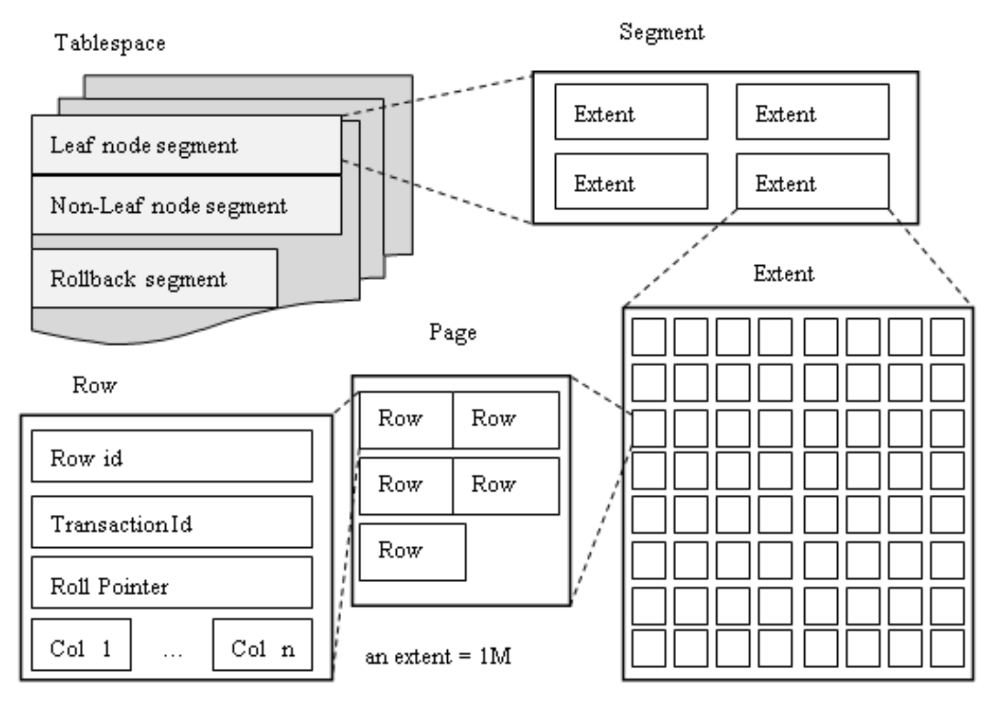

[TOC]

# 基础概念

InnoDB的特性：支持事务和分布式事务、行级锁、支持外键和保存点。

InnoDB存储引擎的文件：

* 表空间文件
  * 独立表空间文件
  * 全局表空间文件
  * undo表空间文件（从MySQL5.6开始支持）
  * 临时表空间文件
* 重做日志文件
  * 物理逻辑日志（redo log）
  * 没有Oracle的归档重做日志

InnoDB存储引擎表空间文件：

* 表空间
  * 表空间是一个逻辑存储的概念
  * 可以由多个文件组成
  * 支持祼设备（由于Linux 2.4的内核已支持O_Driect，其性能与裸设备并无差异，使用O_Driect后同样可绕过文件系统的缓存，因此使用裸设备与否对性能并没有过多的影响）
* 独立表空间
  * --innodb-file-per-table（将每个表的元数据信息单独存储到表空间文件中，默认开启）
  * 每张用户表对应一个ibd文件（该文件存放在指定库下，并以*.ibd的格式命名）
  * 分区表可以对应多个ibd文件（每个分区占用一个表空间文件）
  * 使用独立表空间文件与否对性能并没有影响，但使用独立表空间文件在删除指定表的时候可快速释放磁盘空间（如没有使用独立表空间文件则会导致系统表空间中该表所占用的空间已标记为可用，但空间无法释放）
* 系统表空间（早期MySQL只支持系统表空间）
  * 存储元数据信息
  * 存储Change Buffer信息（每个表的表数据和索引的元数据信息也会保存在共享表空间中）
  * 所有表和索引的信息（在后来的版本中将这部分数据存储到了独立表空间中）
  * 存储undo信息（从MySQL5.6开始将这部分数据存储到了undo表空间中）
  * 使用“innodb_data_file_path”来控制系统表空间文件的初始大小与路径
* undo表空间
  * MySQL 5.6 版本支持
  * innodb_undo_tablespaces
* 临时表空间
  * 从MySQL5.7开始支持临时表空间，可将临时表的元数据信息单独存放

**InnoDB支持的单个表空间文件最大为64TB。**

```
# 查看当前数据库下的表空间文件（独立表空间文件除外）
shell> ls -R | grep ^ib.*
  ib_buffer_pool
  ibdata1
  ibtmp1
  ib_logfile0
  ib_logfile1
```

表空间文件一般存放在数据目录下以ib开头的文件：

* ibdata即为共享表空间文件（即系统表空间），将所有数据存放在ibdata1中；
* ibtmp1即为临时表空间文件，用于存放使用“create tempoary table”创建的临时表或排序时使用的基于磁盘的临时表；
* *.ibd文件即为用户表的表空间文件（通过innodb-file-per-table变量控制，默认开启）用于存放数据文件和索引文件，但一个表中的部份索引文件存放在change buffer中，而change buffer是保存在共享表空间中的；


information_schema.INNODB_SYS_TABLESPACES表用于存放的是共享表空间中每个表的元数据信息，有关InnoDB文件每表和通用表空间的元数据。

```
mysql> select * from information_schema.INNODB_SYS_TABLESPACES limit 10;
+-------+---------------------------------+------+-------------+------------+-----------+---------------+------------+---------------+-----------+----------------+
| SPACE | NAME                            | FLAG | FILE_FORMAT | ROW_FORMAT | PAGE_SIZE | ZIP_PAGE_SIZE | SPACE_TYPE | FS_BLOCK_SIZE | FILE_SIZE | ALLOCATED_SIZE |
+-------+---------------------------------+------+-------------+------------+-----------+---------------+------------+---------------+-----------+----------------+
|     6 | mysql/plugin                    |  289 | Barracuda   | Dynamic    |      8192 |             0 | Single     |          4096 |     49152 |          49152 |
|     7 | mysql/servers                   |  289 | Barracuda   | Dynamic    |      8192 |             0 | Single     |          4096 |     49152 |          49152 |
|     8 | mysql/help_topic                |  289 | Barracuda   | Dynamic    |      8192 |             0 | Single     |          4096 |   9437184 |        9437184 |
|     9 | mysql/help_category             |  289 | Barracuda   | Dynamic    |      8192 |             0 | Single     |          4096 |     57344 |          57344 |
|    10 | mysql/help_relation             |  289 | Barracuda   | Dynamic    |      8192 |             0 | Single     |          4096 |     90112 |          90112 |
|    11 | mysql/help_keyword              |  289 | Barracuda   | Dynamic    |      8192 |             0 | Single     |          4096 |    204800 |         204800 |
|    12 | mysql/time_zone_name            |  289 | Barracuda   | Dynamic    |      8192 |             0 | Single     |          4096 |     49152 |          49152 |
|    13 | mysql/time_zone                 |  289 | Barracuda   | Dynamic    |      8192 |             0 | Single     |          4096 |     49152 |          49152 |
|    14 | mysql/time_zone_transition      |  289 | Barracuda   | Dynamic    |      8192 |             0 | Single     |          4096 |     49152 |          49152 |
|    15 | mysql/time_zone_transition_type |  289 | Barracuda   | Dynamic    |      8192 |             0 | Single     |          4096 |     49152 |          49152 |
+-------+---------------------------------+------+-------------+------------+-----------+---------------+------------+---------------+-----------+----------------+
10 rows in set (0.00 sec)
```

mysql5.7中可使用“create tablespace TB_SPACE_NAME add datafile "/path/to/ibd_file.ibd" file_block_size=XXX”来创建一个通用表空间，而在建表时可指定多个表使用同一个通用表空间而无需创建一个独立的表空间文件。一个通用表空间可以不在默认的数据目录之下，而且一个通用表空间中可以存放多个不同表的数据和索引文件存放在一起。

而一个通用表空间中可以存储多个不同表的数据和索引文件。

```
mysql> create tablespace ts10 add datafile '/test/ts10.ibd' file_block_size=8192;
mysql> create table t10 (a int) tablespace=ts10;
mysql> create table t11 (b int) tablespace=ts10;
```

File_block_size即为一个页的大小，但如果此处设置的一个页的大小与“innodb_page_size”的大小不同会导致新建的表无法识别。

UNDO表空间：

* 默认存放在数据目录下，以undo开头的文件即为undo表空间；
* undo表空间的数量由`innodb_undo_tablespaces=N`来控制；

undo表空间用于保存数据库在被修改之前的数据。

重做日志文件：

* 通过`innodb_log_file_size=#M`变量来控制重做日志的大小，在线上使用时，这个值应该尽可能的大，建议在4G以上；


## 表空间的内部组织结构




* 一个表空间是由多个对象组成，而每个对象是由段进行组织的（包括叶子节点段、非叶节点段、加滚节点段等）；
* 段对于用户来说是透明的；
* 段也是一个逻辑概念，在mysql的元数据表中是没有段的相关信息的；

### 表空间——区


* mysql中的表空间文件是自增长的；
* 区是最小的空间申请单位，则一个区内的空间就是连续的，但区与区之间不一定连续；
* 区的大小固定为1M（16k一个页则一个区有64个页，8K则对应128个页）；
* 使用“innodb_page_size”来设置用户表的非压缩表的一个页的大小；
* 通常一次申请4个区的大小，而在某些特殊情况下也会一次申请5个区的空间；
* 使用区可以优化IO，如果操作的多个数据是在一个区内的多个页，则可以保证其操作在磁盘上是连续的。

### 表空间——页

* 页是最小的IO操作单位；
* 对于普通用户表则默认每个页为16k（通过innodb_page_size来控制每个页的大小，一般建议设置为8192即8k，如果是SSD则建议设置为4k）；
* `innodb_page_size`在mysql中是全局的（压缩表除外），而且定义后不可修改，如果修改会导致数据无法读写；
* 压缩表中一个页的大小可以单独指定；
* 在一个表空间中的多个页由`page_nunber`进行定义，由`page_number`来表明数据存放在第几个页中；

SPACE的序号保存在`information_schema.INNODB_SYS_TABLES`表中的“SPACE”字段，用于表明某个表与物理文件的对应关系；

* 例如`SYS_DATAFILES`、`SYS_FOREIGN`、`SYS_TABLESPACES`表的SPACE_ID即为0，即表示多个表共用一个表空间文件。

```
mysql> select * from information_schema.INNODB_SYS_TABLES;
    +----------+-------------------------------------------+------+--------+-------+-------------+------------+---------------+------------+
    | TABLE_ID | NAME                                      | FLAG | N_COLS | SPACE | FILE_FORMAT | ROW_FORMAT | ZIP_PAGE_SIZE | SPACE_TYPE |
    +----------+-------------------------------------------+------+--------+-------+-------------+------------+---------------+------------+
    |     2803 | LocalWiki/AO_187CCC_SIDEBAR_LINK          |   33 |     14 |  2811 | Barracuda   | Dynamic    |             0 | Single     |
    |     2848 | LocalWiki/AO_21D670_WHITELIST_RULES       |   33 |      7 |  2856 | Barracuda   | Dynamic    |             0 | Single     |
    |     2834 | LocalWiki/AO_21F425_MESSAGE_AO            |   33 |      5 |  2842 | Barracuda   | Dynamic    |             0 | Single     |
    |     2836 | LocalWiki/AO_21F425_MESSAGE_MAPPING_AO    |   33 |      6 |  2844 | Barracuda   | Dynamic    |             0 | Single     |
    |     2835 | LocalWiki/AO_21F425_USER_PROPERTY_AO      |   33 |      7 |  2843 | Barracuda   | Dynamic    |             0 | Single     |
    |     2818 | LocalWiki/AO_38321B_CUSTOM_CONTENT_LINK   |   33 |      8 |  2826 | Barracuda   | Dynamic    |             0 | Single     |
    |     2843 | LocalWiki/AO_4789DD_HEALTH_CHECK_STATUS   |   33 |     14 |  2851 | Barracuda   | Dynamic    |             0 | Single     |
    |     2845 | LocalWiki/AO_4789DD_PROPERTIES            |   33 |      6 |  2853 | Barracuda   | Dynamic    |             0 | Single     |
    |     2846 | LocalWiki/AO_4789DD_READ_NOTIFICATIONS    |   33 |      9 |  2854 | Barracuda   | Dynamic    |             0 | Single     |
    ......
    |      136 | test_db/parent                            |   33 |      4 |   131 | Barracuda   | Dynamic    |             0 | Single     |
    |      174 | test_db/t0                                |   33 |      4 |   132 | Barracuda   | Dynamic    |             0 | Single     |
    |      176 | test_db/t1                                |   39 |      4 |   169 | Barracuda   | Compressed |          4096 | Single     |
    +----------+-------------------------------------------+------+--------+-------+-------------+------------+---------------+------------+
    489 rows in set (0.00 sec)

mysql> select name,table_id,space from information_schema.innodb_sys_tables where name like "teleport%";
    +--------------------------+----------+-------+
    | name                     | table_id | space |
    +--------------------------+----------+-------+
    | teleport/tp_acc          |       46 |    32 |
    | teleport/tp_acc_auth     |       47 |    33 |
    | teleport/tp_audit_auz    |       54 |    40 |
    | teleport/tp_audit_map    |       55 |    41 |
    | teleport/tp_audit_policy |       53 |    39 |
    | teleport/tp_config       |       40 |    26 |
    | teleport/tp_core_server  |       41 |    27 |
    | teleport/tp_group        |       48 |    34 |
    | teleport/tp_group_map    |       49 |    35 |
    | teleport/tp_host         |       45 |    31 |
    | teleport/tp_ops_auz      |       51 |    37 |
    | teleport/tp_ops_map      |       52 |    38 |
    | teleport/tp_ops_policy   |       50 |    36 |
    | teleport/tp_record       |       57 |    43 |
    | teleport/tp_record_audit |       58 |    44 |
    | teleport/tp_role         |       42 |    28 |
    | teleport/tp_syslog       |       56 |    42 |
    | teleport/tp_user         |       43 |    29 |
    | teleport/tp_user_rpt     |       44 |    30 |
    +--------------------------+----------+-------+
    19 rows in set (0.00 sec)

# 系统表空间的SPACE号为0
mysql> select * from information_schema.INNODB_SYS_TABLES where space = 0;
    +----------+------------------+------+--------+-------+-------------+------------+---------------+------------+
    | TABLE_ID | NAME             | FLAG | N_COLS | SPACE | FILE_FORMAT | ROW_FORMAT | ZIP_PAGE_SIZE | SPACE_TYPE |
    +----------+------------------+------+--------+-------+-------------+------------+---------------+------------+
    |       14 | SYS_DATAFILES    |    0 |      5 |     0 | Antelope    | Redundant  |             0 | System     |
    |       11 | SYS_FOREIGN      |    0 |      7 |     0 | Antelope    | Redundant  |             0 | System     |
    |       12 | SYS_FOREIGN_COLS |    0 |      7 |     0 | Antelope    | Redundant  |             0 | System     |
    |       13 | SYS_TABLESPACES  |    0 |      6 |     0 | Antelope    | Redundant  |             0 | System     |
    |       15 | SYS_VIRTUAL      |    0 |      6 |     0 | Antelope    | Redundant  |             0 | System     |
    +----------+------------------+------+--------+-------+-------------+------------+---------------+------------+
    5 rows in set (0.01 sec)
```

在`information_schema.INNODB_SYS_TABLES`表中TABLE_ID和SPACE是一一对应的（如开启了--innodb_file_per_table则一一对应，但通用表空间可能不是一一对应的），而TABLE_ID是保存在frm中（即表结构文件），而SPACE对应的是文件系统层的编号，找到SPACE和page_number即可找到文件系统层的文件以及数据的偏移量（一次读取一个页，因此根据page_number可找到这个页属于哪个区）。

当通过索引检索到数据保存在某个页中，则可以根据(SPACE_ID,page_number)找到指定的二进制文件以及对应的数据的偏移量，从而进行数据的读取。

#### 压缩表中的页

压缩表的一个页的大小可以跟`innodb_page_size`指定的大小不同

```
# 创建一个压缩表，这个压缩表中一个页的大小为4k
mysql> create table TB_NAME (table_defination ....) row_format=compressed key_block_size=4;

# 将一个表从普通用户表修改为压缩表
mysql> alter table TB_NAME row_format=compressed key_block_size=#;
```

通过以上语法可创建一个压缩表，并且指定其一个页的大小为4k。可以将用户表的非压缩表转为压缩表。一般在flash中是建议开启压缩，而里的压缩并不会对记录进行压缩而是对页进行压缩。

**注意：如果将线上的表使用`alter table ... row_format=compressed key_block_size=#;`需要确认mysql的`innodb_file_format=Barracuda`并且开启`innodb_file_per_table`。**

使用压缩表可以大量节省IO，即一次IO可以读取更多的记录。

压缩过程：原本一个页的大小为`innodb_page_size`的大小，而压缩后的一个页是通过`key_block_size`进行指定的，但是一个`innodb_page_size`的页不一定能够正好压缩成一个`key_block_size`的大小，通常会在内存中进行压缩测试，如果一个`innodb_page_size`压缩后不满一个`key_block_size`的大小则会占用一个`key_block_size`，如果压缩后超出一个`key_block_size`而不满两个`key_block_size`则占用两个`key_block_size`。

如果一个`key_block_size`没有占满，例如一个`key_block_size`为4k，已经使用了3k，则会在下次插入时将`redo_log`写入到剩余的`key_block_size`中，当整个`key_block_size`使用完了再将`redo_log`的记录写入到这个页中然后再压缩后存放到`key_block_size`中。

`Key_block_size`一般建议设置为`innodb_page_size`的一半可提高其压缩的成功率。

#### 查看压缩表的压缩比例

**information_schema.INNODB_CMP**

可查看information_schema.INNODB_CMP表，该表用于保存INNODB对于4k的页压缩的次数，压缩成功的次数，压缩的时间，解压的次数，解压的时间，通过计算“compress_ops_ok/compress_ops”即可得到压缩成功的比率。

```
mysql> select * from information_schema.INNODB_CMP;
    +-----------+--------------+-----------------+---------------+----------------+-----------------+
    | page_size | compress_ops | compress_ops_ok | compress_time | uncompress_ops | uncompress_time |
    +-----------+--------------+-----------------+---------------+----------------+-----------------+
    |      1024 |            0 |               0 |             0 |              0 |               0 |
    |      2048 |            0 |               0 |             0 |              0 |               0 |
    |      4096 |        86976 |           86976 |            31 |              1 |         2465863 |
    |      8192 |            0 |               0 |             0 |              0 |               0 |
    |     16384 |            0 |               0 |             0 |              0 |               0 |
    +-----------+--------------+-----------------+---------------+----------------+-----------------+
    5 rows in set (0.01 sec)
```

但在该表中无法查看指定表的压缩比例。如需查看指定的某个表的压缩比例需要开启`innodb_cmp_per_index_enabled`后查看`information_schema.INNODB_CMP_PER_INDEX`。

```
mysql> set global innodb_cmp_per_index_enabled=1;
    Query OK, 0 rows affected (0.09 sec)
mysql> exit

shell> mysql --login-path=telport_mysql
mysql> show variables like "innodb%cmp%";
    +------------------------------+-------+
    | Variable_name                | Value |
    +------------------------------+-------+
    | innodb_cmp_per_index_enabled | ON    |
    +------------------------------+-------+
    1 row in set (0.01 sec)
mysql> select * from information_schema.INNODB_CMP_PER_INDEX;
    +---------------+--------------------------------+-------------+--------------+-----------------+---------------+----------------+-----------------+
    | database_name | table_name                     | index_name  | compress_ops | compress_ops_ok | compress_time | uncompress_ops | uncompress_time |
    +---------------+--------------------------------+-------------+--------------+-----------------+---------------+----------------+-----------------+
    | dbt3          | #mysql50##sql-ib154-2268103898 | i_l_partkey |        13913 |           13894 |             5 |              0 |               0 |
    | dbt3          | #mysql50##sql-ib154-2268103898 | i_l_suppkey |         7335 |            7325 |             2 |              1 |         2466562 |
    +---------------+--------------------------------+-------------+--------------+-----------------+---------------+----------------+-----------------+
    2 rows in set (0.01 sec)
```

**information_schema.INNODB_CMP_RESET**

该表用于清空information_schema.INNODB_CMP表中的数据，只要访问该表即可获取information_schema.INNODB_CMP表中的数据，而information_schema.INNODB_CMP中就会被清空。

`key_block_size`即便与`innodb_page_size`一致，仍会对表内的页进行压缩，例如：`innodb_page_size=16k`且`key_block_size=16`，仍会将页中的数据进行压缩，而压缩后的大小假设为10k，而这10k的数据仍会存放在16k的磁盘空间中，剩余的6k的空间用于存放这个页的`redo_log`。

#### 透明表空间压缩

```
mysql> create table TABLE_NAME (table_defination ... ) compression="zlib";
mysql> create table TABLE_NAME (table_defination ... ) compression="lz4";
```

**如果在创建一个透明表空间压缩表的时候报“warning”则实际上是没有开启透明表空间压缩的。**

透明表空间压缩仅支持zlib和lz4两种算法。

lz4速度更快，zlib压缩比例较大。

使用文件系统层面的压缩，例如将一个16K的页读入内存后进行压缩，如果压缩为4k则会在压缩的数据之后填写空洞的数据以达到16K的大小，然后使用文件系统Punch  hold（空洞算法）的算法进行写入，而写入后的实际大小仍为4k，但这4k仍会占用文件系统层面上16K的空间。

目前使用的NTFS、ext4和Xfs都支持。

注意：透明表空间压缩和压缩表不能同时开启。

**查询information_schema.INNODB_SYS_TABLESPACES**可查看某个表的大小和实际占用的存储空间。

```
mysql> select * from INNODB_SYS_TABLESPACES;
    +-------+-------------------------------------+------+-------------+------------+-----------+---------------+------------+---------------+-----------+----------------+
    | SPACE | NAME                                | FLAG | FILE_FORMAT | ROW_FORMAT | PAGE_SIZE | ZIP_PAGE_SIZE | SPACE_TYPE | FS_BLOCK_SIZE | FILE_SIZE | ALLOCATED_SIZE |
    +-------+-------------------------------------+------+-------------+------------+-----------+---------------+------------+---------------+-----------+----------------+
    |     5 | mysql/plugin                        |  289 | Barracuda   | Dynamic    |      8192 |             0 | Single     |          4096 |     49152 |          49152 |
    |     6 | mysql/servers                       |  289 | Barracuda   | Dynamic    |      8192 |             0 | Single     |          4096 |     49152 |          49152 |
    |     7 | mysql/help_topic                    |  289 | Barracuda   | Dynamic    |      8192 |             0 | Single     |          4096 |   9437184 |        9437184 |
    |     8 | mysql/help_category                 |  289 | Barracuda   | Dynamic    |      8192 |             0 | Single     |          4096 |     57344 |          57344 |
    |     9 | mysql/help_relation                 |  289 | Barracuda   | Dynamic    |      8192 |             0 | Single     |          4096 |     90112 |          90112 |
    |    10 | mysql/help_keyword                  |  289 | Barracuda   | Dynamic    |      8192 |             0 | Single     |          4096 |    204800 |         204800 |
    |    11 | mysql/time_zone_name                |  289 | Barracuda   | Dynamic    |      8192 |             0 | Single     |          4096 |     49152 |          49152 |
    |    12 | mysql/time_zone                     |  289 | Barracuda   | Dynamic    |      8192 |             0 | Single     |          4096 |     49152 |          49152 |
    |    13 | mysql/time_zone_transition          |  289 | Barracuda   | Dynamic    |      8192 |             0 | Single     |          4096 |     49152 |          49152 |
    |    14 | mysql/time_zone_transition_type     |  289 | Barracuda   | Dynamic    |      8192 |             0 | Single     |          4096 |     49152 |          49152 |
    |    15 | mysql/time_zone_leap_second         |  289 | Barracuda   | Dynamic    |      8192 |             0 | Single     |          4096 |     49152 |          49152 |
    |    16 | mysql/innodb_table_stats            |  289 | Barracuda   | Dynamic    |      8192 |             0 | Single     |          4096 |     49152 |          49152 |
    ........
    |   278 | c5web/a_area_alarm                  |  289 | Barracuda   | Dynamic    |      8192 |             0 | Single     |          4096 |     49152 |          49152 |
    |   280 | c5web/t_vehicle_rollcall_info       |  289 | Barracuda   | Dynamic    |      8192 |             0 | Single     |          4096 |     49152 |          49152 |
    +-------+-------------------------------------+------+-------------+------------+-----------+---------------+------------+---------------+-----------+----------------+
```

启用key_block_size会导致QPS的性能下降20%，但使用透明表空间压缩会使QPS性能提升30%。

不作压缩、使用`key_block_size`和`compression`在磁盘空间使用上在区别：


在mysql不开启压缩、使用`key_block_size`和`compression`在QPS上的区别：


### 表空间——记录

* InnoDB存储引擎是索引组织表；
  * Index Organized Table
  * 与Oracle IOT表类似
  * 适合OLTP应用
  * 数据是有序的
* 叶子节点存放一整行所有数据
  * 索引即数据，所有数据保存在叶子节点中，所有的叶子节点会使用指针进行串联起来
  * 通常而言非叶节点为三到四层
  * 非叶节点用于存储主键值和指针（指向下一层索引或数据的位置即page_number）
  * 页内的数据使用单向链表的方式使得原本无序的数据逻辑有序
*  聚集索引记录存放在以下系统列（隐式）
  * Rowid：B+树索引键值
  * trx id：6字节
  * roll pointer：7字节

InnoDB会使用索引组织表来存储数据（InnoDB只支持索引组织表），因此必需要有主键，但如果在建表的时候没有人为的指定主键，则InnoDB会自动（隐式）添加一个主键。

叶子节点和非叶节点中的数据分别存放的不同的数据段中（叶子节点段和非叶节点段），而每个段内的以四个区为单位进行空间申请，每个区固定大小为1M。

二级索引中叶子节点存放的是键值和主键值。

```
mysql> select * from TABLES where table_name="t0"\G
    *************************** 1. row ***************************
      TABLE_CATALOG: def
       TABLE_SCHEMA: test_db
         TABLE_NAME: t0
         TABLE_TYPE: BASE TABLE
             ENGINE: InnoDB
            VERSION: 10
         ROW_FORMAT: Dynamic
         TABLE_ROWS: 2
     AVG_ROW_LENGTH: 4096
        DATA_LENGTH: 8192
    MAX_DATA_LENGTH: 0
       INDEX_LENGTH: 0
          DATA_FREE: 0
     AUTO_INCREMENT: 3
        CREATE_TIME: 2020-10-17 10:23:21
        UPDATE_TIME: 2020-10-17 15:22:40
         CHECK_TIME: NULL
    TABLE_COLLATION: utf8mb4_general_ci
           CHECKSUM: NULL
     CREATE_OPTIONS: COMPRESSION="lz4"
      TABLE_COMMENT:
    1 row in set (0.00 sec)
```

在mysql5.7中列的格式已经都修改为了dynamic的格式，使用这种格式的好处在于如果这个列比较大（大对象），则会将这个列中的所有数据存放到“overflow page”中，而在原来的列的位置仅存储20个字节的指针指向数据真正存储的页，而以前的“COMACT”格式的列最多可以保存768B的值，再将数据存储到“overflow page”中。

在每个页中都会按记录插入的顺序为每个记录标记一个heap_no，在看记录有没有被锁时看的就是这个heap_no上有没有锁。而每个页中默认会有两条伪记录用于保存最小值和最大值（其对应的heap_no分别为0和1），因此用户在每个页中插入的第一条记录的heap_no是从2开始的。heap_no在数据写入该页的时候即会生成，并且不会被修改。

#### 查看InnoDB对哪条记录加锁

```
terminal1:
		mysql> set global innodb_status_output_locks = 1;
		mysql> begin;
		mysql> delete from t0 where id = 1;

terminal2:
		mysql> pager less
		mysql> show engine innodb status\G
    ......
    ---TRANSACTION 273528, ACTIVE 564 sec
    2 lock struct(s), heap size 1136, 1 row lock(s), undo log entries 1
    MySQL thread id 226, OS thread handle 139667976148736, query id 200400 localhost root
    TABLE LOCK table `test_db`.`t0` trx id 273528 lock mode IX
    RECORD LOCKS space id 132 page no 3 n bits 80 index PRIMARY of table `test_db`.`t0` trx id 273528 lock_mode X locks rec but not gap
    Record lock, heap no 2 PHYSICAL RECORD: n_fields 3; compact format; info bits 32
     0: len 4; hex 80000001; asc     ;;
     1: len 6; hex 000000042c78; asc     ,x;;
     2: len 7; hex 6c000000331233; asc l   3 3;;
    ......------------
    TRANSACTIONS
    ------------
    Trx id counter 276653
    Purge done for trx's n:o < 276652 undo n:o < 0 state: running but idle
    History list length 69
    LIST OF TRANSACTIONS FOR EACH SESSION:
    ---TRANSACTION 421144292952800, not started
    0 lock struct(s), heap size 1136, 0 row lock(s)
    ---TRANSACTION 421144292953712, not started
    0 lock struct(s), heap size 1136, 0 row lock(s)
    ---TRANSACTION 421144292951888, not started
    0 lock struct(s), heap size 1136, 0 row lock(s)
    ---TRANSACTION 276636, ACTIVE 46 sec
    2 lock struct(s), heap size 1136, 1 row lock(s), undo log entries 1
    MySQL thread id 252, OS thread handle 139668114437888, query id 204450 localhost root
    TABLE LOCK table `test_db`.`t0` trx id 276636 lock mode IX
    RECORD LOCKS space id 132 page no 3 n bits 72 index PRIMARY of table `test_db`.`t0` trx id 276636 lock_mode X locks rec but not gap
    Record lock, heap no 2 PHYSICAL RECORD: n_fields 3; compact format; info bits 32
     0: len 4; hex 80000001; asc     ;;
     1: len 6; hex 00000004389c; asc     8 ;;
     2: len 7; hex 370000003f0110; asc 7   ?  ;;
		......
```

Page no为3说明这个页是root页，heap no为2说明这条记录是这个页里用户插入的第一条记录。

```
terminal1:
mysql> set session transaction_isolation="REPEATABLE-READ";
mysql> set global transaction_isolation="REPEATABLE-READ";
mysql> begin;
mysql> select * from t0 where id > 1 for update;

terminal2:
mysql> pager less;
mysql> show engine innodb status\G
    ......
    ---TRANSACTION 276659, ACTIVE 5 sec
    2 lock struct(s), heap size 1136, 2 row lock(s)
    MySQL thread id 252, OS thread handle 139668114437888, query id 204488 localhost root
    TABLE LOCK table `test_db`.`t0` trx id 276659 lock mode IX
    RECORD LOCKS space id 132 page no 3 n bits 72 index PRIMARY of table `test_db`.`t0` trx id 276659 lock_mode X
    Record lock, heap no 1 PHYSICAL RECORD: n_fields 1; compact format; info bits 0
     0: len 8; hex 73757072656d756d; asc supremum;;

    Record lock, heap no 2 PHYSICAL RECORD: n_fields 3; compact format; info bits 0
     0: len 4; hex 80000001; asc     ;;
     1: len 6; hex 000000043879; asc     8y;;
     2: len 7; hex fa000000290110; asc     )  ;;
     ......
```

此时可看到有一条记录锁锁住了一条heap no为1的记录。