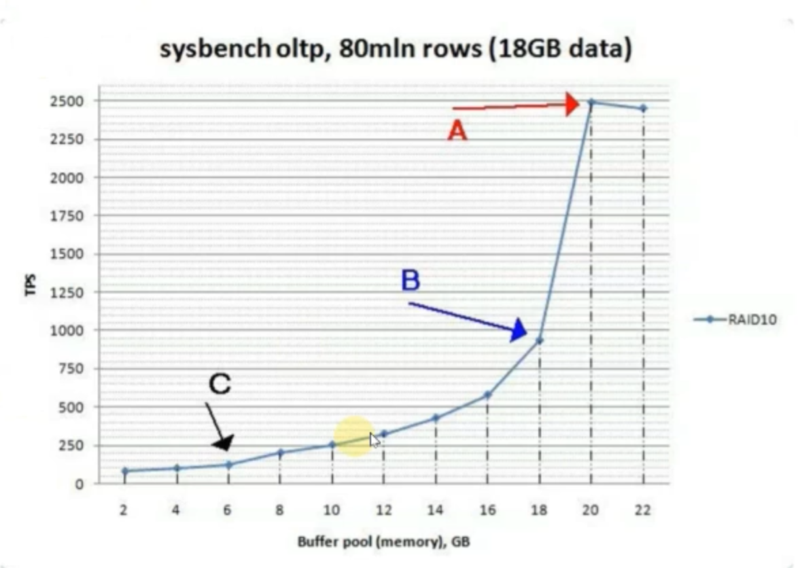
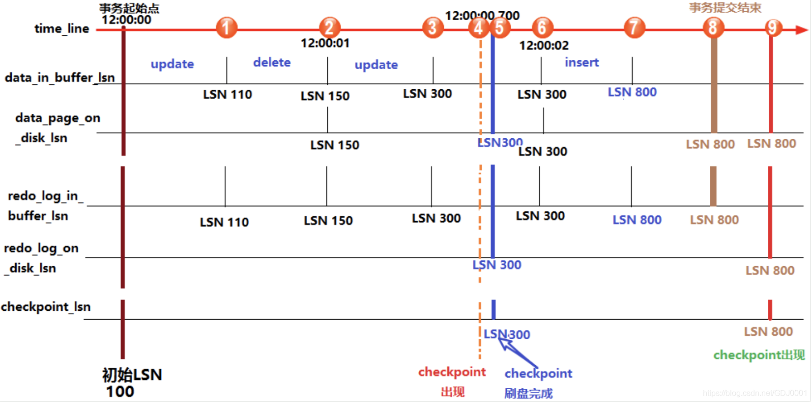

[TOC]

# 缓冲池基本概念

* InnoDB的缓冲池类似于Oracle的SGA；
* 使用`--innodb_buffer_pool_size`进行设置
* InnoDB的缓冲池越大越好
* 生产环境建议设置为64G或96G



`buffer pool`的主要作用是将磁盘上的数据页缓存到内存中，如果有数据需要修改也是将这个页中的所有数据原样读入内存，然后在内存中进行数据的修改，修改完成后再刷回磁盘中，**注意：buffer pool缓存的数据是以页为单位进行组织的**。

## 设置InnoDB Buffer Pool

Buffer Pool实际上保存的是热点数据，只有当Buffer Pook中没有的数据才会到磁盘中去读取。

innodb_buffer_pool_size：设置INNODB缓冲池的总大小，单位为B即字节。

innodb_buffer_pool_instances：设置缓冲池的个数，多个进程去读取一个Buffer Pool是会产生竞争的，将Buffer Pool拆成多个可以将热点打散，建议将Buffer Pool的个数设置为CPU的核心数，多个缓冲池的总大小仍为“innodb_buffer_pool_size”的大小。

## InnoDB Buffer Pool的管理

1. 通过“show engine innodb status;”来查看InnoDB的状态信息；
2. 通过“information_schema.INNODB_BUFFER_POOL_STATS;”查看INNODB的性能信息；

```
# 查看mysql的缓冲池的状态
mysql> select * from innodb_buffer_pool_stats limit 1\G
    *************************** 1. row ***************************
                             POOL_ID: 0
                           POOL_SIZE: 16383
                        FREE_BUFFERS: 11150
                      DATABASE_PAGES: 4962
                  OLD_DATABASE_PAGES: 1811
             MODIFIED_DATABASE_PAGES: 0
                  PENDING_DECOMPRESS: 536
                       PENDING_READS: 0
                   PENDING_FLUSH_LRU: 0
                  PENDING_FLUSH_LIST: 0
                    PAGES_MADE_YOUNG: 0
                PAGES_NOT_MADE_YOUNG: 0
               PAGES_MADE_YOUNG_RATE: 0
           PAGES_MADE_NOT_YOUNG_RATE: 0
                   NUMBER_PAGES_READ: 4194
                NUMBER_PAGES_CREATED: 768
                NUMBER_PAGES_WRITTEN: 1001
                     PAGES_READ_RATE: 0
                   PAGES_CREATE_RATE: 0
                  PAGES_WRITTEN_RATE: 0
                    NUMBER_PAGES_GET: 173480
                            HIT_RATE: 0
        YOUNG_MAKE_PER_THOUSAND_GETS: 0
    NOT_YOUNG_MAKE_PER_THOUSAND_GETS: 0
             NUMBER_PAGES_READ_AHEAD: 635
           NUMBER_READ_AHEAD_EVICTED: 0
                     READ_AHEAD_RATE: 0
             READ_AHEAD_EVICTED_RATE: 0
                        LRU_IO_TOTAL: 0
                      LRU_IO_CURRENT: 0
                    UNCOMPRESS_TOTAL: 0
                  UNCOMPRESS_CURRENT: 0
    1 row in set (0.01 sec)
```

information_schema.INNODB_BUFFER_POOL_STATS中POOL_SIZE实际展示的是内存中页的数量，这个值与“show engine innodb status”中的Buffer pool size是相同的。

information_schema.INNODB_BUFFER_POOL_STATS中FREE_BUFFERS表示空闲的页的数量，这个值与“show engine innodb status”中的Free buffers的值相同。

information_schema.INNODB_BUFFER_POOL_STATS中DATABASE_PAGES表示LRU中页的数量，这个值与“show engine innodb status”中的Database pages的值相同。


InnoDB Buffer Pool是由Free List、LRU List和Flush List组成，而Buffer Pool也是由一个个页在大小（innodb_page_size）的块组成。

* Free List，保存空闲的的块（块的大小为一个`innodb_page_size`）。
* LRU List，从磁盘中读取一个页就从Free List拿一个块到LRU List中去。
  * LRU，Least Recently Used即最近最少使用的算法。但mysql并没有简单的使用LRU的算法，当磁盘当中的页第一次被读到内存中的时候不会LRU List的最前面，而是放到Midpoint的位置，当这个页第二次被读到的时候才会被移动到LRU的首部。
  * unzip_LRU
* Flush List，包含脏页（读到内存中的页中的数据**第一次**被修改了即为脏页），但Flush List只会保存脏页的指针保存到Flush List中。
  * 根据oldest_lsn进行排序

LRU List中的页的内容信息保存在information_schema.INNODB_BUFFER_PAGE_LRU表中。

```
msyql> > select * from INNODB_BUFFER_PAGE_LRU limit 1\G
    *************************** 1. row ***************************
                POOL_ID: 0
           LRU_POSITION: 0
                  SPACE: 149
            PAGE_NUMBER: 184574
              PAGE_TYPE: INDEX
             FLUSH_TYPE: 1
              FIX_COUNT: 0
              IS_HASHED: YES
    NEWEST_MODIFICATION: 3367639622
    OLDEST_MODIFICATION: 0
            ACCESS_TIME: 1829020100
             TABLE_NAME: `dbt3`.`lineitem`
             INDEX_NAME: i_l_suppkey_partkey
         NUMBER_RECORDS: 218
              DATA_SIZE: 4796
        COMPRESSED_SIZE: 0
             COMPRESSED: NO
                 IO_FIX: IO_NONE
                 IS_OLD: YES
        FREE_PAGE_CLOCK: 26657
```

该表中SPACE为0的即对应为系统表。

NEWEST_MODIFICATION：表示space和page no对应的页最近一次修改的时候的LSN的值；

OLDEST_MODIFICATION：表示space和page no对应的页第一次修改的时候的LSN的值，FLUSH List是根据该值进行排序；

Modified db page：被修改的页，即脏页。

youngs/s：从old变成new的状态

Non-youngs/s：


缓冲池污染：当执行一次“select * from table;”很可能会导致一张大表中的所有数据都被加载到内存中（这个表中的所有的页都会被读取多次，因此会被移动到LRU列表的首部），而这个表中的数据仅会被使用一次，而以后就再也读不到了，但这些读进去的页会把热点数据淘汰掉从而造成缓冲池中没有缓存热点数据。

### 缓冲池参数的配置

从MySQL 5.7开始可以在线调缓冲池的大小。

innodb_buffer_pool_size：设置缓冲池的总大小。

midpoint的位置是可以通过参数调整的。

使用如下的配置可避免缓冲池被污染：

* Innodb_old_blocks_pct：设置LRU中old page所占的百分比，而New page和Old page之前的位置即为midpoint所在的空间。

* innodb_old_blocks_time：设置数据在old中缓存的时长，old中的数据被读到也不会立刻移动到LRU的首部，至少等待“innodb_old_blocks_time”的时长，在这个时长以后被读到才会移动到LRU的首部。

### 缓冲池预热

当数据库重启后缓冲池中为空，因此是没有热点数据会导致数据库频繁读取磁盘中的数据（此时的io会非常高），**为了快速恢复数据库运行时的状态所以需要为缓冲池进行预热**。

在MySQL5.6之前使用如下命令可用于手动实现缓冲池的预热：

* select count(1) from table force index(primary);
* select count(1) from index;

强制使用索引将某个表中数据读取到内存中。但此种方法并不高效。

在MySQL5.6之后支持使用如下的配置，以支持缓冲池的预热：

* Innodb_buffer_pool_dump_now={on|off}
* Innodb_buffer_pool_load_now={on|off}
* Innodb_buffer_pool_dump_at_shutdown={on|off}
* Innodb_buffer_pool_load_at_startup={on|off}
* Innodb_buffer_pool_filename={ib_buffer_pool}
* Innodb_buffer_pool_load_abort={on|off}
* Innodb_buffer_pool_dump_pct=#

执行“set global innodb_buffer_pool_dump_now=1”即可立即将缓冲池进行备份。执行完成后会在数据目录下产生一个“ib_buffer_pool”的文件，这个文件保存的并不是缓冲池中的数据而是space和page_no（页的号码），使用这种方式进行热点数据导出时仅会导出整个buffer_pool中“Innodb_buffer_pool_dump_pct”比例的数据，而在mysql的错误日志会保存mysql正常停机时将热点数据dump出来的过程。

```
# 查看指定页号对应的表
mysql> select * from innodb_sys_tablespaces where space=243;
+-------+--------------------+------+-------------+------------+-----------+---------------+------------+---------------+-------------+----------------+
| SPACE | NAME               | FLAG | FILE_FORMAT | ROW_FORMAT | PAGE_SIZE | ZIP_PAGE_SIZE | SPACE_TYPE | FS_BLOCK_SIZE | FILE_SIZE   | ALLOCATED_SIZE |
+-------+--------------------+------+-------------+------------+-----------+---------------+------------+---------------+-------------+----------------+
|   243 | c5web/n_alarm_info |  289 | Barracuda   | Dynamic    |      8192 |             0 | Single     |          4096 | 55528390656 |    55528394752 |
+-------+--------------------+------+-------------+------------+-----------+---------------+------------+---------------+-------------+----------------+
1 row in set (0.00 sec)
```

Innodb_buffer_pool_dump_pct用于指定仅把缓冲池中前百分之多少的数据备份出来，可以将其设置得稍大（默认值为25）。

建议设置Innodb_buffer_pool_dump_at_shutdown和Innodb_buffer_pool_load_at_startup都设置为on。

由于mysql默认没有定期将内存中的innodb_buffer_pool备份至磁盘的功能，因此建议通过脚本实现定期备份内存中的innodb_buffer_pool，如果实现了mysql主从，另外建议将备份出的文件传送一份至slave节点的mysql上，以便在failover的时候能够快速恢复。

### 缓冲池中的压缩页

假设使用key_block_size=4k对磁盘上的页进行压缩后，一个innodb_page_size=16k正好被压缩成4k，当这个页被读到内存之后只有被解压之后才能读到磁盘中的内容，而此时内存中既有压缩的页又有非压缩的页。因此内存中是保存了两份相同的数据，可以理解为内存的利用率是降低了的。

当内存中的压缩页被修改的时候就可以将修改的重做日志写入到压缩的4k的页中（假设此时这个压缩页也没有真正被填满）而无需再次压缩，从而提高写入的性能；如果4k的压缩页被填满则会进行reorganize（将这个页内的所有的重做日志进行回放）再次压缩，如果压缩后还没有写满4k则会把对这部分数据的修改的redolog再写入到压缩的4k的剩余空间中。

压缩页在innodb_buffer_pool中会占用两份空间，使用压缩的页可实现快速刷盘，而非压缩的页可实现快速读取数据。

```
mysql> > select * from innodb_buffer_page_lru limit 1\G
    *************************** 1. row ***************************
                POOL_ID: 0
           LRU_POSITION: 0
                  SPACE: 0
            PAGE_NUMBER: 7
              PAGE_TYPE: SYSTEM
             FLUSH_TYPE: 1
              FIX_COUNT: 0
              IS_HASHED: NO
    NEWEST_MODIFICATION: 5076887226
    OLDEST_MODIFICATION: 0
            ACCESS_TIME: 2505162257
             TABLE_NAME: NULL
             INDEX_NAME: NULL
         NUMBER_RECORDS: 0
              DATA_SIZE: 0
        COMPRESSED_SIZE: 0
             COMPRESSED: NO
                 IO_FIX: IO_NONE
                 IS_OLD: YES
        FREE_PAGE_CLOCK: 0
    1 row in set (0.78 sec)

mysql> select space,page_number,table_name,index_name,compressed,compressed_size from innodb_buffer_page_lru where compressed_size!=0 limit 10;
    +-------+-------------+-------------------+---------------+------------+-----------------+
    | space | page_number | table_name        | index_name    | compressed | compressed_size |
    +-------+-------------+-------------------+---------------+------------+-----------------+
    |  2880 |           4 | `dbt3`.`customer` | i_c_nationkey | NO         |            4096 |
    |  2880 |           1 | NULL              | NULL          | NO         |            4096 |
    |  2880 |        4098 | `dbt3`.`customer` | i_c_nationkey | NO         |            4096 |
    |  2880 |        4097 | NULL              | NULL          | NO         |            4096 |
    |  2880 |        4099 | `dbt3`.`customer` | i_c_nationkey | NO         |            4096 |
    |  2880 |        4100 | `dbt3`.`customer` | i_c_nationkey | NO         |            4096 |
    |  2880 |        4101 | `dbt3`.`customer` | i_c_nationkey | NO         |            4096 |
    |  2880 |        4102 | `dbt3`.`customer` | i_c_nationkey | NO         |            4096 |
    |  2880 |        4103 | `dbt3`.`customer` | i_c_nationkey | NO         |            4096 |
    |  2880 |        4104 | `dbt3`.`customer` | i_c_nationkey | NO         |            4096 |
    +-------+-------------+-------------------+---------------+------------+-----------------+
    10 rows in set (0.69 sec)

mysql> select space,page_number,table_name,index_name,compressed,compressed_size from innodb_buffer_page_lru where compressed_size!=0 and compressed="yes" limit 10;
    +-------+-------------+------------+------------+------------+-----------------+
    | space | page_number | table_name | index_name | compressed | compressed_size |
    +-------+-------------+------------+------------+------------+-----------------+
    |  2880 |        4815 | NULL       | NULL       | YES        |            4096 |
    |  2880 |        4816 | NULL       | NULL       | YES        |            4096 |
    |  2880 |        4817 | NULL       | NULL       | YES        |            4096 |
    |  2880 |        4818 | NULL       | NULL       | YES        |            4096 |
    |  2880 |        4819 | NULL       | NULL       | YES        |            4096 |
    |  2880 |        4820 | NULL       | NULL       | YES        |            4096 |
    |  2880 |        4821 | NULL       | NULL       | YES        |            4096 |
    |  2880 |        4822 | NULL       | NULL       | YES        |            4096 |
    |  2880 |        4823 | NULL       | NULL       | YES        |            4096 |
    |  2880 |        4826 | NULL       | NULL       | YES        |            4096 |
    +-------+-------------+------------+------------+------------+-----------------+
    10 rows in set (0.71 sec)
```

### CheckPoint

* 缩短数据库的恢复时间；
* 缓冲池不够用时，将脏页刷新到磁盘；
* 重做日志不可用时，***刷新脏页***。

内存中的页与磁盘中的页是对应的，但内存中的页被修改页但并未将内存中的页及时刷新回磁盘，而此时服务器宕机则内存中的数据无法与磁盘中的数据保持一致，如果内存中的页被修改时会有redo log写入至磁盘，可以在服务器宕机时通过redo log把被修改的数据恢复回来。但是如果数据库运行的时间很长，则redo log也会很大，则数据恢复的时间也会被拉长，因此checkpoint就是用于缩短数据库恢复的时长。



LSN：Log Sequence Number，实际上是字节数，当数据库启动时，LSN为16，如果此时对数据库中的数据修改了，而这个修改对应的redo log占用了10个字节，则此时LSN则增长为26（16+10），这个LSN是表示redo log日志中的LSN用于表示这个redo log共写入了多少个字节。

```
# 查看innodb存储引擎的lsn的相关信息
mysql> show engine innodb status \G
    ...
    ---
    LOG
    ---
    Log sequence number 5080218425    # 当前在内存中的最新的lsn号，最后提交的事务产生的lsn
    Log flushed up to   5080218425    # 日志已经刷到磁盘中redo log文件中的事务产生的lsn号，redo log持久化了，代表着这之前的事务都可以重做
    Pages flushed up to 5080218425    # buffer pool缓存的数据页已持久化到磁盘时的lsn号，此时之前的数据都持久到磁盘了，位于检查点之后和刷新到redo log之前（该值对应为NEWEST_MODIFICATION）
    Last checkpoint at  5080218416    # 检查点的lsn号，此时之前的事务对应的buffer pool缓存数据的page已持久化到磁盘中，所以当前lsn号之前的redo log文件内容都可以被覆盖掉不需要用来准备恢复数据了，从Log flushed up to到Last checkpoint at之间的redo log文件的内容才是 用来做crash时的恢复数据操作（该值对应为OLDEST_MODIFICATION）
    0 pending log flushes, 0 pending chkp writes
    3448 log i/o's done, 0.00 log i/o's/second
    ...

```

在正常情况下：“Log sequence number” >= “Log flushed up to” >= “Pages flushed up to” >= “Last checkpoint at”

每个页中也有一个LSN，用于表示这个页在做checkpoint的时候的LSN，而这个LSN与infomation_schema.INNODB_BUFFER_PAGE_LRU表中的NEWEST_MODIFICATION和OLDEST_MODIFICATION字段对应，而NEWEST_MODIFICATION表示将内存中的数据刷新到磁盘时的最新的LSN。

```
# 查看innodb buffer pool的详细信息
mysql> select * from information_schema.INNODB_BUFFER_PAGE_LRU limit 2\G
    *************************** 1. row ***************************
                POOL_ID: 0
           LRU_POSITION: 0
                  SPACE: 0
            PAGE_NUMBER: 7
              PAGE_TYPE: SYSTEM
             FLUSH_TYPE: 1
              FIX_COUNT: 0
              IS_HASHED: NO
    NEWEST_MODIFICATION: 5076887226
    OLDEST_MODIFICATION: 0
            ACCESS_TIME: 2505162257
             TABLE_NAME: NULL
             INDEX_NAME: NULL
         NUMBER_RECORDS: 0
              DATA_SIZE: 0
        COMPRESSED_SIZE: 0
             COMPRESSED: NO
                 IO_FIX: IO_NONE
                 IS_OLD: YES
        FREE_PAGE_CLOCK: 0
    *************************** 2. row ***************************
                POOL_ID: 0
           LRU_POSITION: 1
                  SPACE: 0
            PAGE_NUMBER: 3
              PAGE_TYPE: SYSTEM
             FLUSH_TYPE: 0
              FIX_COUNT: 0
              IS_HASHED: NO
    NEWEST_MODIFICATION: 0
    OLDEST_MODIFICATION: 0
            ACCESS_TIME: 2505162258
             TABLE_NAME: NULL
             INDEX_NAME: NULL
         NUMBER_RECORDS: 0
              DATA_SIZE: 0
        COMPRESSED_SIZE: 0
             COMPRESSED: NO
                 IO_FIX: IO_NONE
                 IS_OLD: YES
        FREE_PAGE_CLOCK: 0
    2 rows in set (0.69 sec)
```

在MySQL中会在三处有LSN的值：“redo log lsn”，“page lsn”和“database checkpoint lsn”。

* “redo log lsn”表示对数据的最新的修改的日志lsn值；
* “page lsn”表示数据页内的两种lsn值，即information_schema.INNODB_BUFFER_PAGE_LRU表中的NEWEST_MODIFICATION和OLDEST_MODIFICATION字段，OLDEST_MODIFICATION表示这个数据页成功刷到磁盘的lsn的值，NEWEST_MODIFICATION表示对这个数据页的最新的修改；
* “database checkpoint lsn”这个值是“last flush page lsn”即最近一次被刷新到磁盘中的重做日志的lsn，表示这个LSN之前的所有的脏页都已经被刷新到了磁盘。而在数据库恢复时就只需要恢复checkpoint LSN到redo log中的LSN之前的重做日志即可。

checkpoint lsn的值保存在redo log的前2KB的位置。

Sharp Checkpoint：

* 将所有的脏页都刷新回磁盘（开销会比较大）；
* 刷新时系统会被hang住；
* 此种方式会在Innodb关闭时使用（innodb_fast_shutdown={1|0}）。

Fuzzy Checkpoint（模糊检查点）：

* 从Flush List中将部分脏页刷新回磁盘；
* Innodb_io_capacity：表示一次刷新多少脏页到磁盘，建议设置为max的一半。
* Innodb_io_capacity_max：表示一次最多刷新多少脏页到磁盘中，可根据存储的IOPS进行优化。
* 使用这种checkpoint的技术刷新脏页对系统影响较小。
* 从LRU List中刷新脏页到磁盘（当innodb buffer pool不够用即Free List没有剩余空间时）；
* --innodb_max_dirty_pages_pet即保存脏页百分比，默认值为75，
* 重做日志重用（Async/Sync Flush Checkpoint），当重做日志不可用时需要强制将一些页刷新回磁盘；
* LRU中需要有差不多100个空闲页。

Innodb_lru_scan_depth：该参数会影响page cleaner线程每次刷脏页的数量，为了保证LRU List中有足够的空闲页可以被使用，会从LRU List中进行刷新，这个参数的涵意是表示每次从LRU列表中刷新的页的数量，而这个参数的操作单元是每个buffer poll instance的，即每个缓冲池都会刷新该参数指定的脏页的数量；一般建议将该值设置为（Innodb_io_capacity_max/innodb_buffer_pool_instances）。