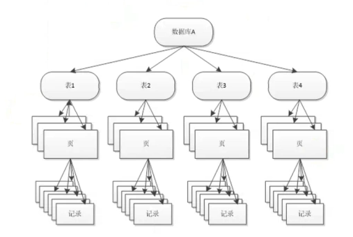

[TOC]

# 锁的概念

* 协调多个进程或线程并发访问某一资源的机制；
* 保证数据并发访问的一致性、有效性；

|  | lock | latch |
| ---- | ---- | ----- |
| 对象 | 事务 | 线程 |
| 保护 | 数据库内容 | 内存数据结构 |
| 持续时间 | 整个事务过程 | 临界资源 |
| 模式 | 行锁、表锁、意向锁 | 读写锁、互斥量 |
| 死锁 | 通过waits-for graph、time out等机制进行死锁检测与处理 | 无死锁检测与处理机制、仅通过应用程序加锁的顺序（latch leveling）保证无死锁的情况发生 |
| 存在于 | Lock Manager的哈希表中 | 每个数据结构的对象中 |

数据库中的死锁检测会自动回滚一个代价最小的事务。

## 在InnoDB中查看持有的latch

```
mysql> show engine innodb mutex;
+--------+-----------------------------+-----------+
| Type   | Name                        | Status    |
+--------+-----------------------------+-----------+
| InnoDB | rwlock: dict0dict.cc:1191   | waits=2   |
| InnoDB | rwlock: log0log.cc:846      | waits=632 |
| InnoDB | sum rwlock: buf0buf.cc:1468 | waits=649 |
+--------+-----------------------------+-----------+
3 rows in set (0.02 sec)
```

从该结果得知 buffer pool 的rw锁的竞争较大，而其他的信息对于DBA而言并无实际意义。

## InnoDB中锁的类型

* S 行级共享锁
* X 行级排它锁
* IS 意向共享锁
* IX 意向排它锁
* AI自增锁

意向锁：

* 揭示下一层级请求的锁类型（意向锁的主要目的是为了实现多粒度的锁）；
* IS：事务想要获得一张表中某几行的共享锁；
* IX：事务想要获得一张表中某几行的排它锁；
* InnoDB存储引擎中意向锁都是表锁；
* 意向锁之间都是相互兼容的。



加锁的操作是在整颗树上进行加锁。而意向锁是表示下一层级要加什么锁。

例如在某条记录上加一个X锁其加锁过程为：在这条记录所在的库上加一个IX锁，在这条记录所在的表上加一个IX锁，在这条记录所在的数据页上加一个IX锁，最后才在这条记录上加一个X锁（注意InnoDB的意向锁是表级别的，因此其加锁过程相对简单只需要在表级别上加上一个意向锁即可）。

意向锁的操作都是在内存中实现的，因此其操作都会很快。

| 兼容性 | IS | IX | S | X |
| ---- | -- | -- | - | - |
| IS | yes | yes | yes | no |
| IX | yes | yes | no | no |
| S | yes | no | yes | no |
| X | no | no | no | no |

## 事务的隔离级别

事务的隔离性是保证一个事务正在操作的数据被另一个事务修改或删除了，最后的执行结果可能无法达到预期，以使得多个事务并行执行的使其看起来像是串行执行的，一个事务对数据做的修改对其他事务是不可见的。

* READ UNCOMMITTED
    - 可查看另一事务未提交的修改，会出现脏读。
* READ COMMITTED
    - 只能看到另一事务已提交的修改，但会出现不可重复读（即同一事务先后读到的同一条记录的内容不一致），使用RC的隔离级别解决的脏读的问题。
* REPEATABLE READ
    - MySQL默认的隔离级别，在该隔离级别中解决的不可重复读的问题。
* SERIALIZABLE
    - 解决了幻读（幻读是前后两次查询的结果的数量不一致）的问题。

虽然REPEATABLE READ和SERIALIZABLE都解决了幻读的问题，但两者的实现机制是不一样的，SERIALIZABLE是通过两阶段锁来实现的而REPEATABLE READ是通过GAP锁和X锁来实现的。

两阶段锁：mysql的两阶段锁主要是持有锁阶段（对记录更新操作或者select for update、lock in share model时）和释放锁阶段（事务执行完成，即commit或rollback会释放锁），而使用两阶段锁主要用于解决事务的隔离性，使得多个事务并行执行而看起来像是串行执行，

隔离级别越低其开销越小。事务请求的锁越少其保持锁的时间就越短。

注意：

* 如果事务隔离级别设置为rc，则binlog_format一定要设置为row，否则可能会导致主从数据不一致的情况；
* 如事务隔离级别为rr在将没有索引的字段作为条件进行查询时可能会造成全表加锁，从而降低了数据库的并发性能；

# 查看锁相关的信息

通过“show engine innodb status”命令进行查看。

```
######################### terminal 1 #########################
# 手动对某条记录施加一个排它锁
mysql> begin;
mysql> select * from t1 for update;

######################### terminal 1 #########################
mysql> set global innodb_status_output_locks = 1;
mysql> pager less
mysql> show engine innodb status\G
...
...
------------
TRANSACTIONS
------------
Trx id counter 781106
Purge done for trx's n:o < 780980 undo n:o < 0 state: running but idle
History list length 35
LIST OF TRANSACTIONS FOR EACH SESSION:
---TRANSACTION 421240506347120, not started
0 lock struct(s), heap size 1136, 0 row lock(s)
---TRANSACTION 421240506346208, not started
0 lock struct(s), heap size 1136, 0 row lock(s)
---TRANSACTION 781097, ACTIVE 472 sec
2 lock struct(s), heap size 1136, 1 row lock(s)
MySQL thread id 40, OS thread handle 139764346504960, query id 21119 10.169.10.98 root
TABLE LOCK table `test_db`.`t0` trx id 781097 lock mode IX
RECORD LOCKS space id 132 page no 3 n bits 72 index PRIMARY of table `test_db`.`t0` trx id 781097 lock_mode X locks rec but not gap
Record lock, heap no 2 PHYSICAL RECORD: n_fields 3; compact format; info bits 0
 0: len 4; hex 80000005; asc     ;;
 1: len 6; hex 0000000b5aa2; asc     Z ;;
 2: len 7; hex a5000000300110; asc     0  ;;
...
...
```

Record lock：表示这个锁为记录级别的锁；

heap no：表示锁住的哪个记录号的记录，一个页内记录号为0和1的均为伪记录用于表示这个页内最小和最大的记录；

PHYSICAL RECORD：表示锁住的是用户插入的记录；

n_fields：表示一共有多少个列；

compact format：表示记录存储的格式；

info bits：其值为0则表示这条记录没有被删除，其值如果不为0则表示这条记录正在被修改或者已经被删除（其值为32则表示该记录已经被删除）；

information_schema.INNODB_TRX表也可以查看锁相关的信息。

```
mysql> select * from information_schema.INNODB_TRX\G
*************************** 1. row ***************************
                    trx_id: 781097
                 trx_state: RUNNING
               trx_started: 2020-11-09 12:57:49
     trx_requested_lock_id: NULL
          trx_wait_started: NULL
                trx_weight: 2
       trx_mysql_thread_id: 40
                 trx_query: NULL
       trx_operation_state: NULL
         trx_tables_in_use: 0
         trx_tables_locked: 1
          trx_lock_structs: 2
     trx_lock_memory_bytes: 1136
           trx_rows_locked: 1
         trx_rows_modified: 0
   trx_concurrency_tickets: 0
       trx_isolation_level: READ COMMITTED
         trx_unique_checks: 1
    trx_foreign_key_checks: 1
trx_last_foreign_key_error: NULL
 trx_adaptive_hash_latched: 0
 trx_adaptive_hash_timeout: 0
          trx_is_read_only: 0
trx_autocommit_non_locking: 0
1 row in set (0.00 sec)
```

trx_query：事务执行的SQL语句，如果其值为NULL则意为该语句已执行完成。

trx_tables_locked：持有的表锁；

trx_rows_locked：持有的记录锁；

trx_lock_memory_bytes：事务占用的内存的字节数；

trx_mysql_thread_id：process的id号；

information_schema.INNODB_LOCKS和information_schema.INNODB_LOCK_WAITS表

```
######################### terminal prepare #########################
mysql> set global innodb_status_output_locks = 1;
mysql> set global innodb_lock_wait_timeout = 300;

######################### terminal 1 #########################
mysql> begin;
mysql> select * from test_db.t0 where id = 5 for update;

######################### terminal 2 #########################
mysql> begin;
mysql> select * from test_db.t0 where id = 5 lock in share mode;

######################### terminal 3 #########################
mysql> select * from information_schema.innodb_locks;
+----------------+-------------+-----------+-----------+----------------+------------+------------+-----------+----------+-----------+
| lock_id        | lock_trx_id | lock_mode | lock_type | lock_table     | lock_index | lock_space | lock_page | lock_rec | lock_data |
+----------------+-------------+-----------+-----------+----------------+------------+------------+-----------+----------+-----------+
| 781153:132:3:2 | 781153      | S         | RECORD    | `test_db`.`t0` | PRIMARY    |        132 |         3 |        2 | 5         |
| 781148:132:3:2 | 781148      | X         | RECORD    | `test_db`.`t0` | PRIMARY    |        132 |         3 |        2 | 5         |
+----------------+-------------+-----------+-----------+----------------+------------+------------+-----------+----------+-----------+
2 rows in set, 1 warning (0.00 sec)

mysql> select * from information_schema.innodb_lock_waits;
+-------------------+-------------------+-----------------+------------------+
| requesting_trx_id | requested_lock_id | blocking_trx_id | blocking_lock_id |
+-------------------+-------------------+-----------------+------------------+
| 781153            | 781153:132:3:2    | 781148          | 781148:132:3:2   |
+-------------------+-------------------+-----------------+------------------+
```

在information_schema.INNODB_LOCK_WAITS表中可看出请求的事务id为781153，而阻塞这个事务的id是781148。

```
# 查看阻塞的事务也需要先后执行两个事务，这两个事务对同一条记录分别进行读写的操作，如在上述事例的条件下即可查看下表的相关信息
# 查看阻塞的事务和等待的事务的详细信息
mysql> select r.trx_id waiting_trx_id,
       r.trx_mysql_thread_id waiting_thread,
       r.trx_query waiting_query,
       b.trx_id blocking_trx_id,
       b.trx_mysql_thread_id blocking_thread,
       b.trx_query blocking_query
from information_schema.innodb_lock_waits w
inner join
    information_schema.innodb_trx b on b.trx_id = w.blocking_trx_id
inner join
    information_schema.innodb_trx r on r.trx_id = w.requesting_trx_id;
+-----------------+----------------+----------------------------------------------------------+-----------------+-----------------+----------------+
| waiting_trx_id  | waiting_thread | waiting_query                                            | blocking_trx_id | blocking_thread | blocking_query |
+-----------------+----------------+----------------------------------------------------------+-----------------+-----------------+----------------+
| 421240506348032 |             52 | select * from test_db.t0 where id = 5 lock in share mode | 781148          |              51 | NULL           |
+-----------------+----------------+----------------------------------------------------------+-----------------+-----------------+----------------+
1 row in set, 1 warning (0.00 sec)

# 或者查看sys库中的innodb_lock_waits表也能看到锁的详细信息
mysql> select * from sys.innodb_lock_waits limit 1\G
*************************** 1. row ***************************
                wait_started: 2020-11-09 14:05:05
                    wait_age: 00:00:21
               wait_age_secs: 21
                locked_table: `test_db`.`t0`
                locked_index: PRIMARY
                 locked_type: RECORD
              waiting_trx_id: 781182
         waiting_trx_started: 2020-11-09 13:59:26
             waiting_trx_age: 00:06:00
     waiting_trx_rows_locked: 2
   waiting_trx_rows_modified: 0
                 waiting_pid: 52
               waiting_query: select * from test_db.t0 where id = 5 lock in share mode
             waiting_lock_id: 781182:132:3:2
           waiting_lock_mode: S
             blocking_trx_id: 781148
                blocking_pid: 51
              blocking_query: NULL
            blocking_lock_id: 781148:132:3:2
          blocking_lock_mode: X
        blocking_trx_started: 2020-11-09 13:39:57
            blocking_trx_age: 00:25:29
    blocking_trx_rows_locked: 1
  blocking_trx_rows_modified: 0
     sql_kill_blocking_query: KILL QUERY 51
sql_kill_blocking_connection: KILL 51
1 row in set, 3 warnings (0.01 sec)
```

wait_started：等待开始的时间；

wait_age：等待的时长，单位为秒；

locked_table：锁所在的表名；

locked_index：这个锁锁住了哪个索引；

locked_type：锁的粒度；

waiting_lock_id：其值的格式为“事务ID:space_ID:page_no:记录号”，记录号并不是有序的，仅表示其插入的先后顺序；

# InnoDB中锁的算法

|  | 脏读 | 不可重复读 | 幻读 |
| ---- | -- | -- | - |
| RU | yes | yes | yes |
| RC | no | yes | yes |
| RR | no | no | yes |
| SR | no | no | no |

脏读：一个事务读到了另一个事务未提交的修改。

不可重复读：一个事务读到了另一个事务已提交的修改，但由于前后两次读到的同一条记录的内容不一致，因此产生不可重复读。

幻读：读到了此前不存在的记录，即同一事务内基于同一条件读到的记录的数量是不一样的，主要在insert和delete的操作无法隔离。

**注意：在MySQL中RR就已经解决的幻读的问题。**

```
######################### terminal prepare #########################
mysql> set global tx_isolation = "REPEATABLE-READ";

######################### terminal 1 #########################
mysql> begin;
mysql> select * from test_db.t0 where id > 3;
+----+
| id |
+----+
|  5 |
+----+
1 row in set (0.00 sec)

######################### terminal 2 #########################
mysql> begin;
mysql> insert into test_db.t0 select 6;
mysql> commit;

# 在terminal 1中继续上一个事务，使用同一条SQL进行查询，其得到的结果是一样的，并没有出现幻读
######################### terminal 1 #########################
mysql> select * from test_db.t0 where id > 3;
+----+
| id |
+----+
|  5 |
+----+
1 row in set (0.00 sec)

mysql> commit ;
Query OK, 0 rows affected (0.00 sec)

mysql> begin;
Query OK, 0 rows affected (0.00 sec)

mysql> select * from t0 where id > 3;
+----+
| id |
+----+
|  5 |
|  6 |
+----+
2 rows in set (0.00 sec)

mysql> commit;
Query OK, 0 rows affected (0.00 sec)
```

在InnoDB锁的算法：

* 每个事务每个页一个锁对象，一个锁对象大概100字节左右；
* 通过位图存放锁信息，因此内存使用率小；
* 没有锁升级；


* 锁重用，会使得锁的开销进一步降低（示例如下）。

```
mysql> begin;
mysql> select * from t where rowid = xxx for update;
mysql> select * from t where rowid = yyy for update;
mysql> commit;

mysql> begin;
mysql> select * from t where rowid = xxx for update;
mysql> select * from t where rowid = yyy lock in share mode;
mysql> commit;
```

显示锁和隐式锁：

* 显式锁（select * from t where rowid = xxx for update）；
* 隐式锁，如果没有锁冲突，则不会创建锁对象，从而将隐式锁转换为显式锁；
* 使用`show engine innodb status\G`只能看到显式锁；
* 隐式锁是没有内存对象的，因此无法使用`show engine innodb status\G`进行查看；

```
# 隐式锁只有在与另一个显式锁发生锁重用的时候才能被show engine innodb status\G命令查看到

######################### terminal prepare #########################
mysql> show variables like "tx%";
+---------------+-----------------+
| Variable_name | Value           |
+---------------+-----------------+
| tx_isolation  | REPEATABLE-READ |
| tx_read_only  | OFF             |
+---------------+-----------------+
2 rows in set (0.00 sec)

mysql> show create table t0\G
*************************** 1. row ***************************
       Table: t0
Create Table: CREATE TABLE `t0` (
  `id` int(11) NOT NULL,
  KEY `id` (`id`)
) ENGINE=InnoDB DEFAULT CHARSET=utf8mb4
1 row in set (0.00 sec)

######################### terminal 1 #########################
mysql> begin;
mysql> insert into t0 select 1;

# 此时只能查看到在表上有一个意向锁，并不能看到记录上的锁
######################### terminal 3 #########################
mysql> pager less;
mysql> show engine innodb status\G
......
......
------------
TRANSACTIONS
------------
Trx id counter 62538
Purge done for trx's n:o < 62536 undo n:o < 0 state: running but idle
History list length 59
LIST OF TRANSACTIONS FOR EACH SESSION:
---TRANSACTION 421197759356528, not started
0 lock struct(s), heap size 1136, 0 row lock(s)
---TRANSACTION 421197759355616, not started
0 lock struct(s), heap size 1136, 0 row lock(s)
---TRANSACTION 62537, ACTIVE 11 sec
1 lock struct(s), heap size 1136, 0 row lock(s), undo log entries 1
MySQL thread id 46, OS thread handle 139708911126272, query id 50934 10.169.10.98 admin
TABLE LOCK table `test_db`.`t0` trx id 62537 lock mode IX
--------
FILE I/O
--------
......
......

######################### terminal 2 #########################
mysql> begin;
mysql> delete from t0 where id = 1;

# 此时可查看到1这条记录上有一条delete语句在等待，还有另一个X locks rec but not gap的记录锁
######################### terminal 3 #########################
mysql> show engine innodb status\G
......
......
------------
TRANSACTIONS
------------
Trx id counter 62539
Purge done for trx's n:o < 62536 undo n:o < 0 state: running but idle
History list length 59
LIST OF TRANSACTIONS FOR EACH SESSION:
---TRANSACTION 421197759356528, not started
0 lock struct(s), heap size 1136, 0 row lock(s)
---TRANSACTION 62538, ACTIVE 3 sec starting index read
mysql tables in use 1, locked 1
LOCK WAIT 2 lock struct(s), heap size 1136, 1 row lock(s)
MySQL thread id 47, OS thread handle 139708241241856, query id 50937 10.169.10.98 admin updating
delete from t0 where id = 1
------- TRX HAS BEEN WAITING 3 SEC FOR THIS LOCK TO BE GRANTED:
RECORD LOCKS space id 153 page no 4 n bits 80 index id of table `test_db`.`t0` trx id 62538 lock_mode X waiting
Record lock, heap no 7 PHYSICAL RECORD: n_fields 2; compact format; info bits 0
 0: len 4; hex 80000001; asc     ;;
 1: len 6; hex 000000001216; asc       ;;

------------------
TABLE LOCK table `test_db`.`t0` trx id 62538 lock mode IX
RECORD LOCKS space id 153 page no 4 n bits 80 index id of table `test_db`.`t0` trx id 62538 lock_mode X waiting
Record lock, heap no 7 PHYSICAL RECORD: n_fields 2; compact format; info bits 0
 0: len 4; hex 80000001; asc     ;;
 1: len 6; hex 000000001216; asc       ;;

---TRANSACTION 62537, ACTIVE 168 sec
2 lock struct(s), heap size 1136, 1 row lock(s), undo log entries 1
MySQL thread id 46, OS thread handle 139708911126272, query id 50934 10.169.10.98 admin
TABLE LOCK table `test_db`.`t0` trx id 62537 lock mode IX
RECORD LOCKS space id 153 page no 4 n bits 80 index id of table `test_db`.`t0` trx id 62537 lock_mode X locks rec but not gap
Record lock, heap no 7 PHYSICAL RECORD: n_fields 2; compact format; info bits 0
 0: len 4; hex 80000001; asc     ;;
 1: len 6; hex 000000001216; asc       ;;

--------
FILE I/O
--------
......
......

```

使用`show engine innodb status\G`查看到聚集索引上有一个6个字节的列，这个列表示事务ID表示最后一次修改这条记录的事务，如果这个事务仍然处于活跃状态则表示这个事务还没有提交，这个ID是一个十六进制的数字可将其转换为十进制数的事务ID。

一致性的非锁定读：

* 在执行SELECT时显式的加上`for update`或`lock in share mode`的方式即为锁定读；
* 在mysql中通过多版本控制的方式读取当前执行时间点的记录；
* 默认情况下InnoDB SELECT没有任何锁。

可以使用undo指针构造出当前记录的前一个版本。如果比较记录上的事务ID与当前事务ID，如果当前事务ID小于记录上的事务ID则阻塞，如果当前事务ID大于记录上的事务ID则读取undolog中的内容。

## Record Lock，Gap Lock和Next-key Lock

* Record Lock：记录锁，只锁定单条记录；
* Gap Lock：间隙锁，锁定一个范围，但不包括记录本身（例如：select * from tb1 where id > 10 and id < 30;则仅锁定10到30之间的间隙，在这个间隙的区间内无法插入数据）；
* Next-Key Lock：Gap Lock ＋ Record Lock，锁定一个范围（这个范围即当前记录以及前一条记录与当前记录的间隙），在某个表中有多少条记录就有多少个Next-Key Lock，并且锁定记录本身（例如：select * from tb1 where id > 10 and id <＝ 30;表示其锁定了10到30之间的间隙以及30这条记录）假设1个索引有10，11，13和20则会有如下个Next-Key Lock。
  - (-无穷,10]
  - (10,11]
  - (11,13]
  - (13,20]
  - (20,+无穷]

Next-Key Lock是结合了Record Lock和Gap Lock的一种锁定算法。默认隔离级别REPEATABLE-READ下，InnoDB中行锁默认使用算法Next-Key Lock，只有当查询的索引是唯一索引或主键时，InnoDB会对Next-Key Lock进行优化，将其降级为Record Lock，即仅锁住索引本身，而不是范围。当查询的索引为辅助索引时，InnoDB则会使用Next-Key Lock进行加锁。

```
# Next-Key Lock示例
######################### terminal prepare #########################
mysql> set global tx_isolation = "read-committed";
mysql> set global innodb_status_output_locks = 1;
mysql> select * from t0;
+----+
| id |
+----+
| 10 |
| 11 |
| 13 |
| 20 |
+----+
4 rows in set (0.00 sec)

######################### terminal 1 #########################
mysql> begin;
mysql> select * from t0 where id <= 13 for update;
+----+
| id |
+----+
| 10 |
| 11 |
| 13 |
+----+
3 rows in set (0.01 sec)

######################### terminal 2 #########################
mysql> pager less;
mysql> show engine innodb status\G
......
......
------------
TRANSACTIONS
------------
Trx id counter 781537
Purge done for trx's n:o < 781525 undo n:o < 0 state: running but idle
History list length 60
LIST OF TRANSACTIONS FOR EACH SESSION:
---TRANSACTION 421240506348032, not started
0 lock struct(s), heap size 1136, 0 row lock(s)
---TRANSACTION 421240506345296, not started
0 lock struct(s), heap size 1136, 0 row lock(s)
---TRANSACTION 421240506346208, not started
0 lock struct(s), heap size 1136, 0 row lock(s)
---TRANSACTION 781536, ACTIVE 12 sec
2 lock struct(s), heap size 1136, 3 row lock(s)
MySQL thread id 62, OS thread handle 139764346504960, query id 22912 10.169.10.98 root
TABLE LOCK table `test_db`.`t0` trx id 781536 lock mode IX
RECORD LOCKS space id 132 page no 3 n bits 72 index PRIMARY of table `test_db`.`t0` trx id 781536 lock_mode X locks rec but not gap
Record lock, heap no 2 PHYSICAL RECORD: n_fields 3; compact format; info bits 0
 0: len 4; hex 8000000a; asc     ;;
 1: len 6; hex 0000000becd0; asc       ;;
 2: len 7; hex b3000000530110; asc     S  ;;

Record lock, heap no 3 PHYSICAL RECORD: n_fields 3; compact format; info bits 0
 0: len 4; hex 8000000b; asc     ;;
 1: len 6; hex 0000000becd0; asc       ;;
 2: len 7; hex b300000053011d; asc     S  ;;

Record lock, heap no 4 PHYSICAL RECORD: n_fields 3; compact format; info bits 0
 0: len 4; hex 8000000d; asc     ;;
 1: len 6; hex 0000000becd0; asc       ;;
 2: len 7; hex b300000053012a; asc     S *;;
......
......

# 在terminal 1中同一事务不要退出
######################### terminal 1 #########################
mysql> delete from t0 where id <= 13;

# 在terminal 2中可看出其锁定的仍是三条记录，并且其info bits为32，即表示锁定了已删除的记录（或该记录标记为已删除）。
# lock_mode X locks rec but not gap表示排它锁仅锁定了记录而没有锁定间隙，在RC的隔离级别下仅会对记录加锁。
######################### terminal 2 #########################
mysql> show engine innodb status \G
......
......
------------
TRANSACTIONS
------------
Trx id counter 781545
Purge done for trx's n:o < 781545 undo n:o < 0 state: running but idle
History list length 62
LIST OF TRANSACTIONS FOR EACH SESSION:
---TRANSACTION 421240506348032, not started
0 lock struct(s), heap size 1136, 0 row lock(s)
---TRANSACTION 421240506345296, not started
0 lock struct(s), heap size 1136, 0 row lock(s)
---TRANSACTION 421240506346208, not started
0 lock struct(s), heap size 1136, 0 row lock(s)
---TRANSACTION 781536, ACTIVE 287 sec
2 lock struct(s), heap size 1136, 3 row lock(s), undo log entries 3
MySQL thread id 62, OS thread handle 139764346504960, query id 22923 10.169.10.98 root
TABLE LOCK table `test_db`.`t0` trx id 781536 lock mode IX
RECORD LOCKS space id 132 page no 3 n bits 72 index PRIMARY of table `test_db`.`t0` trx id 781536 lock_mode X locks rec but not gap
Record lock, heap no 2 PHYSICAL RECORD: n_fields 3; compact format; info bits 32
 0: len 4; hex 8000000a; asc     ;;
 1: len 6; hex 0000000bece0; asc       ;;
 2: len 7; hex 21000000481062; asc !   H b;;

Record lock, heap no 3 PHYSICAL RECORD: n_fields 3; compact format; info bits 32
 0: len 4; hex 8000000b; asc     ;;
 1: len 6; hex 0000000bece0; asc       ;;
 2: len 7; hex 21000000481085; asc !   H  ;;

Record lock, heap no 4 PHYSICAL RECORD: n_fields 3; compact format; info bits 32
 0: len 4; hex 8000000d; asc     ;;
 1: len 6; hex 0000000bece0; asc       ;;
 2: len 7; hex 210000004810a8; asc !   H  ;;
......
......
```

不同的隔离级别锁定的记录的数量是不一样的。

```
# 当事务隔离级别设置为repeatable-read时，其锁定的记录的数量与read-committed时其锁定的记录的数量是不一样的
######################### terminal prepare #########################
mysql> set global tx_isolation = "repeatable-read";
mysql> set global innodb_status_output_locks = 1;
mysql> select * from t0;
+----+
| id |
+----+
| 10 |
| 11 |
| 13 |
| 20 |
+----+
4 rows in set (0.00 sec)

######################### terminal 1 #########################
mysql> begin;
mysql> delete from t0 where id <= 13;

# lock_mode X在与上一次read-committed比较，在此时锁定了记录与间隙，即Next-Key Lock
######################### terminal 2 #########################
mysql> pager less;
mysql> show engine innodb status\G
......
......
------------
TRANSACTIONS
------------
Trx id counter 781838
Purge done for trx's n:o < 781835 undo n:o < 0 state: running but idle
History list length 69
LIST OF TRANSACTIONS FOR EACH SESSION:
---TRANSACTION 421240506347120, not started
0 lock struct(s), heap size 1136, 0 row lock(s)
---TRANSACTION 421240506346208, not started
0 lock struct(s), heap size 1136, 0 row lock(s)
---TRANSACTION 781833, ACTIVE 26 sec
2 lock struct(s), heap size 1136, 4 row lock(s), undo log entries 3
MySQL thread id 68, OS thread handle 139764347045632, query id 23565 10.168.250.6 root
Trx read view will not see trx with id >= 781832, sees < 781832
TABLE LOCK table `test_db`.`t0` trx id 781833 lock mode IX
RECORD LOCKS space id 132 page no 3 n bits 72 index PRIMARY of table `test_db`.`t0` trx id 781833 lock_mode X
Record lock, heap no 2 PHYSICAL RECORD: n_fields 3; compact format; info bits 32
 0: len 4; hex 8000000a; asc     ;;
 1: len 6; hex 0000000bee09; asc       ;;
 2: len 7; hex 43000000411146; asc C   A F;;

Record lock, heap no 3 PHYSICAL RECORD: n_fields 3; compact format; info bits 32
 0: len 4; hex 8000000b; asc     ;;
 1: len 6; hex 0000000bee09; asc       ;;
 2: len 7; hex 43000000411169; asc C   A i;;

Record lock, heap no 4 PHYSICAL RECORD: n_fields 3; compact format; info bits 32
 0: len 4; hex 8000000d; asc     ;;
 1: len 6; hex 0000000bee09; asc       ;;
 2: len 7; hex 4300000041118c; asc C   A  ;;

Record lock, heap no 5 PHYSICAL RECORD: n_fields 3; compact format; info bits 0
 0: len 4; hex 80000014; asc     ;;
 1: len 6; hex 0000000becd0; asc       ;;
 2: len 7; hex b3000000530137; asc     S 7;;
......
......
```

**注意：在RR的隔离级别下只要被读到的记录都会被加锁，其次在InnoDB中必需读到下一条不符合条件的记录为止，因此其条为为id<=13也会对(13,20]加上Next-Key Lock。**

在某些条件下InnoDB会将Next-Key Lock优化为Record Lock：

* 当索引含有唯一约束条件时（如执行select * from t0 where id=10 for update;时就会发生锁降级）；
* 锁定一条记录（point selete）；
* next-key lock降级为record lock；

如果某个表没有唯一约束条件，则对这个表进行加锁很可能会造成全表所有记录均被锁定。

```
######################### terminal prepare #########################
mysql> set global tx_isolation = "repeatable-read";
mysql> show create table t3\G
*************************** 1. row ***************************
       Table: t3
Create Table: CREATE TABLE `t3` (
  `id` int(11) NOT NULL
) ENGINE=InnoDB DEFAULT CHARSET=utf8mb4
1 row in set (0.01 sec)
mysql> select * from t3;
+----+
| id |
+----+
| 10 |
| 11 |
| 13 |
| 20 |
| 21 |
| 24 |
| 30 |
| 32 |
+----+
8 rows in set (0.01 sec)

######################### terminal 1 #########################
mysql> begin;
mysql> select * from t3 where id = 10 for update;

# 由于此时t3表没有唯一约束因此，游标扫到的所有记录均会被加上X锁，而此时的索引为前6个字节的隐式索引，因此整个表中的所有数据都会被读到，又因为此时的事务隔离级别为RR，因此会在全表的范围加上Next-Key Lock。
######################### terminal 2 #########################
mysql> pager less
mysql> show engine innodb status\G
......
......
------------
TRANSACTIONS
------------
Trx id counter 781932
Purge done for trx's n:o < 781928 undo n:o < 0 state: running but idle
History list length 12
LIST OF TRANSACTIONS FOR EACH SESSION:
---TRANSACTION 421240506347120, not started
0 lock struct(s), heap size 1136, 0 row lock(s)
---TRANSACTION 421240506346208, not started
0 lock struct(s), heap size 1136, 0 row lock(s)
---TRANSACTION 781931, ACTIVE 12 sec
2 lock struct(s), heap size 1136, 9 row lock(s)
MySQL thread id 68, OS thread handle 139764347045632, query id 23697 10.168.250.6 root
TABLE LOCK table `test_db`.`t3` trx id 781931 lock mode IX
RECORD LOCKS space id 2890 page no 3 n bits 80 index GEN_CLUST_INDEX of table `test_db`.`t3` trx id 781931 lock_mode X
Record lock, heap no 1 PHYSICAL RECORD: n_fields 1; compact format; info bits 0
 0: len 8; hex 73757072656d756d; asc supremum;;

Record lock, heap no 2 PHYSICAL RECORD: n_fields 4; compact format; info bits 0
 0: len 6; hex 00000000690b; asc     i ;;
 1: len 6; hex 0000000bee5d; asc      ];;
 2: len 7; hex a7000000660110; asc     f  ;;
 3: len 4; hex 8000000a; asc     ;;

Record lock, heap no 3 PHYSICAL RECORD: n_fields 4; compact format; info bits 0
 0: len 6; hex 00000000690c; asc     i ;;
 1: len 6; hex 0000000bee5d; asc      ];;
 2: len 7; hex a700000066011f; asc     f  ;;
 3: len 4; hex 8000000b; asc     ;;

Record lock, heap no 4 PHYSICAL RECORD: n_fields 4; compact format; info bits 0
 0: len 6; hex 00000000690d; asc     i ;;
 1: len 6; hex 0000000bee5d; asc      ];;
 2: len 7; hex a700000066012e; asc     f .;;
 3: len 4; hex 8000000d; asc     ;;

Record lock, heap no 5 PHYSICAL RECORD: n_fields 4; compact format; info bits 0
 0: len 6; hex 00000000690e; asc     i ;;
 1: len 6; hex 0000000bee5d; asc      ];;
 2: len 7; hex a700000066013d; asc     f =;;
 3: len 4; hex 80000014; asc     ;;

Record lock, heap no 6 PHYSICAL RECORD: n_fields 4; compact format; info bits 0
 0: len 6; hex 00000000690f; asc     i ;;
 1: len 6; hex 0000000bee63; asc      c;;
 2: len 7; hex ab000000680110; asc     h  ;;
 3: len 4; hex 80000015; asc     ;;

Record lock, heap no 7 PHYSICAL RECORD: n_fields 4; compact format; info bits 0
 0: len 6; hex 000000006910; asc     i ;;
 1: len 6; hex 0000000bee63; asc      c;;
 2: len 7; hex ab00000068011f; asc     h  ;;
 3: len 4; hex 80000018; asc     ;;

Record lock, heap no 8 PHYSICAL RECORD: n_fields 4; compact format; info bits 0
 0: len 6; hex 000000006911; asc     i ;;
 1: len 6; hex 0000000bee63; asc      c;;
 2: len 7; hex ab00000068012e; asc     h .;;
 3: len 4; hex 8000001e; asc     ;;

Record lock, heap no 9 PHYSICAL RECORD: n_fields 4; compact format; info bits 0
 0: len 6; hex 000000006912; asc     i ;;
 1: len 6; hex 0000000bee63; asc      c;;
 2: len 7; hex ab00000068013d; asc     h =;;
 3: len 4; hex 80000020; asc     ;;
......
......
```

## Gap锁对事务的影响

1. 一个表中有1、3、5、7这四条记录；
2. 假设开启一个事务trx1，并在这个事务中执行了delete from t1 where id <= 7;的语句，但此时事务并未提交；
3. 另外有一个事务trx2，在这个事务中执行了insert into t1 select 6;的语句并提交该事务；
4. 此时提交了trx1的事务；

当没有Gap锁的情况下，trx2的事务并不会被阻塞，其表中最后仅会保存有一个6的记录，而以上的事务在日志中保存的顺序为先insert 6然后再执行了delete <= 7，这部分日志如果在slave上执行的话，其结果与master表中的数据则并不一致，因此无法满足隔离级别的要求。

## 插入意向锁

插入意向锁(insertion intention lock)

* gap 锁
* 提高并发插入性能

在实际插入时检查大于插入值的一条记录上是否已施加了Gap锁或记录锁，或者没有锁。

```
######################### terminal prepare #########################
mysql> select @@global.tx_isolation;
+-----------------------+
| @@global.tx_isolation |
+-----------------------+
| REPEATABLE-READ       |
+-----------------------+
1 row in set, 1 warning (0.00 sec)

mysql> show create table t1\G
*************************** 1. row ***************************
       Table: t1
Create Table: CREATE TABLE `t1` (
  `id` int(11) NOT NULL,
  PRIMARY KEY (`id`)
) ENGINE=InnoDB DEFAULT CHARSET=utf8mb4
1 row in set (0.00 sec)

mysql> select * from t1;
+----+
| id |
+----+
|  3 |
|  5 |
|  6 |
|  7 |
|  8 |
|  9 |
| 10 |
| 12 |
| 13 |
| 16 |
| 20 |
| 25 |
| 28 |
| 33 |
+----+
14 rows in set (0.00 sec)

######################### terminal 1 #########################
mysql> begin;
mysql> delete from t1 where id <= 20;

######################### terminal 2 #########################
mysql> begin;
mysql> insert into t1 select 18;

######################### terminal 3 #########################
mysql> pager less;
mysql> show engine innodb status\G
......
......
------------
TRANSACTIONS
------------
Trx id counter 62506
Purge done for trx's n:o < 62505 undo n:o < 0 state: running but idle
History list length 47
LIST OF TRANSACTIONS FOR EACH SESSION:
---TRANSACTION 421197759356528, not started
0 lock struct(s), heap size 1136, 0 row lock(s)
---TRANSACTION 62505, ACTIVE 11 sec inserting
mysql tables in use 1, locked 1
LOCK WAIT 2 lock struct(s), heap size 1136, 1 row lock(s)
MySQL thread id 32, OS thread handle 139708241241856, query id 50795 10.169.10.98 admin executing
insert into t1 select 18
------- TRX HAS BEEN WAITING 11 SEC FOR THIS LOCK TO BE GRANTED:
RECORD LOCKS space id 154 page no 3 n bits 88 index PRIMARY of table `test_db`.`t1` trx id 62505 lock_mode X locks gap before rec insert intention waiting
Record lock, heap no 12 PHYSICAL RECORD: n_fields 3; compact format; info bits 32
 0: len 4; hex 80000014; asc     ;;
 1: len 6; hex 00000000f420; asc       ;;
 2: len 7; hex 5300000035026e; asc S   5 n;;

------------------
TABLE LOCK table `test_db`.`t1` trx id 62505 lock mode IX
RECORD LOCKS space id 154 page no 3 n bits 88 index PRIMARY of table `test_db`.`t1` trx id 62505 lock_mode X locks gap before rec insert intention waiting
Record lock, heap no 12 PHYSICAL RECORD: n_fields 3; compact format; info bits 32
 0: len 4; hex 80000014; asc     ;;
 1: len 6; hex 00000000f420; asc       ;;
 2: len 7; hex 5300000035026e; asc S   5 n;;

---TRANSACTION 62496, ACTIVE 49 sec
2 lock struct(s), heap size 1136, 12 row lock(s), undo log entries 11
MySQL thread id 31, OS thread handle 139708806956800, query id 50792 10.169.10.98 admin
TABLE LOCK table `test_db`.`t1` trx id 62496 lock mode IX
RECORD LOCKS space id 154 page no 3 n bits 88 index PRIMARY of table `test_db`.`t1` trx id 62496 lock_mode X
Record lock, heap no 2 PHYSICAL RECORD: n_fields 3; compact format; info bits 32
 0: len 4; hex 80000003; asc     ;;
 1: len 6; hex 00000000f420; asc       ;;
 2: len 7; hex 53000000350110; asc S   5  ;;

Record lock, heap no 3 PHYSICAL RECORD: n_fields 3; compact format; info bits 32
 0: len 4; hex 80000005; asc     ;;
 1: len 6; hex 00000000f420; asc       ;;
 2: len 7; hex 53000000350133; asc S   5 3;;
......
......
```

引入insert intention lock的目的就是提高插入的效率，插入加锁的过程如下：

* 查找小于或等于插入值的那一条记录得到的记录为record；
* 查找record的next_record是否有锁；
* next_record如果没有锁则直接插入，如果有锁则在next_record上加一个insert intention lock；
* 等待next_record上的锁被释放则进行数据插入；

### 思考题

在RR的隔离级别下：

create table z (a int, b int , primary key (a), key (b));
insert into z select 1,1;
insert into z select 3,1;
insert into z select 5,3;
insert into z select 7,6;
insert into z select 10,8;

select * from z where b = 3 for update;

以下哪些SQL会被执行：
select * from z where a = 5 lock in share mode;
insert into z select 4,2;
insert into z select 6,5;
insert into z select 8,6;
insert into z select 2,0;
insert into z select 6,7;

```
以上SQL中1、2、3不会被执行，后面的SQL会被执行，但执行insert into z select 6,6;也不会被执行，因为在基于非聚集索引进行查询的时候(6,6)的这一行记录是属于非聚集索引(6,7)这条记录之前的，而这条记录上有一条x lock。
```

# 死锁

* 两个或两个以上的事务在执行过程中因争夺锁资源而造成的一种互相等待的现象；
* 解决死锁可以使用`--innodb_lock_wait_timeout`指定超时时间来回滚开销最小的那个事务，从而避免死锁的等待。
* 锁超时和死锁是两个不同的概念，锁超时是因为一个事务等待另一个事务释放资源，而死锁是两个事务互相等待。
* 锁超时不会回滚事务，而死锁则会回滚权重小的事务。
* 设置`innodb_print_all_deadlocks=1`可以将死锁信息输出至mysql的错误日志中，错误日志中保存的内容即为发生死锁时`show engine innodb status\G`的信息。

```
######################### terminal 1 #########################
mysql> begin;
mysql> delete from t0 where id = 3;

######################### terminal 2 #########################
mysql> begin;
mysql> delete from t0 where id = 5;

######################### terminal 1 #########################
mysql> delete from t0 where id = 5;

# 此时mysql检测到死锁，因此回滚了一个开销较小的事务，另一个事务则可以继续执行了
######################### terminal 2 #########################
mysql> delete from t0 where id = 3;
ERROR 1213 (40001): Deadlock found when trying to get lock; try restarting transaction

######################### terminal 3 #########################
mysql> pager less;
mysql> show engine innodb status \G
......
......
------------------------
LATEST DETECTED DEADLOCK
------------------------
2020-11-18 09:28:06 0x7f107dcf8700
*** (1) TRANSACTION:
TRANSACTION 62539, ACTIVE 34 sec starting index read
mysql tables in use 1, locked 1
LOCK WAIT 5 lock struct(s), heap size 1136, 4 row lock(s), undo log entries 1
MySQL thread id 53, OS thread handle 139708911126272, query id 50981 10.169.10.98 admin updating
delete from t0 where id = 5
*** (1) WAITING FOR THIS LOCK TO BE GRANTED:
RECORD LOCKS space id 153 page no 4 n bits 80 index id of table `test_db`.`t0` trx id 62539 lock_mode X waiting
Record lock, heap no 3 PHYSICAL RECORD: n_fields 2; compact format; info bits 32
 0: len 4; hex 80000005; asc     ;;
 1: len 6; hex 000000001201; asc       ;;

*** (2) TRANSACTION:
TRANSACTION 62544, ACTIVE 16 sec starting index read, thread declared inside InnoDB 5000
mysql tables in use 1, locked 1
5 lock struct(s), heap size 1136, 4 row lock(s), undo log entries 1
MySQL thread id 54, OS thread handle 139708806956800, query id 50982 10.169.10.98 admin updating
delete from t0 where id = 3
*** (2) HOLDS THE LOCK(S):
RECORD LOCKS space id 153 page no 4 n bits 80 index id of table `test_db`.`t0` trx id 62544 lock_mode X
Record lock, heap no 3 PHYSICAL RECORD: n_fields 2; compact format; info bits 32
 0: len 4; hex 80000005; asc     ;;
 1: len 6; hex 000000001201; asc       ;;

*** (2) WAITING FOR THIS LOCK TO BE GRANTED:
RECORD LOCKS space id 153 page no 4 n bits 80 index id of table `test_db`.`t0` trx id 62544 lock_mode X waiting
Record lock, heap no 2 PHYSICAL RECORD: n_fields 2; compact format; info bits 32
 0: len 4; hex 80000003; asc     ;;
 1: len 6; hex 000000001200; asc       ;;

*** WE ROLL BACK TRANSACTION (2)
------------
TRANSACTIONS
------------
Trx id counter 62550
Purge done for trx's n:o < 62550 undo n:o < 0 state: running but idle
History list length 2
LIST OF TRANSACTIONS FOR EACH SESSION:
---TRANSACTION 421197759356528, not started
0 lock struct(s), heap size 1136, 0 row lock(s)
---TRANSACTION 421197759355616, not started
0 lock struct(s), heap size 1136, 0 row lock(s)
---TRANSACTION 62539, ACTIVE 52 sec
5 lock struct(s), heap size 1136, 6 row lock(s), undo log entries 2
MySQL thread id 53, OS thread handle 139708911126272, query id 50981 10.169.10.98 admin
TABLE LOCK table `test_db`.`t0` trx id 62539 lock mode IX
RECORD LOCKS space id 153 page no 4 n bits 80 index id of table `test_db`.`t0` trx id 62539 lock_mode X
Record lock, heap no 2 PHYSICAL RECORD: n_fields 2; compact format; info bits 32
 0: len 4; hex 80000003; asc     ;;
 1: len 6; hex 000000001200; asc       ;;

RECORD LOCKS space id 153 page no 3 n bits 80 index GEN_CLUST_INDEX of table `test_db`.`t0` trx id 62539 lock_mode X locks rec but not gap
Record lock, heap no 2 PHYSICAL RECORD: n_fields 4; compact format; info bits 32
 0: len 6; hex 000000001200; asc       ;;
 1: len 6; hex 00000000f44b; asc      K;;
 2: len 7; hex 6e0000002318b3; asc n   #  ;;
 3: len 4; hex 80000003; asc     ;;

Record lock, heap no 3 PHYSICAL RECORD: n_fields 4; compact format; info bits 32
 0: len 6; hex 000000001201; asc       ;;
 1: len 6; hex 00000000f44b; asc      K;;
 2: len 7; hex 6e0000002318e0; asc n   #  ;;
 3: len 4; hex 80000005; asc     ;;

RECORD LOCKS space id 153 page no 4 n bits 80 index id of table `test_db`.`t0` trx id 62539 lock_mode X locks gap before rec
Record lock, heap no 3 PHYSICAL RECORD: n_fields 2; compact format; info bits 32
 0: len 4; hex 80000005; asc     ;;
 1: len 6; hex 000000001201; asc       ;;

Record lock, heap no 4 PHYSICAL RECORD: n_fields 2; compact format; info bits 0
 0: len 4; hex 80000007; asc     ;;
 1: len 6; hex 000000001202; asc       ;;

RECORD LOCKS space id 153 page no 4 n bits 80 index id of table `test_db`.`t0` trx id 62539 lock_mode X
Record lock, heap no 3 PHYSICAL RECORD: n_fields 2; compact format; info bits 32
 0: len 4; hex 80000005; asc     ;;
 1: len 6; hex 000000001201; asc       ;;
......
......
```

发生死锁是数据库的正常行为，如发生死锁重试即可，但如经常发生死锁则需要对应用中的SQL进行调优。

## 电商场景死锁案例

在电商类应用中，用户在将购物车中的商品统一下订单，而每下单一个商品都会对库存执行update进行减去购买数量的操作，多个用户如果对相同的多个商品进行下单时则容易产生死锁的情况。

在以上场景中建议在应用中首先对购物车中的商品按商品ID进行排序，而后根据排序后的顺序进行库存减一的操作。通过这种优化会将死锁变成锁等待。

## 唯一键死锁

```
######################### terminal prepare #########################
mysql> show variables like "tx%";
+---------------+-----------------+
| Variable_name | Value           |
+---------------+-----------------+
| tx_isolation  | REPEATABLE-READ |
| tx_read_only  | OFF             |
+---------------+-----------------+
2 rows in set (0.00 sec)

mysql> create table t2 (id int unique);
mysql> insert into t2 select 1;
mysql> insert into t2 select 5;
mysql> select * from t2;
+------+
| id   |
+------+
|    1 |
|    5 |
+------+
2 rows in set (0.00 sec)

######################### terminal 1 #########################
mysql> begin;
mysql> insert into t2 select 3;

######################### terminal 2 #########################
mysql> begin;
mysql> insert into t2 select 3;

######################### terminal 3 #########################
mysql> begin;
mysql> insert into t2 select 3;

######################### terminal 1 #########################
mysql> rollback;

######################### terminal 2 #########################
ERROR 1213 (40001): Deadlock found when trying to get lock; try restarting transaction

######################### terminal 3 #########################
Query OK, 1 row affected (5.09 sec)
Records: 1  Duplicates: 0  Warnings: 0

######################### terminal 4 #########################
mysql> pager less;
mysql> show engine innodb status\G
......
......
------------------------
LATEST DETECTED DEADLOCK
------------------------
2020-11-18 15:24:32 0x7f107dcf8700
*** (1) TRANSACTION:
TRANSACTION 62566, ACTIVE 5 sec inserting
mysql tables in use 1, locked 1
LOCK WAIT 4 lock struct(s), heap size 1136, 2 row lock(s), undo log entries 1
MySQL thread id 62, OS thread handle 139708241241856, query id 51468 10.169.10.98 admin executing
insert into t2 select 3
*** (1) WAITING FOR THIS LOCK TO BE GRANTED:
RECORD LOCKS space id 155 page no 4 n bits 72 index id of table `test_db`.`t2` trx id 62566 lock_mode X locks gap before rec insert intention waiting
Record lock, heap no 3 PHYSICAL RECORD: n_fields 2; compact format; info bits 0
 0: len 4; hex 80000005; asc     ;;
 1: len 6; hex 00000000121a; asc       ;;

*** (2) TRANSACTION:
TRANSACTION 62565, ACTIVE 44 sec inserting, thread declared inside InnoDB 1
mysql tables in use 1, locked 1
4 lock struct(s), heap size 1136, 2 row lock(s), undo log entries 1
MySQL thread id 59, OS thread handle 139708806956800, query id 51456 10.169.10.98 admin executing
insert into t2 select 3
*** (2) HOLDS THE LOCK(S):
RECORD LOCKS space id 155 page no 4 n bits 72 index id of table `test_db`.`t2` trx id 62565 lock mode S locks gap before rec
Record lock, heap no 3 PHYSICAL RECORD: n_fields 2; compact format; info bits 0
 0: len 4; hex 80000005; asc     ;;
 1: len 6; hex 00000000121a; asc       ;;

*** (2) WAITING FOR THIS LOCK TO BE GRANTED:
RECORD LOCKS space id 155 page no 4 n bits 72 index id of table `test_db`.`t2` trx id 62565 lock_mode X locks gap before rec insert intention waiting
Record lock, heap no 3 PHYSICAL RECORD: n_fields 2; compact format; info bits 0
 0: len 4; hex 80000005; asc     ;;
 1: len 6; hex 00000000121a; asc       ;;

*** WE ROLL BACK TRANSACTION (2)
------------
TRANSACTIONS
------------
Trx id counter 62571
Purge done for trx's n:o < 62571 undo n:o < 0 state: running but idle
History list length 7
LIST OF TRANSACTIONS FOR EACH SESSION:
---TRANSACTION 421197759357440, not started
0 lock struct(s), heap size 1136, 0 row lock(s)
---TRANSACTION 421197759355616, not started
0 lock struct(s), heap size 1136, 0 row lock(s)
---TRANSACTION 421197759354704, not started
0 lock struct(s), heap size 1136, 0 row lock(s)
---TRANSACTION 62566, ACTIVE 752 sec
4 lock struct(s), heap size 1136, 3 row lock(s), undo log entries 1
MySQL thread id 62, OS thread handle 139708241241856, query id 51468 10.169.10.98 admin
TABLE LOCK table `test_db`.`t2` trx id 62566 lock mode IX
RECORD LOCKS space id 155 page no 4 n bits 72 index id of table `test_db`.`t2` trx id 62566 lock mode S
RECORD LOCKS space id 155 page no 4 n bits 72 index id of table `test_db`.`t2` trx id 62566 lock mode S locks gap before rec
Record lock, heap no 3 PHYSICAL RECORD: n_fields 2; compact format; info bits 0
 0: len 4; hex 80000005; asc     ;;
 1: len 6; hex 00000000121a; asc       ;;

Record lock, heap no 4 PHYSICAL RECORD: n_fields 2; compact format; info bits 0
 0: len 4; hex 80000003; asc     ;;
 1: len 6; hex 00000000121d; asc       ;;

RECORD LOCKS space id 155 page no 4 n bits 72 index id of table `test_db`.`t2` trx id 62566 lock_mode X locks gap before rec insert intention
Record lock, heap no 3 PHYSICAL RECORD: n_fields 2; compact format; info bits 0
 0: len 4; hex 80000005; asc     ;;
 1: len 6; hex 00000000121a; asc       ;;
......
......
```

1. 事务1在插入3的时候会持有对3这条记录的x-lock；
2. 由于表中的这个字段是唯一索引，事务2在插入3的时候会检查插入的这个3是否是唯一的，由于事务2在插入3之前已经有一条相同的记录存在，因此会在已有的3上施加一个s-lock，同时也会检查记录5上是否有gap锁；
3. 事务3也插入了一条记录3，mysql也会执行与会话2相同的操作：检查后一条记录上是否有gap锁，由于有唯一键约束则会在已有的3这条记录上施加一个s-lock；
4. 事务1这个事务没有提交而是rollback，事务1插入的记录3会被标记为删除，因此3上会有两个s-lock；
5. 由于事务2和事务3都在执行insert操作，因此记录3上除了有两个s-lock之外还有事务2和事务3施加的insert intention lock，因此就发生了死锁；

参考官方中文文档1810页的例子。

以上发生死锁的场景是在具有唯一键约束的表中进行插入操作，并且插入的insert_record与前一条record相同：

1. 该表中的该字段具有唯一性约束；
2. 查找插入记录insert_record的前一条记录record；
3. mysql会自动查看record的下一条记录next_record上是否有锁；
4. 如果insert_record与record相等则会在record上施加一个S lock（此处施加的S lock就是用来保证唯一性的）；
5. 如果next_record上没有锁则插入，如果next_record上有锁则等待。

# InnoDB的AI自增锁

* 一个表一个自增列
* AUTO_INCREMENT是主键
* SELECT MAX(auto_inc_col) FROM t FOR UPDATE;这条SQL会将表锁住，但这条SQL的主要作用是由于AI值不是持久化的，在数据库启动的时候用于读取自增值最大值。
* 在事务提交前释放（而其他锁只在事务提交后才释放，而自增锁的释放时间策略是由innodb_autoinc_lock_mode变量进行定义的），而其他的锁只会在事务提交之后才会释放；
* 自增ID可能是不连续的；

```
######################### terminal prepare #########################
mysql> create table t3 (id int not null auto_increment primary key , a int);
Query OK, 0 rows affected (1.24 sec)

######################### terminal 1 #########################
mysql> begin;
mysql> insert into t3 value (null, 1);

######################### terminal 2 #########################
mysql> begin;
mysql> insert into t3 value (null, 1);

######################### terminal 1 #########################
mysql> rollback;

######################### terminal 2 #########################
mysql> rollback;

######################### terminal 1 #########################
mysql> insert into t3 value (null,1);
mysql> select * from t3;
+----+------+
| id | a    |
+----+------+
|  3 |    1 |
+----+------+
1 row in set (0.08 sec)
```

插入类型 | 说明
- | -
insert-like | insert-like指所有的插入语句，如：INSERT、REPLACE、INSERT...SELECT 、REPLACE ... SELECT、LOAD DATA等
simple inserts | simple inserts指能在插入前就确定插入行数的语句，这些语句包括INSERT、REPLACE等，需要注意的是：simple inserts不包含INSERT ... ON DUPLICATE KEY UPDATE这类SQL语句
bulk inserts | bulk inserts指在插入前不能确定得到插入行数的语句，如：INSERT ... SELECT，REPLACE ... SELECT，LOAD　DATA
mixed-mode inserts | mixed-mode inserts指插入中有一部分的值是自增长的，有一部分是确定的，如：INSERT INTO t1 (c1, c2) VALUES (1, 'a'), (NULL, 'b'), (5, 'c'), (NULL, 'd')，也可以是指INSERT ... ON DUPLICATE KEY UPDATE 这类语句

--innodb_autoinc_lock_mode={0|1|2}

* 0：表示传统模式（在SQL语句执行完成后自增锁才释放，就存在由于执行INSERT ... SELECT中其行数不确定，而其他插入语句必需等待这条SQL执行完成后才能继续插入）
* 1：默认模式（simple inserts并发在插入之前即可释放自增锁，bulk insert传统模式只能在SQL语句执行完成之后才能释放）
* 2：所有自增都以并发方式（每插入一条SQL即可持有AI锁，因此bulk insert也可以并发），可能导致同一SQL语句自增可能不连续，row-based binlog；

从模式1到模式2可以对性能并没有提升，因为在bulk insert下使用模式1只会持有一次AI锁，而在模式2下会有多次的AI锁的切换，因此其时间的开销会增加。

**自增型主键在复合索引中必需设置为复合索引的第一个列。**


* auto_increment_increment：AI的自增起始值；
* auto_increment_offset：AI的步长；