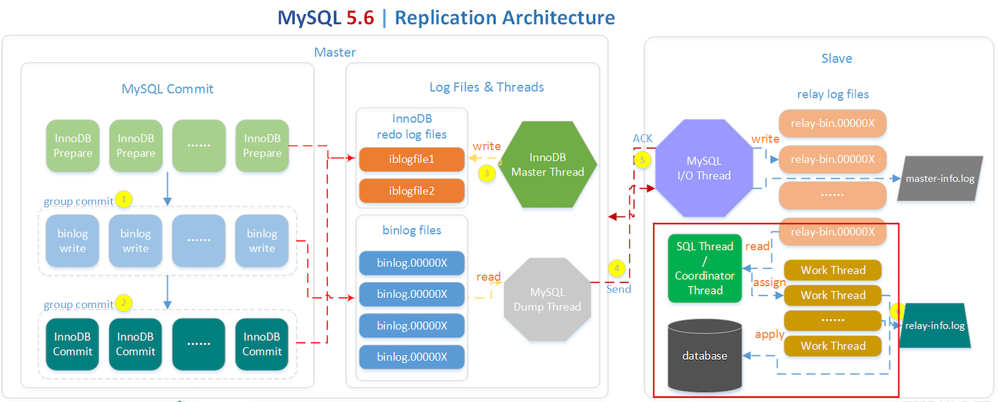

[TOC]

# transaction

开启一个事务：

* begin;
* start transaction;

begin除了用于开启一个事务也用于存储过程等MySQL编程的开始，因此在MySQL的代码块中使用事务则不应该使用begin而使用start transaction。

结束一个事务：

* commit;
* rollback;

事务：

* A，原子性
    - 通过redo来实现，一个事务不可切割，要么都执行要么都不执行；
* C，一致性
    - 通过undo log来实现，事务只能从一个有效状态转移到另一个有效状态而不破坏约束条件；
* I，隔离性
    - 使用锁来实现，使多个事务同时执行好似串行执行；
* D，持久性
    - 通过redo和undo同时实现，用于保证一个已提交的事务可以被持久存储而不会丢失

# redo

在MySQL中，如果每一次的更新操作都需要写进磁盘，然后磁盘也要找到对应的那条记录，然后再更新，整个过程IO成本、查找成本都很高。为了解决这个问题，MySQL的设计者就采用了日志（redo log）来提升更新效率。

而日志和磁盘配合的整个过程，其实就是MySQL里的WAL技术，WAL的全称是Write-Ahead Logging，它的关键点就是先写日志，再写磁盘。

具体来说，当有一条记录需要更新的时候，InnoDB引擎就会先把记录写到redo log（redolog buffer）里面，并更新内存（buffer pool），这个时候更新就算完成了。同时，InnoDB 引擎会在适当的时候（如系统空闲时），将这个操作记录更新到磁盘里面（刷脏页）。

redo log是InnoDB存储引擎层的日志，又称重做日志文件，redo log是循环写的，redo log不是记录数据页更新之后的状态，而是记录这个页做了什么改动。

redo log是固定大小的，比如可以配置为一组4个文件，每个文件的大小是1GB，那么日志总共就可以记录4GB的操作。从头开始写，写到末尾就又回到开头循环写，如下图所示。


* \-\-innodb_log_buffer_size：用于指定内存中存储redo日志的大小；
    - 默认设置为8M，该缓冲区用于保存脏数据在被写入redo日志文件之前在内存中存放的大小；
    - 对于较小的innodb_buffer_poo_size则建议将innodb_log_buffer_size设置一样大，由于innodb_log_buffer会定期刷盘，因此应该参考一秒内数据写入量或一个事务的数据量来设置innodb_log_buffer的大小；
* \-\-innodb_log_file_size：用于指定redo日志的文件大小，此处为单个文件的大小；
    - 建议在写入密集型的应用中将redo日志的总大小调整为innodb_buffer_pool的大小，可延缓checkpoint，当一个日志文件写满后，innodb会自动切换到另外一个日志文件，而且会触发数据库的检查点（Checkpoint），这会导致innodb缓存脏页的小批量刷新，会明显降低innodb的性能；
    - 如果innodb_log_file_size设置得过滤，会导致日志切换更频繁，也就直接导致更多的BUFFER FLUSH，由于日志切换的时候是不能BUFFER FLUSH的， BUFFER写不下去，导致没有多余的buffer 写redo， 那么整个MySQL就HANG住；
    - 如果有一个大事务，把所有的日志文件写满了还没写完，这样就会导致日志不能切换也会被hang住。可以根据文件修改时间来判断日志文件的旋转频率，如果频率较小则说明日志文件过小。
    - 如果设置过大会减小checkpoint，但由于单次checkpoint的数据量较大，另外MySQL在Crash时也会导致较长的恢复时间；
    - 一般建议根据`show engine innodb status\G`中'Log sequence number'和'Last checkpoint at'差值来判断innodb_log_file_size的设置是否合理。
* \-\-innodb_log_files_in_group：用于指定设置几个redo日志文件；
    - 该值不能直接修改，应该先正常关闭MySQL，然后删除对应的innodb_log_file（即ib_logfile0和ib_logfile1等redo日志文件），然后修改my.cnf中该变量的值之后启动MySQL服务即可；
* \-\-innodb_log_group_home_dir：用于指定redo日志存放的目录；
    - 建议将redo日志与数据目录分开存放，从而避免与数据目录发生IO资源的冲突；
* \-\-innodb_flush_log_at_timeout：默认为1秒，如果修改此处的时间为2秒则innodb_flush_log_at_trx_commit设置为0时则会在每2秒或innodb_log_buffer_size使用一半时自动刷盘；

## 基于什么原则调整innodb_log_buffer_size的大小

redo日志刷盘的策略：

* master thread每秒都将innodb_log_buffer中的数据刷新至磁盘中的redo日志文件中；
* innodb_log_buffer_size已被使用了一半则将内存中的数据刷新至磁盘中；
* 当事务提交时将innodb_log_buffer中的数据刷新至磁盘；

* \-\-innodb_flush_log_at_trx_commit={0|1|2}：定义redo日志从内存中的buffer刷新至磁盘的策略；
    - 0：事务提交时不将innodb_log_buffer写入磁盘，仅在每秒或innodb_log_buffer_size使用了一半时刷新到磁盘，因此使用该策略最多会丢失1秒或innodb_log_buffer_size一半的数据，但这种设置MySQL的性能最好；
    - 1：事务提交时将redo_log_buffer中的数据刷新至磁盘，这种设置是最安全的不会导致数据丢失；
    - 2：事务提交时将redo_log_buffer中的数据写入系统缓存（但如果操作系统crash则会产生数据丢失）；

## redo日志文件的结构和redo的日志体

innodb存储引擎中，redo log以块为单位进行存储的，每个块占512字节，这称为redo log block。所以不管是log buffer中还是os buffer中以及redo log file on disk中，都是这样以512字节的块存储的。

每个redo log block由3部分组成：日志块头、日志块尾和日志主体。**其中日志块头占用12字节，日志块尾占用8字节**，所以每个redo log block的日志主体部分只有512-12-8=492字节。


因为redo log记录的是数据页的变化，当一个数据页产生的变化需要使用超过492字节的redo log来记录，那么就会使用多个redo log block来记录该数据页的变化。

日志块头包含4部分：

* log_block_hdr_no：(4字节)该日志块在redo log buffer中的位置ID；
* log_block_hdr_data_len：(2字节)该log block中已记录的log大小。写满该log block时为0x200，表示512字节
* log_block_first_rec_group：(2字节)该log block中第一个log的开始偏移位置，因为有时候一个数据页产生的日志量超出了一个日志块，这是需要用多个日志块来记录该页的相关日志；例如，某一数据页产生了552字节的日志量，那么需要占用两个日志块，第一个日志块占用492字节，第二个日志块需要占用60个字节，那么对于第二个日志块来说，它的第一个log的开始位置就是73字节(60+12)；
* lock_block_checkpoint_no：**（4字节）写入检查点信息的位置**；

日志块尾只有1部分：

* log_block_trl_no：该值与日志块头的`log_block_hdr_no`相等；

由于MySQL是将内存中inndbo_log_buffer刷到磁盘中的innodb_log_log中去的，因此redo日志文件的内部结构与内存中的inndb_log_buffer是一样的；


在每个组的第一个redo log file中，前2KB记录4个特定的部分，从2KB之后才开始记录log block。除了第一个redo log file中会记录，log group中的其他log file不会记录这2KB，但是却会腾出这2KB的空间。

因为innodb存储引擎存储数据的单元是页（和SQL Server中一样），所以redo log也是基于页的格式来记录的。默认情况下，innodb的页大小是16KB(由`innodb_page_size`变量控制)，一个页内可以存放非常多的log block(每个512字节)，而log block中记录的又是数据页的变化。

其中log block中的492字节的部分就是redo log body，redo log body分为四个部分：

* redo_log_type：占用1个字节，表示redo log的日志类型。
* space：表示表空间的ID（即表空间ID），采用压缩的方式后，占用的空间可能小于4字节。
* page_no：表示页的偏移量（即页号），同样是压缩过的。
* redo_log_body：表示每个重做日志的数据部分，恢复时会调用相应的函数进行解析。

insert语句和delete语句写入redo log的内容是不一样的。如下图所示：


# binlog

从MySQL整体来看，其实就有两块：一块是Server层，它主要做的是MySQL功能层面的事情；还有一块是引擎层，负责存储相关的具体事宜。redo log是InnoDB引擎特有的日志，而Server层也有自己的日志，称为binlog（归档日志）。

binlog属于逻辑日志，是以二进制的形式记录的是这个语句的原始逻辑，依靠binlog是没有crash-safe能力的。

binlog有两种模式，statement格式的话是记sql语句，row格式会记录行的内容，记两条，更新前和更新后都有。

* \-\-binlog_cache_size：设置内存中的binlog_cache的大小，此处的binlog_cache_size是每个session一份，应结合sync_binlog中一次cache的事务的大小，所有未提交的二进制日志都会写入这部分内存，在执行commit时一并将binlog_cache中的数据写入至二进制日志的文件中；
* \-\-max_binlog_cache_size：表示的是所有session使用的binlog_cache的总大小，一般不需要调整，如果所有session使用的binlog_cache使用的内存的总和超过max_binlog_cache_size的大小则会导致mysql报错；
* \-\-max_binlog_size：单个二进制日志最大的大小；
* \-\-binlog_format={ROW|STATEMENT|MIXED}：设置二进制日志记录的格式；
    - ROW表示仅记录哪条记录被修改了，被修改成什么样了，如果一条SQL会导致大量记录的变化则使用ROW格式记录的二进制日志的内容也会较大，推荐使用ROW模式；
    - STATEMENT表示修改记录的SQL，但如果执行的SQL中包括不确定的因素如：date()函数则也会导致二进制日志在从库上执行时的不一致，另外使用STATEMENT的模式在RC的事务隔离级别下也会导致主从的数据不一致的；
    - MIXED表示混合模式，在二进制日志中混合使用ROW和STATEMENT两种模式，默认使用STATEMENT而在一些特定情况下使用ROW；
* \-\-sync_binlog={0|N}：控制数据库的binlog刷到磁盘上去的策略；
    - sync_binlog=0，表示MySQL不控制binlog的刷新，由文件系统自己控制它的缓存的刷新。这时候的性能是最好的，但是风险也是最大的。因为一旦系统Crash，在binlog_cache中的所有binlog信息都会被丢失；
    - sync_binlog=N，表示每N次事务提交，MySQL调用文件系统的刷新操作将缓存刷下去。最安全的就是sync_binlog=1了，表示每次事务提交，MySQL都会把binlog刷到磁盘，N=1最安全但性能损失也比较大；
* \-\-binlog_group_commit_sync_delay：单位微妙，默认0，范围：0～1000000（1秒），等待多少时间后才进行组提交；
* \-\-binlog_group_commit_sync_no_delay_count：单位个数，默认0，范围：0～1000000，等待延迟提交的最大事务数，如果上面参数的时间没到，但事务数到了，则直接同步到磁盘。若binlog_group_commit_sync_delay没有开启，则该参数也不会开启；
* \-\-binlog-do-db：指定mysql的binlog日志记录哪个db，如果有多个库需要同步则要写多行，每行一个；
* \-\-binlog-ignore-db：指定的库的操作不记录到二进制日志中；
* \-\-log-slave-update：如果开启链式复制，则处理中间的服务器即要开启二进制日志也要开启中继日志，则需要开启该选项；
* \-\-binlog_rows_query_log_events：默认为不启用，启用binlog_rows_query_log_events时，在设置binlog_format=ROW时也会在binlog日志中记录原始SQL语句；

二进制日志并不是一个单独文件，由一组存储实际内容的二进制日志文件和一个跟踪二进制日志文件存储位置的二进制日志索引文件


每一个二进制日志文件以格式描述事件开始(format description event),以日志轮换事件（rotate event）结束。

* 格式描述事件包括：改文件的服务器版本号。服务器及二进制日志信息，还有一个标记，标记二进制日志文件是否正确关闭。如果正在写入二进制日志，则设置该标记，否则清除该标记（这样可以检测出在奔溃时间中损坏的二进制日志文件，并允许通过复制进行恢复）；
* 日志轮换包括：下一个二进制日志文件的名称及告知二进制日志继续写入到哪个文件；

```
mysql> show master status\G
*************************** 1. row ***************************
             File: db092.000007
         Position: 4923
     Binlog_Do_DB:
 Binlog_Ignore_DB:
Executed_Gtid_Set: 54c3cf8c-f837-11ea-b2d5-005056be166d:1-20,
81fbd93a-f7f9-11ea-9908-005056be166d:1-1407,
b250a0cd-f811-11ea-bfe3-005056be166d:1-5
1 row in set (0.00 sec)

mysql> show binlog events in "db092.000007";
+--------------+------+----------------+-----------+-------------+-------------------------------------------------------------------------------------------------------------------+
| Log_name     | Pos  | Event_type     | Server_id | End_log_pos | Info                                                                                                              |
+--------------+------+----------------+-----------+-------------+-------------------------------------------------------------------------------------------------------------------+
| db092.000007 |    4 | Format_desc    | 200916092 |         123 | Server ver: 5.7.28-log, Binlog ver: 4                                                                             |
| db092.000007 |  123 | Previous_gtids | 200916092 |         234 | 81fbd93a-f7f9-11ea-9908-005056be166d:1-1407,
b250a0cd-f811-11ea-bfe3-005056be166d:1-5                             |
| db092.000007 |  234 | Gtid           | 200916092 |         299 | SET @@SESSION.GTID_NEXT= '54c3cf8c-f837-11ea-b2d5-005056be166d:1'                                                 |
| db092.000007 |  299 | Query          | 200916092 |         483 | CREATE USER 'admin'@'10.%' IDENTIFIED WITH 'mysql_native_password' AS '*3FBB7FB5A93FE26552771AFEFD5206158252AE9C' |
| db092.000007 |  483 | Gtid           | 200916092 |         548 | SET @@SESSION.GTID_NEXT= '54c3cf8c-f837-11ea-b2d5-005056be166d:2'                                                 |
| db092.000007 |  548 | Query          | 200916092 |         698 | GRANT ALL PRIVILEGES ON *.* TO 'admin'@'10.%' WITH GRANT OPTION                                                   |
| db092.000007 |  698 | Gtid           | 200916092 |         763 | SET @@SESSION.GTID_NEXT= '54c3cf8c-f837-11ea-b2d5-005056be166d:3'                                                 |
| db092.000007 |  763 | Query          | 200916092 |         850 | flush privileges                                                                                                  |
| db092.000007 |  850 | Gtid           | 200916092 |         915 | SET @@SESSION.GTID_NEXT= '54c3cf8c-f837-11ea-b2d5-005056be166d:4'                                                 |
| db092.000007 |  915 | Query          | 200916092 |        1018 | create database test_db                                                                                           |
| db092.000007 | 1018 | Gtid           | 200916092 |        1083 | SET @@SESSION.GTID_NEXT= '54c3cf8c-f837-11ea-b2d5-005056be166d:5'                                                 |
| db092.000007 | 1083 | Query          | 200916092 |        1206 | use `test_db`; create table t0 (id int not null, key (id))                                                        |
| db092.000007 | 1206 | Gtid           | 200916092 |        1271 | SET @@SESSION.GTID_NEXT= '54c3cf8c-f837-11ea-b2d5-005056be166d:6'                                                 |
| db092.000007 | 1271 | Query          | 200916092 |        1346 | BEGIN                                                                                                             |
| db092.000007 | 1346 | Table_map      | 200916092 |        1394 | table_id: 137 (test_db.t0)                                                                                        |
| db092.000007 | 1394 | Write_rows     | 200916092 |        1454 | table_id: 137 flags: STMT_END_F                                                                                   |
| db092.000007 | 1454 | Xid            | 200916092 |        1485 | COMMIT /* xid=18765 */                                                                                            |
| db092.000007 | 1485 | Gtid           | 200916092 |        1550 | SET @@SESSION.GTID_NEXT= '54c3cf8c-f837-11ea-b2d5-005056be166d:7'                                                 |
| db092.000007 | 1550 | Query          | 200916092 |        1680 | use `test_db`; create table t1 (id int not null, primary key(id))                                                 |
| db092.000007 | 1680 | Gtid           | 200916092 |        1745 | SET @@SESSION.GTID_NEXT= '54c3cf8c-f837-11ea-b2d5-005056be166d:8'                                                 |
| db092.000007 | 1745 | Query          | 200916092 |        1820 | BEGIN                                                                                                             |
| db092.000007 | 1820 | Table_map      | 200916092 |        1868 | table_id: 147 (test_db.t1)                                                                                        |
| db092.000007 | 1868 | Write_rows     | 200916092 |        1928 | table_id: 147 flags: STMT_END_F                                                                                   |
| db092.000007 | 1928 | Xid            | 200916092 |        1959 | COMMIT /* xid=28715 */                                                                                            |
......
......
| db092.000007 | 4724 | Query          | 200916092 |        4799 | BEGIN                                                                                                             |
| db092.000007 | 4799 | Table_map      | 200916092 |        4848 | table_id: 267 (test_db.t4)                                                                                        |
| db092.000007 | 4848 | Write_rows     | 200916092 |        4892 | table_id: 267 flags: STMT_END_F                                                                                   |
| db092.000007 | 4892 | Xid            | 200916092 |        4923 | COMMIT /* xid=51549 */                                                                                            |
+--------------+------+----------------+-----------+-------------+-------------------------------------------------------------------------------------------------------------------+
75 rows in set (0.00 sec)
```

使用mysqlbinlog也查直接查看二进制日志文件中的具体内容。

## binlog与redolog

最开始MySQL里并没有InnoDB引擎。MySQL自带的引擎是MyISAM，但是MyISAM没有crash-safe的能力，binlog日志只能用于归档。而InnoDB是另一个公司以插件形式引入MySQL的，既然只依靠binlog是没有crash-safe能力的，所以InnoDB使用另外一套日志系统——也就是redo log来实现crash-safe能力。

binlog与redo log的区别：

* redo log是InnoDB引擎特有的，而binlog是MySQL的Server层实现的，所有引擎都可以使用；
* redo log是物理逻辑日志，记录的是在某个数据页上做了什么修改，而binlog是逻辑日志，记录的是这个语句的原始逻辑；
* redo log是循环写入的，空间固定会用完，binlog是追加写入的，因此不会覆盖以前的日志；

MySQL执行器和InnoDB引擎在执行update语句时的内部流程：

1. 执行器先找引擎取 ID=2 的这一行记录。ID是主键，引擎直接用B+树搜索找到这一行。如果 ID=2 这一行所有的数据页本来就在内存中，就直接返回给执行器；否则就需要从磁盘将数据页读入内存，然后再返回；
2. 执行器拿到引擎给的行数据，把这个值加1，比如原来是N，现在就是N+1，得到新的一行数据，再调用引擎接口写入这行新的数据；
3. 引擎将这行新的数据更新到内存（InnoDB Buffer Pool）中，同时将这个更新操作记录到redo log是，此时redo log处于prepare状态。然后告知执行器执行完成了，随时可以提交事务；
4. 当用户提交commit之后，执行器调用引擎的提交事务接口，引擎把刚才写入的redo log改为已提交（commit）的状态；
5. 执行器将这个事务一串的操作流程都记录到binlog_cache中，等待时间将binlog_cache中的数据刷新到磁盘；


redo log会在用户操作的过程中一直写入日志，但是binlog的日志仅会在用户执行commit的时候写入日志。

其中将 redo log 的写入拆成了两个步骤：prepare 和 commit，这就是两阶段提交（2PC）。

MySQL 使用两阶段提交主要解决 binlog 和 redo log 的数据一致性的问题（如果binlog提交并落盘而redo log没有落盘则会导致主从数据不一致的情况）。

redo log 和 binlog 都可以用于表示事务的提交状态，而两阶段提交就是让这两个状态保持逻辑上的一致。下图为 MySQL 二阶段提交简图：


两阶段提交的流程：

* InnoDB redo log 写盘，InnoDB 事务进入 prepare 状态（在redo log中写入事务的id号）。
* 如果前面 prepare 成功，binlog 写盘，那么再继续将事务日志持久化到 binlog，如果持久化成功，那么 InnoDB 事务则进入 commit 状态(在 redo log 里面写一个 commit 记录)；

备注: 每个事务 binlog 的末尾，会记录一个 XID event，标志着事务是否提交成功，也就是说，recovery 过程中，binlog 最后一个 XID event 之后的内容都应该被 purge。



事实上从mysql 5.6之后二进制日志的刷盘和redo log的commit也都是组提交的；在mysql 5.5之前为了保证redo log和binlog的顺序是一致的从而设置redo log和binlog都是按事务的先后顺序串行执行的，因此其效率很低；

在5.6之后二进制日志和redo日志的commit都是组提交的，而从5.7之后redo日志的prepare日志也是组提交的。

# undo

https://blog.csdn.net/zwleagle/article/details/39010477

InnoDB的undo对象：

* rollback segment
* undo log segment
* undo page
* undo log
* undo log record

在MySQL 5.6之后新增以下三个undo日志相关的配置：

* innodb_undo_directory：undo日志存放的目录；
* innodb_undo_logs：指定每个undo log的日志段的数量；
* innodb_undo_tablespaces：指定undo rollback segment的个数，一个


## rollback segment

MySQL 5.5之前仅有一个rollback segment；而在MySQL 5.6之后有128个rollback segment；在MySQL 5.7中有96个rollback segment；

* InnoDB的rollback segment是不保存任何undo log；
* InnoDB的rollback segment中仅保存undo log segment的位置；
* 一个rollback segment中包含1024个undo solt；
* rollback segment中保存有**HISTORY LIST**（保存事务已提交的update undo log）；

一般而言增删改的操作都会用到undo线程，而一个undo线程就会占据一个undo solt，因此在MySQL 5.7之前最大只能有不超过1024个用到undo solt的线程；

## undo log record

在InnoDB中undo log分为两种类型：

* insert undo log record
* update undo log record

# purge

在数据库中执行的delete仅会将对应记录标记为删除（delete-mark），然后才会使用purge线程用于真正删除对应记录，delete-mark是同步操作，而purge是异步操作。

delete-mark是记录在页中每条记录的record-header的info_bits的位置。

innodb_purge_threads：用于指定purge线程的数量；

# group commit

# XA

在电商类应用中”提交订单后减库存”就是分布式事务的一类应用。

```

# 开启一个分布式事务
XA {START | BEGIN} xid [JOIN | RESUME]

XA END xid [SUSPEND [FOR MIGRATE]]

XA PREPARE xid

XA COMMIT xid [ONE PHASH]

XA ROLLBACK xid

XA RECOVER
```

# transaction programming