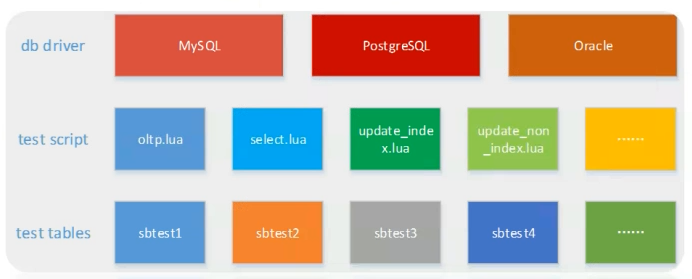

[TOC]

# sysbench

QPS：使用questions的值除以uptime即可得到QPS；
TPS：每秒的事务数；

```
mysql> show global status like "questions";
    +---------------+-----------+
    | Variable_name | Value     |
    +---------------+-----------+
    | Questions     | 381558481 |
    +---------------+-----------+

mysql> show global status like "uptime";
    +---------------+---------+
    | Variable_name | Value   |
    +---------------+---------+
    | Uptime        | 8219991 |
    +---------------+---------+

# mysql的QPS
mysql> select 381558481 / 8219991;
    +---------------------+
    | 381558481 / 8219991 |
    +---------------------+
    |             46.4184 |
    +---------------------+


mysql> show global status where variable_name in ('com_select',"com_insert","com_delete","com_update");
    +---------------+---------+
    | Variable_name | Value   |
    +---------------+---------+
    | Com_delete    | 731     |
    | Com_insert    | 6622675 |
    | Com_select    | 340135  |
    | Com_update    | 7148245 |
    +---------------+---------+

# mysql的TPS
mysql> select (731 + 6622675 + 340135 + 7148245) / 8219991;
    +----------------------------------------------+
    | (731 + 6622675 + 340135 + 7148245) / 8219991 |
    +----------------------------------------------+
    |                                       1.7168 |
    +----------------------------------------------+

# 使用以下命令统计1s内的事务的变化也可以
mysql> show global status where variable_name in ('com_select',"com_insert","com_delete","com_update"); select sleep(1) ; show global status where variable_name in ('com_select',"com_insert","com_delete","com_update");
+---------------+---------+
| Variable_name | Value   |
+---------------+---------+
| Com_delete    | 731     |
| Com_insert    | 6628130 |
| Com_select    | 340349  |
| Com_update    | 7163472 |
+---------------+---------+
4 rows in set (0.00 sec)

+----------+
| sleep(1) |
+----------+
|        0 |
+----------+
1 row in set (1.00 sec)

+---------------+---------+
| Variable_name | Value   |
+---------------+---------+
| Com_delete    | 731     |
| Com_insert    | 6628131 |
| Com_select    | 340350  |
| Com_update    | 7163488 |
+---------------+---------+
4 rows in set (0.00 sec)
```

sysbench是一款简单高效的基准性能测试工具，可以根据某个具体的操作进行测试，官方地址：https://github.com/akopytov/sysbench



## sysbench的常用选项与测试案例

sysbench的语法：

`sysbench [options]... [testname] [command]`

通用选项：

```
--num-threads=N：创建测试线程的数目。默认为1.
--max-requests=N：请求的最大数目。默认为10000，0代表不限制。
--max-time=N：最大执行时间，单位是s。默认是0,不限制。
--forced-shutdown=STRING：超过max-time强制中断。默认是off。
--thread-stack-size=SIZE：每个线程的堆栈大小。默认是32K。
--init-rng=[on|off]：在测试开始时是否初始化随机数发生器。默认是off。
--test=STRING：指定测试项目名称。
--debug=[on|off]：是否显示更多的调试信息。默认是off。
--validate=[on|off]：在可能情况下执行验证检查。默认是off。
```

testanme：测试项目

```
fileio：文件测试，用于测试系统IO能力；
cpu：测试CPU性能；
memory：内存性能测试；
threads：线程测试；
mutex：互斥性能测试；
```

command：指定sysbench要执行的命令，包括prepare、run和cleanup；

```
prepare：
run：
cleanup：
```

# tpcc