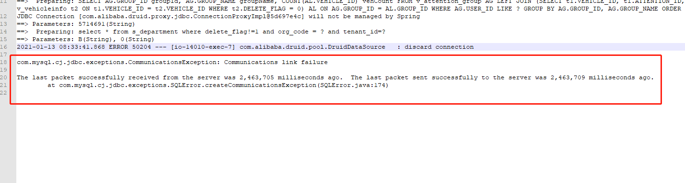

1. 如果redo log设置较小会有什么影响？

redo log是一个滚动写入的文件（以保证顺序写入），而mysql会根据redo log进行数据重放，因此如果日志过小则会产生此前已保存至redo log的sql尚未执行完成而新的写入没有对应的空闲的redo log的空间用于存储从而导致写阻塞的情况。

2. 如何判断redo log是否合理？

使用`show engine innodb status\G`查看`Log sequence number`-`Pages flushed up to`的字节数。如果得到的大小大于redo log总大小的50％则应该增加redo log的空间。

3. query cache的全局锁？

4. jdbc异常断开，但仅修改wait_timeout无法生效的问题

数据库连接池会把已经断开的连接认为是存活的连接给执行的程序，应用服务上频繁出现如下的故障日志；

在数据库上修改wait_timeout但无法生效，是因为wait_timeout与interactive_timeout的值有关，interactive_timeout用于指定交互式连接的断开前的连接空闲时长，wait_timeout用于指定非交互式连接的连接断开前的空闲时长，而如果仅修改wait_timeout的值而不修改interactive_timeout的值即便使用set global和set session同时修改全局和会话级别的变量也会导致wait_timeout的修改不生效，因此修改wait_timeout也需要一并修改interactive_timeout的值。