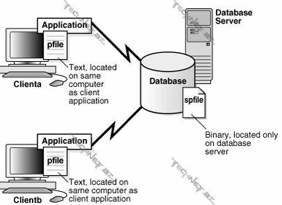

[TOC]

# 简介

当启动一个数据库实例的时候，oracle会读取服务器参数文件（server parameter file，即spfile，该文件为二进制文件）或者文本初始化参数文件（text initialization parameter file，pfile，该文件为文本文件）。

SPFILE的路径一般位于ORACLE_HOME目录下的“dbs/spfilevlms.ora”，该文件只会存在于服务器上；该文件为二进制文件，无法通过文本管理类的命令进行查看或编辑，可使用`strings spfileprod.ora`来查看该文件中的文本信息。

PFILE文件一般存储在客户端上，目前一般不使用pfile；



查看oracle实例使用的spfile的文件路径：

```

    SQL> show parameter spfile;

        NAME                                 TYPE        VALUE
        ------------------------------------ ----------- ------------------------------
        spfile                               string      /u01/app/oracle/product/12.2.0
                                                         /dbhome_1/dbs/spfilevlms.ora
```

官方文档路径：

Concepts --> 13.5 Overview of Parameter Files

初始化参数分为两类（调整大约30个基本参数就可以获得很好的性能）：

* 基本参数
    - control_files：指定控制文件的绝对路径；
    - DB_BLOCK_SIZE：指定块的大小；
    - DB_NAME：指定数据库名；
    - UNDO_TABLESPACE：指定undo表空间的文件名；
    - memory_target：数据库根据该参数调整实例的内存大小；
* 高级参数

## 参数命名规则

spfile命名规则：spfileSID.ora
pfile命名规则：initSID.ora

文件路径：
    Linux：${ORACLE_HOME}/dbs
    Windows：${ORACLE_HOME}/database

## 修改参数

参数有静态和动态之分，动态参数又分为会话级别参数和系统级别参数，静态的参数修改需要重启实例才会生效；

* 会话级别参数：影响当前用户会话（MEMORY_TARGET）
    - `alter session set nls_date_format='yyyy-mm-dd hh24:mi:ss;'`
* 系统级别参数：影响数据库和所有用户会话（NLS_DATE_FORMAT）
    - `alter system set key=value scope=memory|spfile|both`

### 修改静态参数

查看有哪些参数是静态参数：

```
    SQL> select * from v$parameter t where t.ISSYS_MODIFIABLE='FALSE';
```

例如：修改processes，该参数用于设置oracle最大的用户进程数和最大连接数；

```

    shell> sqlplus / as sysdba
    SQL> show parameter process

        NAME                                 TYPE        VALUE
        ------------------------------------ ----------- ------------------------------
        aq_tm_processes                      integer     1
        asm_io_processes                     integer     20
        cell_offload_processing              boolean     TRUE
        db_writer_processes                  integer     1
        gcs_server_processes                 integer     0
        global_txn_processes                 integer     1
        job_queue_processes                  integer     4000
        log_archive_max_processes            integer     4
        processes                            integer     300
        processor_group_name                 string

    # 如提示ERROR则说明该参数为静态参数，不可直接修改

    SQL> alter system set processes=500;

        alter system set processes=500
                         *
        ERROR at line 1:
        ORA-02095: specified initialization parameter cannot be modified

    # 通过使用scope=spfile说明修改该参数仅在spfile文件中生效，从而实现修改oracle的静态参数

    SQL> alter system set processes=500 scope=spfile;

        System altered.

    SQL> exit
    shell> strings ${ORACLE_HOME}/dbs/spfilevlms.ora
        ......
        *.local_listener='LISTENER_VLMS'
        *.nls_language='AMERICAN'
        *.nls_territory='AMERICA'
        *.op
        en_cursors=300
        *.pga_aggregate_target=199m
        *.processes=500
        *.remote_login_passwordfile='EXCLUSIVE'
        *.sga_target=597m
        *.undo_tablespace='UNDOTBS1'
    shell> dbshut
    shell> dbstart
    shell> sqlplus / as sysdba
    SQL> show parameter process

        NAME                                 TYPE        VALUE
        ------------------------------------ ----------- ------------------------------
        aq_tm_processes                      integer     1
        asm_io_processes                     integer     20
        cell_offload_processing              boolean     TRUE
        db_writer_processes                  integer     1
        gcs_server_processes                 integer     0
        global_txn_processes                 integer     1
        job_queue_processes                  integer     4000
        log_archive_max_processes            integer     4
        processes                            integer     500
        processor_group_name                 string

```

### 修改动态参数

查看哪些参数是动态参数：

```
    SQL> select * from v$parameter t where t.ISSYS_MODIFIABLE='IMMEDIATE';
```

```
    SQL> show parameter open_cur

        NAME                                 TYPE        VALUE
        ------------------------------------ ----------- ------------------------------
        open_cursors                         integer     300
    SQL> alter system set open_cursors=500;
    SQL> show parameter open_cur
        NAME                                 TYPE        VALUE
        ------------------------------------ ----------- ------------------------------
        open_cursors                         integer     500

```

### 修改会话级别参数

```

    SQL> alter session set nls_date_format='yyyy-mm-dd hh24:mi:ss';

        Session altered.

    SQL> select sysdate from dual;

        SYSDATE
        -------------------
        2021-08-26 11:52:22

```

### 修改系统级别参数

查看有哪些参数是系统级别参数：


```
    # 查看系统级别参数

    SQL> select * from v$parameter t where t.ISSES_MODIFIABLE='FALSE';
```

# spfile与pfile的相互创建

通过spfile创建pfile

```

    SQL> create pfile from spfile;

        File created.
    SQL> exit
    shell> ls $ORACLE_HOME/dbs/initvlms.ora
        /u01/app/oracle/product/12.2.0/dbhome_1/dbs/initvlms.ora
    shell> cat $ORACLE_HOME/dbs/initvlms.ora
        vlms.__data_transfer_cache_size=0
        vlms.__db_cache_size=331350016
        vlms.__inmemory_ext_roarea=0
        vlms.__inmemory_ext_rwarea=0
        vlms.__java_pool_size=4194304
        vlms.__large_pool_size=20971520
        vlms.__oracle_base='/u01/app/oracle'#ORACLE_BASE set from environment
        vlms.__pga_aggregate_target=209715200
        vlms.__sga_target=629145600
        vlms.__shared_io_pool_size=25165824
        vlms.__shared_pool_size=230686720
        vlms.__streams_pool_size=0
        *.audit_file_dest='/u01/app/oracle/admin/vlms/adump'
        *.audit_trail='db'
        *.compatible='12.2.0'
        *.control_files='/u01/app/oracle/oradata/vlms/control01.ctl','/u01/app/oracle/fast_recovery_area/vlms/control02.ctl'
        *.db_block_size=8192
        *.db_name='vlms'
        *.db_recovery_file_dest='/u01/app/oracle/fast_recovery_area/vlms'
        *.db_recovery_file_dest_size=2780m
        *.deferred_segment_creation=FALSE
        *.diagnostic_dest='/u01/app/oracle'
        *.dispatchers='(PROTOCOL=TCP) (SERVICE=vlmsXDB)'
        *.local_listener='LISTENER_VLMS'
        *.nls_language='AMERICAN'
        *.nls_territory='AMERICA'
        *.open_cursors=500
        *.pga_aggregate_target=199m
        *.processes=500
        *.remote_login_passwordfile='EXCLUSIVE'
        *.sga_target=597m
        *.undo_tablespace='UNDOTBS1'

    # 新创建的pfile也可不在默认路径下

    SQL> create pfile='/u01/initvlms.ora' from spfile;

```

通过pfile创建spfile：

```
    SQL> create spfile from pfile;
```

### 参数文件启动顺序

1. spfileORACLE_SID.ora
2. spfile.ora
3. initORACLE_SID.ors

使用指定的spfile来启动数据库实例：

```

    SQL> startup pfile='/u01/app/oracle/product/12.2.0/dbhome_1/dbs/spfilevlms.ora'

```
