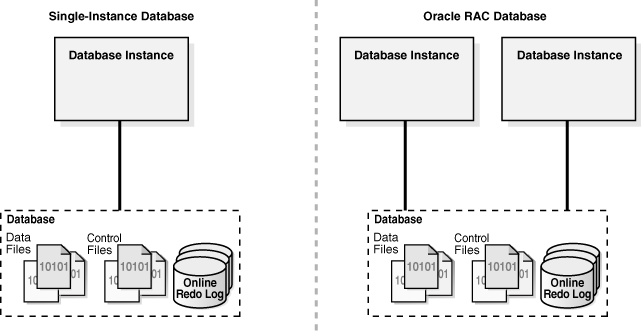

[TOC]

# oracle实例

官方文档：Concepts --> 13 Oracle Database Instance

oracle实例是一块内存区域，当实例启动的时候，会分配一个叫做SGA（System Global Area）的内存区域和启动若干后台进程，也就是“实例=SGA+后台进程”。

实例可以单独启动。


```
SQL> shutdown immediate
SQL> startup nomount
SQL> show parameter memory
```

数据库启动会先找到spfile，然后根据spfile中设置的memory_target申请部分内存空间。

PMON：进程监控进程；

SMON：系统监控进程；

DBWn：DataBase Writer，数据库写进程；

    DBW0：第0号数据库写进程；

LGWR：Log Write，即日志写进程；

CKPT：Check Point，检查点进程；

SGA用途：

1. 维护内部数据结构；
2. 缓存磁盘的数据；
3. 缓存redo数据；
4. 存储SQL执行计划；

SGA组成部分：

1. DataBase Buffer Cache：数据库缓冲和缓存
2. In-Memory Area：
3. Redo Log Buffer：Redo日志缓冲区；
4. Shared Pool：共享池（存放执行计划）
    * Library Cache：库缓存
    * Data Dictionary cache：数据字典缓冲；
5. Large Pool：大池
6. Java Pool：java池
7. Streams Pool：流池
8. Fixed SGA：

## 常用视图

v$instance：当前实例的相关信息；

gv$instance：集群环境中的实例信息；

v$sgainfo：SGA的信息，SGA内各部分的内存大小；

v$sgastat：SGA的状态信息；

v$process：查看进程相关信息，BACKGROUND字段为1则表示该进程为后台进程（SPID：系统进程号；PID：表示在oracle内部的进程号）；

v$bgprocess：查看后台进程相关信息。

## 单实例与RAC

RAC：Real Application Cluster，实时应用集群；



单实例：在一台机器上直接管理对应主机上的一系列数据文件；

RAC：多个实例管理同一套数据文件，而多个实例位于不同的服务器上；