# 从proxmox将虚拟机导出至vmware

将proxmox中的10.168.5.30-k8s-node导出至vmware esxi的虚拟化平台中。

1. 关闭虚拟机（确认虚拟机的id号）；

```
root@pve121:~# qm list --full
      VMID NAME                 STATUS     MEM(MB)    BOOTDISK(GB) PID
      2001 10.168.5.20-k8s-master stopped    32768             50.00 0
      2011 10.168.5.30-k8s-node stopped    32768             50.00 0
root@pve121:~# lsblk
NAME                            MAJ:MIN RM  SIZE RO TYPE MOUNTPOINT
sda                               8:0    1 14.6T  0 disk
├─sda1                            8:1    1 1007K  0 part
├─sda2                            8:2    1  512M  0 part
└─sda3                            8:3    1 14.6T  0 part
  ├─pve-swap                    253:0    0   16G  0 lvm  [SWAP]
  ├─pve-root                    253:1    0  200G  0 lvm  /
  ├─pve-data_tmeta              253:2    0 15.8G  0 lvm
  │ └─pve-data-tpool            253:4    0 14.3T  0 lvm
  │   ├─pve-data                253:5    0 14.3T  0 lvm
  │   ├─pve-vm--2001--disk--0   253:6    0   50G  0 lvm
  │   ├─pve-vm--2011--disk--0   253:7    0   50G  0 lvm
  │   ├─pve-vm--2001--cloudinit 253:8    0    4M  0 lvm
  │   └─pve-vm--2011--cloudinit 253:9    0    4M  0 lvm
  └─pve-data_tdata              253:3    0 14.3T  0 lvm
    └─pve-data-tpool            253:4    0 14.3T  0 lvm
      ├─pve-data                253:5    0 14.3T  0 lvm
      ├─pve-vm--2001--disk--0   253:6    0   50G  0 lvm
      ├─pve-vm--2011--disk--0   253:7    0   50G  0 lvm
      ├─pve-vm--2001--cloudinit 253:8    0    4M  0 lvm
      └─pve-vm--2011--cloudinit 253:9    0    4M  0 lvm
```

从以上命令可知10.168.5.30-k8s-node的PVE的ID是2011，对应的lvm的分区文件是/dev/mapper/pve-vm--2011--disk--0；

2. 使用qemu-img将虚拟机的lvm的分区文件导出为vmdk；

```
root@pve121:~# qemu-img convert -O vmdk -c /dev/mapper/pve-vm--2011--disk--0 2011.vmdk
```

3. 将vmdk文件从pve的服务器上传至vmware虚拟机；

```
root@pve121:~# scp 2011.vmdk root@10.168.1.115:/vmfs/volumes/115_DataStorage/
```

5. 在vmware中新建一个空白虚拟机，将该虚拟中的磁盘删除；

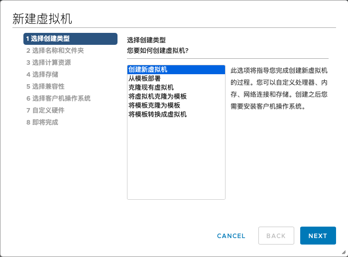

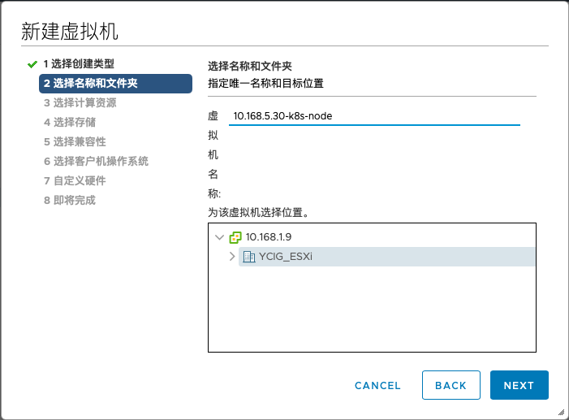

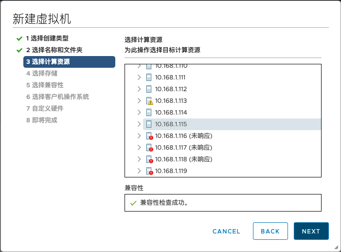

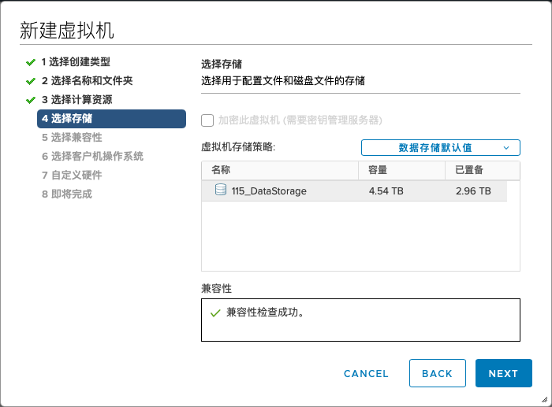

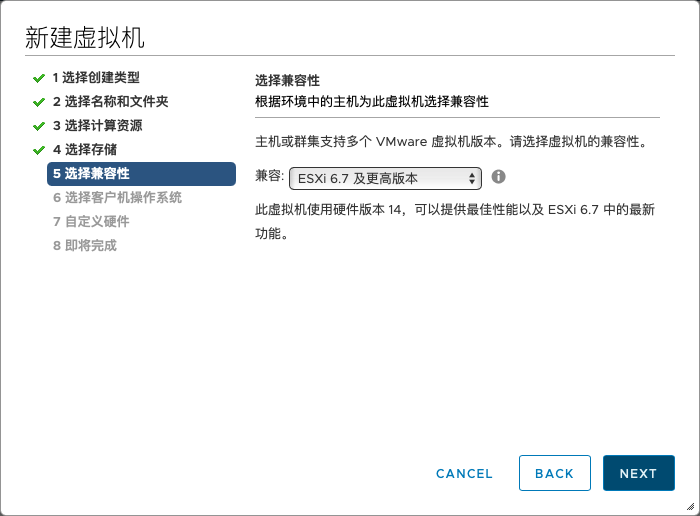

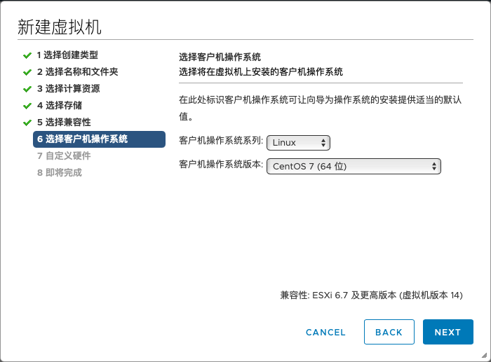

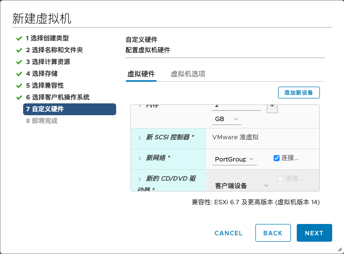

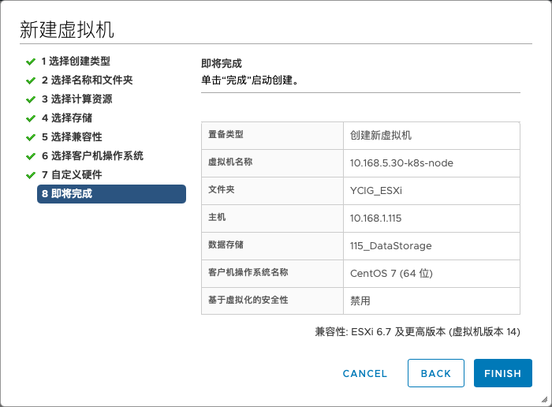

6. 将上传的vmdk文件使用vmkfstools转换为vmware可读取的文件并保存至新建的虚拟机的目录下；

```
[root@localhost:/vmfs/volumes/5ee1d198-2e7ea923-40bc-c4346bb99ba0] vmkfstools -i 2011.vmdk ./10.168.5.30-k8s-node/10.168.5.30-k8s-node.vmdk -d thin
Destination disk format: VMFS thin-provisioned
Cloning disk '2011.vmdk'...
Clone: 100% done.
```

7. 在vmware的虚拟机中加入转换后的磁盘文件；

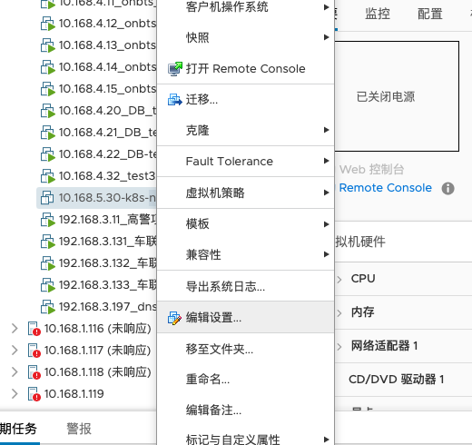

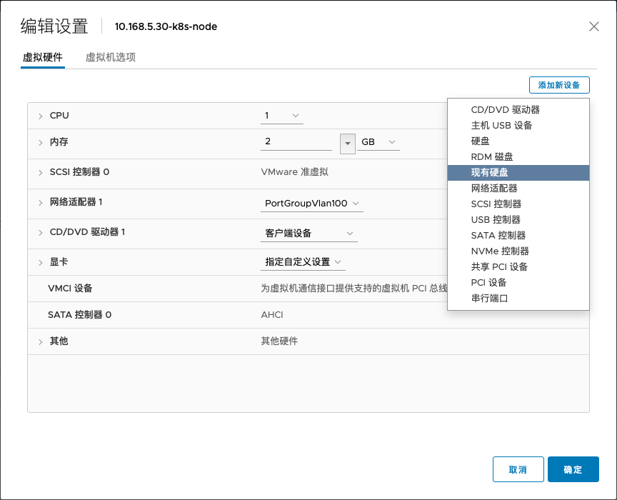

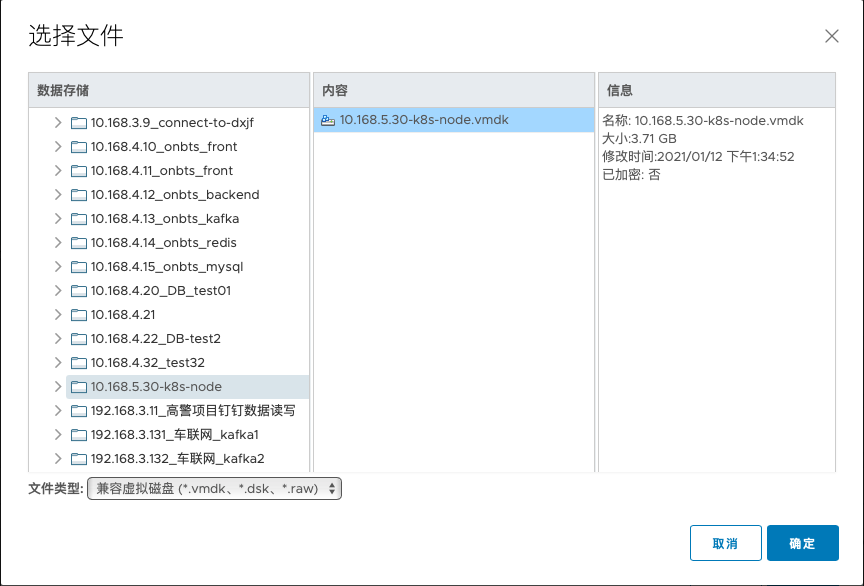

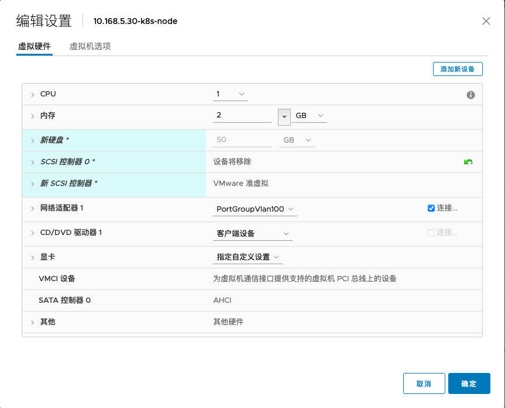

8. 测试该虚拟机能否启动；

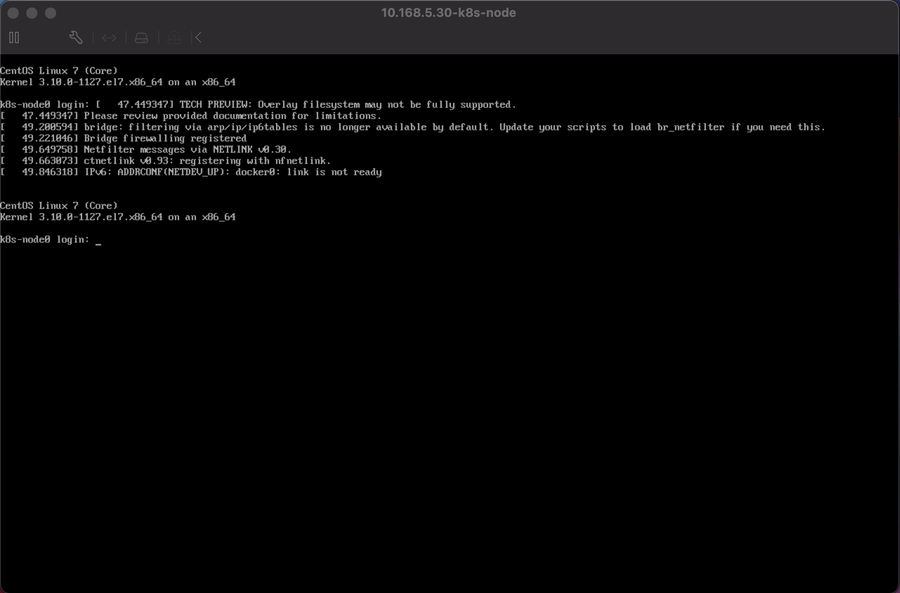
