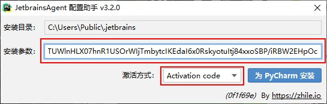
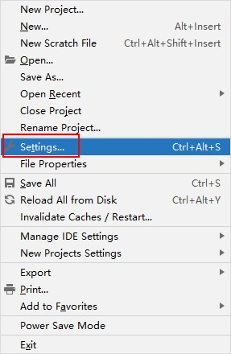

[TOC]

# 安装 python3

1. 下载[python3](https://www.python.org/downloads/release/python-363/)

2. 双击安装包开始安装

此处切记钩选“Add Python 3.8 to PATH”。

3. 选择该安装包需要安装的功能

4.　选择python3的安装目录（确认安装目录正确后点击Install）

5.　显示如下图片则表示python3安装成功

# 安装 pycharm

1.　双击pycharm的安装包，点击下一步

2.　选择pycharm的安装目录

3.　确认pycharm的安装选项

4.　点击下一步后即可安装成功

5.　安装完成后点击桌面图标开始激活软件

填写下载文件中的激活码。

6.　启动后选择本地目录做为今后python项目文件存放的目录

7.　将下载的“jetbrains-agent.jar”拖到pycharm的主界面中

点击“Restart”重启pycharm。

8.　找到下载文件的激活选项的文件，填写后点“为PyCharm安装”

9.　点击“是”之后pycharm即破解成功

10.　点击pycharm的“File”图标后找到“Settings”为pycharm进行基础设置

11.　将此前安装的python的可执行文件设置为默认的python的shebang

12.　设置新建python文件时默认的注释

