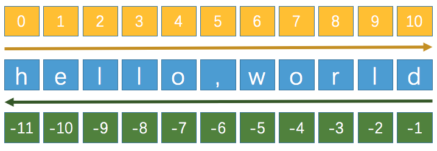

[TOC]

# 数据类型

python默认的数据类型可简单的分为数字、序列、映射和集合几种。根据其实例是否可被修改，又可分为可变和不可变类型。

| 名称      | 分类     | 是否可变 |
| --------- | -------- | -------- |
| int       | number   | N        |
| float     | number   | N        |
| bool      | number   | N        |
| str       | sequence | N        |
| bytes     | sequence | N        |
| bytearray | sequence | Y        |
| list      | sequence | Y        |
| tuple     | sequence | N        |
| dict      | mapping  | Y        |
| set       | set      | Y        |
| frozenset | set      | N        |

可使用“id()”判断变量是否为可变类型。

```
In [9]: a=True

In [10]: id(a)
Out[10]: 4377545488

In [11]: a=False

In [12]: id(a)
Out[12]: 4377545520

# 两次执行的a的id值不同，即表示其所在内存的位置不同。

In [25]: L1=[1,2]

In [26]: id(L1)
Out[26]: 4426155968

In [27]: L1.append(3)

In [28]: id(L1)
Out[28]: 4426155968

In [29]: print(L1)
[1, 2, 3]

# 对于list而言是可变类型，其中的值的变化是不影响其在内存的位置的
```

## 数字类型

### 整数

Python3 将原 int、long 两种整数类型合并为 int，采用变长结构。虽然这会导致更多的内存开销，但胜在简化了语言规则。

变长的结构允许创建超大的天文数字，但理论上仅受可分配内存大小的限制。

对于较长的数字，为便于阅读，习惯以千分位进行分隔标记，但逗号在python语法中有特殊含义，因此使用下划线替代。

```
In [30]: 1_333_222 == 1333222
Out[30]: True
```

除十进制外，数字还包括二进制、八进制以及十六进制表示。下划线分隔符同样适用于这些进制的字面量。

#### 进制转换

```
# 使用bin()、oct()、hex()可将整数分别转换为二进制、八进制和十六进制
In [31]: bin(100)
Out[31]: '0b1100100'

In [32]: oct(100)
Out[32]: '0o144'

In [33]: hex(100)
Out[33]: '0x64'

#　使用int()可将其他进制数转换为十进制数
In [34]: int('0b1100100',2)
Out[34]: 100

In [35]: int('0o144',8)
Out[35]: 100

In [36]: int('0x64',16)
Out[36]: 100
```

### 浮点数

有小数部分的类型即为浮点数。除法运算永远返回浮点数。Python中提供浮点数的完整支持；包含多种混合类型运算数的运算会把整数转换为浮点数。

Python也内置对复数支持，使用后缀“j”或者“J”用于表示虚数部分（例如：3+5j）。

### 数学运算

所有数字类型（复数除外）除四则运算外都支持以下函数运算。

| 运算            | 结果                                    | 注释                                                         |
| --------------- | --------------------------------------- | ------------------------------------------------------------ |
| -x              | x取反                                   |                                                              |
| +x              | x不变                                   |                                                              |
| abs(x)          | x的绝对值                               |                                                              |
| int(x)          | 将x转换为整数                           | 从浮点数转换为整数会被舍入或像是C语言中一样被截断，math.floor()和math.ceil() |
| float(x)        | 将x转换为浮点数                         | float 也接受字符串 "nan" 和附带可选前缀 "+" 或 "-" 的 "inf" 分别表示非数字 (NaN) 以及正或负无穷 |
| complex(re, im) | 一个带有实部re和虚部im的复数。im默认为0 |                                                              |
| c.conjugate()   | 复数c的共轭                             |                                                              |
| divmod(x, y)    | (x // y, x % y)                         | 不可用于复数。应在适当条件下使用abs()转换为浮点数            |
| pow(x, y)       | x的y次幂                                | Python 将 `pow(0, 0)` 和 `0 ** 0` 定义为 `1`，这是编程语言的普遍做法 |
| x ** y          | x的y次幂                                | 同上                                                         |

## 字符串类型

字符串字面量：将文本放入单引号、双引号或三引号（可以跨行，而三引号既可以使用三个双引号也可以使用三个单引号），这几种引号。

文档字符串：模块、类或函数的第一条语句是一个字符的换，则该字符串就成为文档字符串，可以使用__doc__属性进行引用。

* 序列表示索引为非负整数；
  * 字符串是字符序列的；
  * 列表和元组是任意python对象的序列。
* 字符和元组属于不可变对象，而列表则支持插入、删除和替换元素；
* 所有序列都支持迭代。

### 字符串操作符

1. s[i]：索引操作，索引超过实际数值会报错。

   ```
   In [6]: s1="hello world"
   
   In [7]: s1[2]
   Out[7]: 'l'
   ```

2. s[i:j]：切片操作，切片后的结果会生成一个新的对象，因为字符串不支持修改。

   ```
   In [10]: s1="hello world"
   
   In [11]: s1[2:3]
   Out[11]: 'l'
   
   In [12]: s1[2:4]
   Out[12]: 'll'
   ```

切片的索引有默认值；省略开始索引时默认为0，省略结束索引时默认为到字符串的结束。在切片中越界的索引会被自动处理。

2. s[i:j:stride]：扩展切片运算。

   ```
   In [17]: s1="abcdefghij"
   
   In [18]: s1[0:4:3]
   Out[18]: 'ad'
   
   In [19]: s1[0:-1:3]
   Out[19]: 'adg'
   ```

   

3. min(s)，max(s)：返回序列中最小值或最大值，只适用于能够对元素排序的序列。

   ```
   In [20]: s1="abcdefghij"
   
   In [21]: min(s1)
   Out[21]: 'a'
   
   In [22]: max(s1)
   Out[22]: 'j'
   
   In [23]: s2="abcd0123"
   
   In [24]: min(s2)
   Out[24]: '0'
   
   In [25]: max(s2)
   Out[25]: 'd'
   ```

4. sum(s)：对序列中的所有数字进行求和，只适用于数字序列。

   ```
   In [32]: l1=[1,2,3]
   
   In [33]: sum(l1)
   Out[33]: 6
   
   In [34]: t1=(1,23)
   
   In [35]: sum(t1)
   Out[35]: 24
   ```

5. all(s)：检查字符串s中的所有项是否为True，可理解为所有项是否有字符。

6. any(s)：检查字符串s中的任意项是否为True。

### 字符串的方法

通过使用“help(str)”可获取字符串的所有可用的方法。

1. s.capitalize()：首字符变大写。

   ```
   In [49]: print(s1)
   abcdefghij
   
   In [50]: s1.capitalize()
   Out[50]: 'Abcdefghij'
   ```

2. s.index(sub[, start[, end]])：找到指定子字符串sub首次出现的次数，否则报错。

   ```
   In [59]: s7="hello world, hello linux, hello python"
   
   In [60]: s7.index("lo", 0, -1)
   Out[60]: 3
   ```

3. s.join(t)：使用s作为分隔符连接序列t中的字符串。

   ```
   In [63]: s7="hello world, hello linux, hello python"
   
   In [64]: "*".join(s7)
   Out[64]: 'h*e*l*l*o* *w*o*r*l*d*,* *h*e*l*l*o* *l*i*n*u*x*,* *h*e*l*l*o* *p*y*t*h*o*n'
   ```

4. s.upper()：将一个字符串转换为大写。

   ```
   In [65]: print(s7)
   hello world, hello linux, hello python
   
   In [66]: s7.upper()
   Out[66]: 'HELLO WORLD, HELLO LINUX, HELLO PYTHON'
   ```

5. s.lower()：转换字符为小写，用法同s.upper()。

   ```
   In [67]: s8=s7.upper()
   
   In [68]: print(s8)
   HELLO WORLD, HELLO LINUX, HELLO PYTHON
   
   In [69]: s8.lower()
   Out[69]: 'hello world, hello linux, hello python'
   ```

6. s.replace(old, new, [, maxreplace])：替换一个或多个子字符串。

   ```
   In [70]: print(s7)
   hello world, hello linux, hello python
   
   In [71]: s7.replace("lo", "AA", 2)
   Out[71]: 'helAA world, helAA linux, hello python'
   ```

7. s.split([sep [, maxsplit]])：使用sep作为分隔符对一个字符串进行划分，maxsplit是划分的最大次数，该操作会将字符串转换为一个列表。

   ```
   In [72]: print(s7)
   hello world, hello linux, hello python
   
   In [73]: s7.split("lo", 2)
   Out[73]: ['hel', ' world, hel', ' linux, hello python']
   
   In [74]: s7.split(",", 2)
   Out[74]: ['hello world', ' hello linux', ' hello python']
   ```

8. s.strip([chrs])：删掉chrs开头和结尾的空白或字符，即字符串修剪。

   ```
   In [77]: print(s7)
   hello world, hello linux, hello python
   
   In [78]: s7.strip("on")
   Out[78]: 'hello world, hello linux, hello pyth'
   ```

## 列表

列表是一个容器，其内置方法为list()，列表支持异构，可嵌套其他类型的元素，如字符串、整型、元组、列表等的有序集合。通过索引的方式访问其中的元素，由于列表是一个可变对象，因此列表支持原处修改，因为列表中所存放的实际上是对某个元素的引用。

### 列表定义与修改

1. LIST_NAME=[X, X, X, X]：通过“[]”的方式即可定义一个列表，如果列表中没有任何元素则说明这是一个空列表。

2. LIST_NAME[INDEX]=VALUE：修改列表中的指定索引位置的值。

3. LIST_NAME[Start_Index:End_Index]：对列表进行切片处理，处理后会生成一个新的对象，End_Index>Start_Index。

   索引分片是的起始值是一个闭区间，终止值是一个开区间。

   ```
   In [4]: l1=[1,2,3,4]
   
   In [5]: l1[1:3]
   Out[5]: [2, 3]
   
   In [6]: l1[1::4]
   Out[6]: [2]
   
   In [7]: l1[1:]
   Out[7]: [2, 3, 4]
   
   In [4]: l1=[1,2,3,4]
   
   In [5]: l1[1:3]
   Out[5]: [2, 3]
   
   In [6]: l1[1::4]
   Out[6]: [2]
   
   In [7]: l1[1:]
   Out[7]: [2, 3, 4]
   In [8]: l1[1]="a"
   
   In [9]: print(l1)
   [1, 'a', 3, 4]
   ```

4. LIST_NAME[Start_Index:End_Index]=[]：删除指定位置的元素。

5. del(LIST_NAME[#1:#2:#3])：删除指定列表中的某些分片。

   ```
   In [9]: name="tom"
   
   In [10]: print(name)
   tom
   
   In [11]: del(name)
   
   In [12]: print(name)
   ---------------------------------------------------------------------------
   NameError                                 Traceback (most recent call last)
   <ipython-input-12-9ba126b17b03> in <module>
   ----> 1 print(name)
   
   NameError: name 'name' is not defined
   
   In [13]: name="tom"
   
   In [14]: del name
   
   In [15]: print(name)
   ---------------------------------------------------------------------------
   NameError                                 Traceback (most recent call last)
   <ipython-input-15-9ba126b17b03> in <module>
   ----> 1 print(name)
   
   NameError: name 'name' is not defined
   ```

   del方法会从内存将元素予以删除，而此后的代码如引用这个变量，则会显示为未定义。

6. LIST_NAME.append(VALUE)：向指定列表的最后的位置附加一个元素。

   ```
   In [9]: print(l1)
   [1, 'a', 3, 4]
   
   In [10]: l1.append((1,2,3))
   
   In [11]: print(l1)
   [1, 'a', 3, 4, (1, 2, 3)]
   ```

   可追加一个元素，但无法追加多个元素，而如果追加的元素是一个列表、元组、集合或字典则会将列表作为一个元素追加到现有的列表中去。

7. LIST_NAME.count(VALUE)：统计指定值出现的次数。

   ```
   In [30]: print(l1)
   [1, 'a', 3, 4, 'a', 'b']
   
   In [31]: l1.count("a")
   Out[31]: 2
   
   In [32]: l1.count(0)
   Out[32]: 0
   ```

8. LIST_NAME.extend(iterable)：将两个列表中的元素合并到原有的列表中去。

   ```
   In [26]: print(l1)
   [1, 'a', 3, 4]
   
   In [27]: l2=["a","b"]
   
   In [28]: l1.extend(l2)
   
   In [29]: print(l1)
   [1, 'a', 3, 4, 'a', 'b']
   ```

9. LIST_NAME.insert(index,object)：在指定位置插入一个对象。

10. LIST_NAME.index(VALUE)：显示指定元素在列表中第一次出现的位置。

11. LIST_NAME.pop([index])：会返回一个被从列表中弹出的元素的值，如果没有指定index则弹出列表中最后一个元素的值。

    此方法可用于从指定列表中选择多个元素，且多个元素之间不重复。

    ```
    In [23]: print(l1)
    [1, 'a', 3, 4, (1, 2, 3)]
    
    In [24]: l1.pop()
    Out[24]: (1, 2, 3)
    
    In [25]: print(l1)
    [1, 'a', 3, 4]
    ```

12. LIST_NAME.remove([VALUE])：从列表中删除指定元素。

    ```
    In [4]: l2=[1,2,3,4,4,3,2,1]
    
    In [5]: l2.remove(2)
    
    In [6]: print(l2)
    [1, 3, 4, 4, 3, 2, 1]
    
    In [7]: l2.remove(2)
    
    In [8]: print(l2)
    [1, 3, 4, 4, 3, 1]
    ```

    如果列表中有多个相同的元素，则使用remove方法进行删除时也仅对删除从起始位置开始的第一个元素。

13. LIST_NAME.clear()：清空列表中的所有元素。

14. LIST_NAME.reverse()：将指定列表逆序显示。

15. LIST_NAME.sort()：对列表中的元素进行排序，对列表进行原处修改而不会产生新的对象。

16. LIST1 + LIST2：对两个列表执行加法运算会产生一个新的对象，而新的对象中包含两个列表中的所有的元素。

17. LIST1 * #：对两个列表执行乘法操作，将LIST1中的元素重复指定次数。

18. LIST2=LIST1：将LIST1中的值赋予给LIST2，但这两个名字引用的是同一个内存对象，因此当LIST1被修改时，LIST2也会被修改。

19. LIST2=LIST1[:]：将LIST1中的所有元素复制为一个新的对象然后赋值给LIST2。

20. len(LIST_NAME)：获取指定列表中元素的个数。

21. 列表的赋值解包。

    ```
    In [16]: print(l1)
    [1, 'a', 3, 4, (1, 2, 3)]
    
    In [17]: x,y,z,m,n=l1
    
    In [18]: print(x,y,z,m,n)
    1 a 3 4 (1, 2, 3)
    ```

## 元组

* 元组（Tuple）与列表类似，不同之外在于元组的**元素不可修改**。
  * 元组表示多个元素组成的序列。
  * 元组与列表一样也支持异构。
  * 元组在python开发中，有特定的应用场景。
* 一般使用元组保存一串信息和数据，元素之间使用“,”分隔。
* 元组使用“()”进行定义。
* 元组的索引与列表一样都是从0开始。

### 元组的定义与引用

1. TUPLE_NAME＝([VALUE1,VALUE2,...])：由于元组一旦声明则不可修改，如果在定义元组时没有为其赋值，则会创建一个空元组，且定义元组时()可省略。

   ```
   In [33]: tu1=(1)
   
   In [34]: tu1
   Out[34]: 1
   
   In [35]: type(tu1)
   Out[35]: int
   
   In [36]: tu2=(1,)
   
   In [37]: tu2
   Out[37]: (1,)
   
   In [38]: type(tu2)
   Out[38]: tuple
   ```

   在定义一个元素的元组的时候必须在这个元素后面加上一个“,”，否则不会将这个数据存储为元组。

2. TUPLE_NAME.count(VALUE)：获取指定元素出现的次数。

3. TUPLE_NAME.index(VALUE)：获取指定元素第一次出现的索引。

4. TUPLE_NAME[#]：显示指定索引的元素的值。

5. TUPLE_NAME1 + TUPLE_NAME2：为两个元组执行加法运算，此时会将两个元组中的所有元素组合为一个新的元组。

元组的应用场景：

* 函数的参数和返回值，一个函数可以接收任意多个参数，或者一次返回多个数据。

* 格式字符串，格式化字符串后面的“()”本质上就是一个元组。

  ```
  In [43]: tu3 = (1, 2, 3)
  
  In [44]: print("%d, %d, %d" % tu3)
  1, 2, 3
  ```

* 将元组转换为一个元组从而实现保护数据的目的。

  ```
  # 使用“tuple()”函数可将一个列表中的元素赋值给一个元组
  In [50]: print(l2)
  [4, 4, 3, 3, 1, 1]
  
  In [51]: type(l2)
  Out[51]: list
  
  In [52]: tuple_number = tuple(l2)
  
  In [53]: type(tuple_number)
  Out[53]: tuple
  
  In [54]: print(tuple_number)
  (4, 4, 3, 3, 1, 1)
  
  # 使用“list()”函数可将一个元组中的元素赋值给一个列表
  ```

## 字典

字典（dictionary）是python中除列表以外最灵活的数据类型，字典是一个可变数据类型即支持原地修改。

* 字典同样可以存储多个数据（通常用于存储一个物体的相关信息）。
* 字典是无序的对象集合，而列表是有序的对象集合。
* 字典使用“{}”进行定义。
* 字典使用键值对存储数据，键值对之间使用“,”进行分隔。
  * 键（key）是索引；
  * 值（value）是数据；
  * 键和值之间使用“:”进行分隔；
  * 键必须是唯一的且仅能是字符串、数字或元组，而值可以是任何数据类型。

### 字典的定义与修改

1. DICT_NAME={KEY1:VALUE1,KEY1:VALUE1,...}：如果字典中不包含任何的KEY和VALUE则为一个空字典。

2. DICT_NAME.clear()：清空指定字典中的所有KEY和VALUE。

3. DICT_NAME.copy()：复制出一个新的字典对象。

4. DICT_NAME.get("KEY")：获取指定KEY所对应的VALUE。

   ```
   In [55]: dic1={"name":"小明", "age": 18, "gender": "male"}
   
   In [56]: dic1.get("name")
   Out[56]: '小明'
   ```

5. DICT_NAME.has_key("KEY")：判断字典中是否存在指定的KEY。

6. DICT_NAME.items()：将字典返回为一个由二元元组组成的列表。

7. DICT_NAME.iteritems()：返回一个迭代器对象，而该迭代器对象中保存的是有key和value组成的元组。

8. DICT_NAME.iterkeys()：返回一个迭代器对象，而该迭代器中所保存的是该字典中的KEY。

9. DICT_NAME.itervalues()：返回一个迭代器对象，该迭代器中保存的是该字典中的VALUE。

10. DICT_NAME.keys()：会返回一个列表对象，该列表中存储指定字典中的所有的KEY。

11. DICT_NAME.values()：返回一个列表对象，该列表中保存指定字典各种的所有的VALUE。

12. DICT_NAME.pop(k[,d])：返回指定KEY所对应的VALUE，并从该字典中弹出指定的KEY及其对应的VALUE。

13. DICT_NAME.popitem()：随机返回一个由KEY和VALUE组成的元组，并将这一对KEY和VALUE从字典中移除。

14. DICT_NAME.setdefault()：和get() 方法类似, 如果键不存在于字典中，将会添加键并将值设为默认值。

15. DICT_NAME.update(DICT2)：把字典DICT2的KEY:VALUE更新到指定的字典中去。

16. DICT_NAME.viewitems()：将字典中的KEY和VALUE保存在一个二元元组中，将这些元组保存至一个列表中。

17. DICT_NAME.viewkeys()：生成一个列表对象，该对象中保存字典中的KEY。

18. DICT_NAME.viewvalues()：生成一个列表对象，该对象中保存字典中的VALUE。

19. cmp(DICT1,DICT2)：比较两个字典是否相同。

20. zip函数

## 集合

